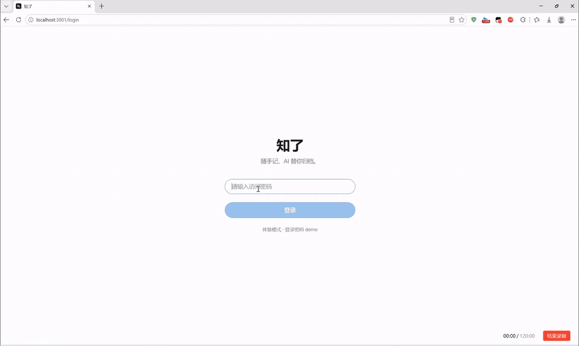

# Zhiliao (知了)

[](https://github.com/B-tech-hub/zhiliao/actions/workflows/ci.yml)
[](https://github.com/B-tech-hub/zhiliao/releases)
[](LICENSE)

Self-hosted, AI-organized personal knowledge base — jot a note, and an LLM titles it, tags it, summarizes it, and files it into the right topic. Low-confidence notes land in an inbox; once enough pile up, the AI suggests new topics via clustering.

The same idea extends to reading it back: **you shouldn't have to guess the keyword either.** Keyword (BM25) and semantic (vector) recall are fused with RRF, so a colloquial paraphrase still finds the note that worded it differently — and while you write, related older notes surface in a sidebar, flagging any that contradict your current draft.

**No fabrication** is a product-level promise, not just a chat feature: citations only ever point at note ids a tool actually returned, anything absent from your sources is reported as absent, and dead hallucinated links are never rendered.

**Your writing stays portable** — also a promise, not a feature bullet. Every save writes the body as plain Markdown to `data/notes/<topic>/<title>-<id>.md`: no export step, no network, just point Obsidian at that folder ([ADR-0020](docs/adr/0020-incremental-markdown-export.md)). The zip export imports back as well, restoring notes, topics, tags, timestamps, summaries and images field by field — **export and import are inverse operations**, not a one-way "export supported" ([ADR-0024](docs/adr/0024-markdown-zip-import.md)). Stop using Zhiliao whenever you like; your words don't leave with it.

Single-user by design. Next.js 15 + SQLite, PWA-ready, works with any OpenAI-compatible API.

Full documentation is in Simplified Chinese — see [README.md](README.md). This page covers just enough to get you running.



## Project status

**North-star metric: real notes captured. No new features ship until it reaches 100.**

Every number this project used to track — commits, ADRs, test coverage — could stay green while nobody actually used the thing. Real note count is the one metric that turns red in that case, so it is now the only one that gates new work.

Bug fixes, documentation, packaging and operations are exempt and continue as usual. The full [Roadmap](README.md#roadmap) (Chinese) lists what is frozen, what is not, and what is waiting on a real user rather than a hypothetical one.

## Features

- Markdown notes (TipTap WYSIWYG), paste/drag uploads up to 20 MB (PNG/JPEG/GIF/WebP/HEIC), debounced autosave. HEIC originals are preserved while JPEG display copies keep previews browser-compatible. Desktop note pages use a wide canvas with an H1–H3 table of contents; mobile stays single-column
- AI pipeline: one call per note → topic + title + tags + summary, with retry/backoff; fields you edit manually are never overwritten
- Topic suggestions: AI clusters inbox notes and proposes new topics — accepted one at a time, so taking one suggestion leaves the others intact
- Hybrid Chinese search: jieba segmentation + SQLite FTS5 (BM25, OR recall, weighted title/tags) fused with cosine vector search via RRF. Configure `EMBEDDING_*` to enable the semantic half — it never falls back to `LLM_*`, and without it search silently stays on BM25. Vectors record their producing model and dimension, so a provider switch is reported rather than returning quietly wrong results. Pick a topic without typing a query to just browse that topic's notes
- Related notes while writing: ~0.9s after you stop typing, up to 8 semantically related notes appear in a sidebar (titles and excerpts only — your draft is never modified). With a chat model configured, it also points out which one contradicts your current conclusion
- Learning from corrections: every time you fix a topic, title or tag, it is stored as a few-shot example (max 3 per field) injected into later prompts. Toggleable in settings
- External access: create an API token in settings (**none exists by default**) — only a SHA-256 hash is stored and the plaintext is shown once. `capture:write` allows `POST /api/external/capture` for quick capture (iOS Shortcuts, mail, bots); `knowledge:read` allows `GET /api/external/knowledge` and read-only `search_knowledge` / `get_knowledge` tools over `/api/mcp` for MCP clients. MCP exposes the topic + AI-summary semantic layer, not raw CRUD, and no destructive operations
- Incremental Markdown export: every change also writes `./data/notes/<topic>/<title>-<id>.md` in the background — write-only, conflict-free, so your text is never locked inside SQLite (point Obsidian straight at that folder)
- AI assistant over the whole library: it can search, read, create, append to, re-file and delete notes, and fetch URLs you have pasted. Every write leaves an undoable card in the conversation; deletions require your confirmation. Vision requests use transient compressed copies. A per-message Deep Reasoning toggle uses a separately configured reasoning model, defaults off, is not persisted, and never exposes model chain-of-thought
- Your data stays yours: one-click zip export (Markdown + display images, with HEIC originals under `assets/originals/`) and zip import for both Zhiliao exports and ordinary Markdown folders. Titles fall back from front matter to H1 to filename; topics accept `topic`, `category`, or the containing folder; content fingerprints prevent duplicate imports when no id exists. Manual backups and a 30-day trash bin are included
- PWA, dark mode, daily backups (database + images, 7 copies each)

## Try it in 1 minute (no API key)

```bash
git clone https://github.com/B-tech-hub/zhiliao.git
cd zhiliao && npm install
npm run demo
```

Open http://localhost:3000, password `demo`. Demo data and a local mock LLM are bundled — nothing leaves your machine. Delete `./data-demo/` to reset.

Prefer Docker? Download [docker-compose.demo.yml](docker-compose.demo.yml), then:

```bash
docker compose -f docker-compose.demo.yml up -d   # → http://localhost:3210
```

## Deploy with Docker

Prebuilt images (amd64 / arm64) are published to `ghcr.io/b-tech-hub/zhiliao`:

```bash
curl -LO https://raw.githubusercontent.com/B-tech-hub/zhiliao/main/docker-compose.yml
curl -Lo .env https://raw.githubusercontent.com/B-tech-hub/zhiliao/main/.env.example
# edit .env (APP_PASSWORD, SESSION_SECRET), then:
docker compose up -d
```

> ⚠️ Zhiliao needs a long-running process (in-process AI job queue + backup timers) — it cannot run on Vercel or other serverless platforms.
>
> On Windows Docker Desktop, add the named-volume override: `docker compose -f docker-compose.yml -f docker-compose.win.yml up -d` (bind mounts don't support SQLite WAL).

## Minimal configuration

| Variable | Required | Notes |
|---|---|---|
| `APP_PASSWORD` | ✅ | login password |
| `SESSION_SECRET` | ✅ | ≥32 random chars (`openssl rand -hex 32`) |
| `LLM_BASE_URL` / `LLM_API_KEY` / `LLM_MODEL` | | any OpenAI-compatible endpoint (DeepSeek, Qwen, Claude, …); can also be set later in the Settings UI |
| `REASONING_BASE_URL` / `REASONING_API_KEY` / `REASONING_MODEL` | | optional deep-reasoning endpoint; URL and key may fall back to the text model, but the reasoning model name must be explicit |
| `EMBEDDING_BASE_URL` / `EMBEDDING_API_KEY` / `EMBEDDING_MODEL` | | enables semantic search; all three must be set explicitly — they **never** fall back to `LLM_*`. Provider must support OpenAI-compatible `/embeddings` |

The app works without an LLM configured — notes stay "pending" and are processed automatically once you add one.

Without `EMBEDDING_*`, search stays on BM25. Once configured, new and edited notes are vectorized automatically; existing notes can be backfilled from the settings page.

## Contributing & security

See [CONTRIBUTING.md](CONTRIBUTING.md) (Chinese). Report vulnerabilities privately via GitHub Security Advisories — see [SECURITY.md](SECURITY.md).

## License

[MIT](LICENSE)
