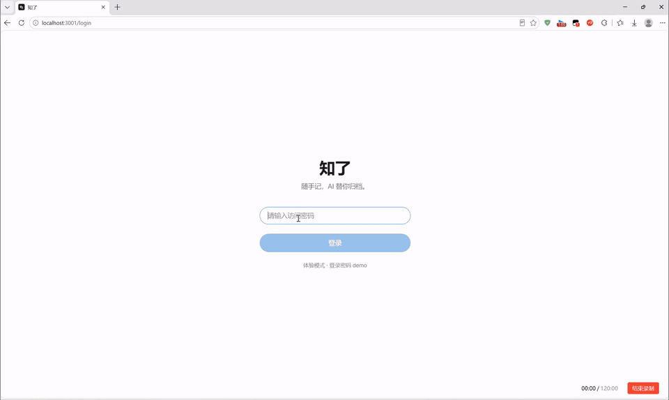

# Zhiliao (知了)

[](https://github.com/B-tech-hub/zhiliao/actions/workflows/ci.yml)
[](https://github.com/B-tech-hub/zhiliao/releases)
[](LICENSE)

Self-hosted, AI-organized personal knowledge base — jot a note, and an LLM titles it, tags it, summarizes it, and files it into the right topic. Low-confidence notes land in an inbox; once enough pile up, the AI suggests new topics via clustering.

The same idea extends to reading it back: **you shouldn't have to guess the keyword either.** Keyword (BM25) and semantic (vector) recall are fused with RRF, so a colloquial paraphrase still finds the note that worded it differently — and while you write, related older notes surface in a sidebar, flagging any that contradict your current draft.

**No fabrication** is a product-level promise, not just a chat feature: citations only ever point at note ids a tool actually returned, anything absent from your sources is reported as absent, and dead hallucinated links are never rendered.

**Your writing stays portable** — also a promise, not a feature bullet. Every save writes the body as plain Markdown to `data/notes/<topic>/<title>-<id>.md`: no export step, no network, just point Obsidian at that folder ([ADR-0020](docs/adr/0020-incremental-markdown-export.md)). The zip export imports back as well, restoring notes, topics, tags, timestamps, summaries and images field by field — **export and import are inverse operations**, not a one-way "export supported" ([ADR-0024](docs/adr/0024-markdown-zip-import.md)). Stop using Zhiliao whenever you like; your words don't leave with it.

Single-user by design. Next.js 15 + SQLite, PWA-ready, works with any OpenAI-compatible API.

Full documentation is in Simplified Chinese — see [README.md](README.md). Contributors should start with [AGENTS.md](AGENTS.md), the [development standards](docs/开发规范.md), and the [UI standards](docs/UI规范.md). This page covers just enough to get you running.



## Project status

**North-star metric: real notes captured. No new features ship until it reaches 100.**

Every number this project used to track — commits, ADRs, test coverage — could stay green while nobody actually used the thing. Real note count is the one metric that turns red in that case, so it is now the only one that gates new work.

Bug fixes, documentation, packaging and operations are exempt and continue as usual. The full [Roadmap](README.md#roadmap) (Chinese) lists what is frozen, what is not, and what is waiting on a real user rather than a hypothetical one.

The current priority is a reproducible open-source release: installation, the core capture/search/source-chat flow, reliable export and restore, consistent versions and documentation, and free self-hosted feedback. The public Demo and paid recruitment are deferred; MIT, single-user self-hosting, the 100-note freeze and existing release checks remain in place.

Start with a published fixed version and the [first-use guide](docs/首次使用与故障排查.md). Report installation or usage problems with the version, environment and reproduction steps using the [free-feedback guide](docs/产品规划/开源发布范围与执行清单-2026-09-13.md#free-feedback) (Chinese). The software is free under MIT; users cover their own device and chosen model costs. See [backup and restore](docs/备份与恢复.md) for data recovery.

**Version status: this working tree targets 0.6.1, which has not been released.** The installation and source Demo commands below still select published v0.6.0. Compose files on the current branch target the pending 0.6.1 image; they do not establish image availability. See the [0.6.1 draft notes](docs/releases/v0.6.1.md) for changes, independent blockers, and pending verification.

## Features

- Markdown notes (TipTap WYSIWYG), paste/drag uploads up to 20 MB (PNG/JPEG/GIF/WebP/HEIC), debounced autosave. HEIC originals are preserved while JPEG display copies keep previews browser-compatible. Desktop note pages use a wide canvas with an H1–H3 table of contents; mobile stays single-column
- AI pipeline: one call per note → topic + title + tags + summary, with retry/backoff; fields you edit manually are never overwritten
- Topic suggestions: AI clusters inbox notes and proposes new topics — accepted one at a time, so taking one suggestion leaves the others intact
- Hybrid Chinese search: jieba segmentation + SQLite FTS5 (BM25, OR recall, weighted title/tags) fused with cosine vector search via RRF. Configure `EMBEDDING_*` to enable the semantic half — it never falls back to `LLM_*`, and without it search silently stays on BM25. Vectors record their producing model and dimension, so a provider switch is reported rather than returning quietly wrong results. Pick a topic without typing a query to just browse that topic's notes
- Related notes while writing: ~0.9s after you stop typing, up to 8 semantically related notes appear in a sidebar (titles and excerpts only — your draft is never modified). With a chat model configured, it also points out which one contradicts your current conclusion
- Learning from corrections: every time you fix a topic, title or tag, it is stored as a few-shot example (max 3 per field) injected into later prompts. Toggleable in settings
- External access: create an API token in settings (**none exists by default**) — only a SHA-256 hash is stored and the plaintext is shown once. `capture:write` allows `POST /api/external/capture` for quick capture (iOS Shortcuts, mail, bots); `knowledge:read` allows `GET /api/external/knowledge` and read-only `search_knowledge` / `get_knowledge` tools over `/api/mcp` for MCP clients. MCP exposes the topic + AI-summary semantic layer, not raw CRUD, and no destructive operations
- Mobile quick capture: create a write-only token, verify a real capture in Settings, then follow the [iOS Shortcuts guide](docs/手机快捷记录.md) to capture shared text, URLs, or dictation without opening the browser first
- Incremental Markdown export: every change also writes `./data/notes/<topic>/<title>-<id>.md` in the background — write-only, conflict-free, so your text is never locked inside SQLite (point Obsidian straight at that folder)
- AI assistant over the whole library: it can search, read, create, append to, re-file and delete notes, and fetch URLs you have pasted. Every write leaves an undoable card in the conversation; deletions require your confirmation. Vision requests use transient compressed copies. A per-message Deep Reasoning toggle uses a separately configured reasoning model, defaults off, is not persisted, and never exposes model chain-of-thought
- Your data stays yours: one-click zip export (Markdown + display images, with HEIC originals under `assets/originals/`) and zip import for both Zhiliao exports and ordinary Markdown folders. Titles fall back from front matter to H1 to filename; topics accept `topic`, `category`, or the containing folder; content fingerprints prevent duplicate imports when no id exists. Manual backups and a 30-day trash bin are included
- PWA, dark mode, daily backups (database + images, 7 copies each)

## Try it in 1 minute (no API key)

For the complete first-use path from login to a saved note, AI status, topic view, and search, see the [first-use and troubleshooting guide](docs/首次使用与故障排查.md) (Simplified Chinese).

Use a fresh independent directory and a dedicated terminal; do not copy `.env*` files or an existing Demo database. The Bash example clears inherited model settings and explicitly isolates Markdown exports. Windows users can run the [PowerShell equivalent](docs/首次使用与故障排查.md#v060-source-demo-powershell). If the directory already exists, choose a new name and start again; do not continue after clone fails.

```bash
(
  set -e
  git clone --branch v0.6.0 --depth 1 https://github.com/B-tech-hub/zhiliao.git zhiliao-demo-v060
  cd zhiliao-demo-v060
  npm ci
  unset DEMO_MODE APP_PASSWORD SESSION_SECRET DATABASE_PATH UPLOAD_DIR
  for demo_prefix in LLM EMBEDDING VISION IMAGE REASONING; do
    unset "${demo_prefix}_BASE_URL" "${demo_prefix}_API_KEY" "${demo_prefix}_MODEL"
  done
  NOTES_EXPORT_DIR=./data-demo/notes PORT=3000 npm run demo
)
```

Requires Node.js 22 or newer. With the isolated configuration above, open http://localhost:3000, password `demo`. Demo data and a local mock LLM are bundled; no API key is required.

The v0.6.0 source launcher allows host values to override Demo defaults. It does not set `NOTES_EXPORT_DIR`, so Markdown defaults to `./data/notes`; creating and updating notes both schedule exports. `DEMO_MODE`, `LLM_*`, `EMBEDDING_*`, `VISION_*`, `IMAGE_*`, `REASONING_*`, and model settings in an existing Demo database can change legacy behavior. Clearing environment variables does not override saved database settings. These instructions require a fresh checkout and dedicated environment; they do not guarantee that legacy v0.6.0 makes no external requests. Enforced overrides and disabled additional models below apply only to the current candidate.

On a first run using the isolated steps above, the database, uploads, and Markdown all stay under that checkout's `./data-demo/`. Stop that Demo before resetting its isolated directory. Previous runs of the old commands may already have exported files to `./data/notes`: deleting only `data-demo` is not a complete reset. Check directory ownership and preserve production data.

In the current **unreleased 0.6.1 source**, `npm run demo` sets `DEMO_RUNTIME=local` and selects the fixed `http://127.0.0.1:8787/v1` mock endpoint. Missing or invalid runtime markers select the fixed container endpoint, `http://mockllm:8787/v1`. Both Demo modes ignore external model settings from the database and environment and disable additional models. The clone command above still selects historical v0.6.0. On September 14, the candidate passed a controlled local Windows source Demo check covering startup, the browser flow, conflicting model settings, and forbidden endpoints; see the [R1 results and verification scope](docs/产品规划/开源发布范围与执行清单-2026-09-13.md#r1-source-demo) and [runtime record](docs/R1源码Demo接线验收-2026-09-14.md) (Chinese). This used a temporary copy and an additional runtime guard; it does not establish clean-install, Docker, native network-isolation, or release readiness.

The current source launcher enforces `APP_PASSWORD=demo`, a dedicated Demo session secret, and paths under `./data-demo/`, overriding conflicting host values. Unfixed variables such as `PORT` still pass through. The Docker Demo password remains configurable through `DEMO_PASSWORD` in its dedicated `demo.env`.

The Docker Demo uses a digest-pinned Nginx ingress for host-port publishing and actual request-body enforcement. The app and mock LLM stay on an isolated internal network. The current [docker-compose.demo.yml](docker-compose.demo.yml) targets the **unreleased 0.6.1 image** and requires [the Nginx config](nginx/demo.conf). The following startup steps apply after that image is published and the relevant checks pass; image availability was not verified in this round:

```bash
printf 'DEMO_PASSWORD=demo\nDEMO_SESSION_SECRET=%s\n' "$(openssl rand -hex 32)" > demo.env
npm run demo:compose -- up -d
```

Stop the instance with `npm run demo:compose -- down -v`. `npm run demo:compose` first clears host `DEMO_*`/`COMPOSE_*` variables, then runs the internal equivalent `docker compose --env-file demo.env -p zhiliao-demo -f docker-compose.demo.yml`, so production `.env` and host variables cannot leak into Demo. The default project is `zhiliao-demo`; its ingress network, isolated internal network, and three `demo_*` named volumes follow the project name and never mount `./data` or production volumes. Nginx only proxies to the app and enforces a `200 MiB` body limit. The ingress binds to `127.0.0.1` by default, so it is not exposed to the LAN. All three services have CPU, memory, process, read-only filesystem, and log rotation limits.

The candidate exempts only build assets under `/_next/static/` from request-rate accounting, so parallel script, stylesheet, and font downloads do not consume the allowance. Pages, APIs, and other paths retain `10r/s` with a burst of `40` per ingress source address. The `32`-connection limit still applies to all paths; dynamic routes such as `/_next/image` are not exempt. See the [focused HTTP and browser verification](docs/R1安装验收-2026-09-15.md#demo-static-rate-limit-repair) (Chinese).

For an existing instance using this ingress with its image already available locally, update `nginx/demo.conf` and recreate only the ingress to initialize the changed rate-limit key. From the original deployment directory, use `npm run demo:compose -- up -d --no-deps --force-recreate --no-build --pull never ingress`. The wrapper still runs `docker compose --env-file demo.env -p zhiliao-demo -f docker-compose.demo.yml` internally; retain that instance's actual project and environment-file arguments. This briefly interrupts ingress traffic without recreating the app, mock, or data volumes.

**Version boundary: published v0.6.0 lacks the current Demo server protections; updating Compose to 0.6.1 does not publish a patched image.** Nginx now performs the actual body-size check before proxying, while the working-tree application also rejects restricted operations and invalid length declarations. Publish a fixed application image before public deployment, and apply host or Docker storage quotas to Demo volumes. Runtime verification progress is recorded in the [Story 2.2 verification record](docs/Demo部署隔离验收-2026-09-10.md) (Simplified Chinese).

Maintainers can use `scripts/verify-demo-runtime.ps1` with Node.js 22+ on the host and the local candidate image. `-Port` selects the loopback port; `-IncludeSse -IncludeNetwork` runs HTTP/SSE checks and 20 network comparisons in one session. The runner links the separate network evidence and cleans up its resources by default. Check, evidence, or cleanup failures return a nonzero exit status. Standalone network and proxy timeout tools remain available through `node scripts/verify-demo-network.mjs --help` and `node scripts/verify-demo-proxy-timeouts.mjs --help`.

The maintainer's current target is Windows Docker Desktop for local use only. The September 12 B2 run passed HTTP/SSE, all 20 network checks, and cleanup; the earlier four proxy checks remain valid within their recorded scope. Hard volume quotas, isolation from actual production services, public HTTPS, and a patched image release remain pending. Local success does not establish readiness for public deployment. See the [Story 2.2 verification record](docs/Demo部署隔离验收-2026-09-10.md#b2-local) (Simplified Chinese). The tools do not build, pull, or publish images automatically; [ADR-0026](docs/adr/0026-demo-ingress-isolation.md) explains the topology.

## Deploy with Docker

**Primary path: prebuilt Docker image.** This guide uses `ghcr.io/b-tech-hub/zhiliao:0.6.0` (amd64 / arm64). Run the following Linux/macOS commands in a new empty directory for a fresh installation. Existing installations should follow the upgrade notes below; Windows PowerShell users should follow [chapters 2–4 of the deployment guide](docs/部署手册-tailscale.md#第-2-章获取固定版本的部署文件) (Chinese).

```bash
curl -fL -o docker-compose.yml https://raw.githubusercontent.com/B-tech-hub/zhiliao/v0.6.0/docker-compose.yml
curl -fL -o .env.example https://raw.githubusercontent.com/B-tech-hub/zhiliao/v0.6.0/.env.example
cp -n .env.example .env
```

**Pin the image before starting.** The historical Compose file in `v0.6.0` still references `latest`. Downloading it from a fixed tag does not pin the image. Change only `services.app.image` to the following value, keeping the rest of the file:

```yaml
image: ghcr.io/b-tech-hub/zhiliao:0.6.0
```

Set `APP_PASSWORD` and `SESSION_SECRET` in `.env`, and clear the sample `LLM_*` placeholder values. You can configure a model later in Settings. Confirm that the image command below prints `ghcr.io/b-tech-hub/zhiliao:0.6.0`, then pull and start. Resolve any error before continuing:

```bash
docker compose config --images
docker compose pull app
docker compose up -d
```

> ⚠️ Zhiliao needs a long-running process (in-process AI job queue + backup timers) — it cannot run on Vercel or other serverless platforms.
>
> On Windows Docker Desktop, use `docker compose -f docker-compose.yml -f docker-compose.win.yml up -d` (bind mounts don't support SQLite WAL). Use both `-f` arguments for image checks and pulls as well; see the deployment guide for the fixed-version download.
>
> For a source build, first clone the complete `v0.6.0` tag: `git clone --branch v0.6.0 --depth 1 https://github.com/B-tech-hub/zhiliao.git zhiliao-src`. In that directory, prepare `.env`, comment out `image:` and enable `build: .`, then run `docker compose up -d --build` (with the Windows override where needed). The two downloaded files above are not a complete source checkout.

Linux/default bind mounts persist data under `./data/db`, `./data/uploads`, and `./data/notes`; on Windows with the override, database and uploads use named volumes `kb_db` and `kb_uploads` while Markdown remains in `./data/notes`. Actual volume names depend on the Compose project. The default `"3000:3000"` port mapping binds all host interfaces. For local access or Tailscale Serve, change it to `"127.0.0.1:3000:3000"`; Tailscale does not close other existing endpoints. Phone PWA installation requires HTTPS; see [the deployment guide](docs/部署手册-tailscale.md).

### Upgrade and restore

The maintainer smoke script defaults to the version in its own checkout's `package.json` (currently unreleased 0.6.1). Use `-PrintConfig` to preview without invoking Docker. To test the published release explicitly, run `powershell -ExecutionPolicy Bypass -File scripts/smoke-fresh-install.ps1 -Image ghcr.io/b-tech-hub/zhiliao:0.6.0`; fixed RC tags and digests are also supported. Historical smoke results do not verify the new candidate.

Before upgrading, retain a [paired database and full-image snapshot](docs/备份与恢复.md), the original image tag/digest, Compose files, `.env`, project name, and actual mounts. Select a published target version, read its release notes, compare any configuration changes in the original deployment directory, and update `image:` to that exact version. Check `docker compose config --images`, then run `docker compose pull app` and `docker compose up -d`. Windows requires both Compose files for all three commands. Pulling an image pinned to `0.6.0` does not select a newer version.

Keep the original project, mounts, and environment file; retain any existing `-p` or `--env-file` arguments. Startup performs database migrations and resumes background jobs. After migration, changing the image back is not sufficient rollback: stop and use the [isolated restore procedure](docs/备份与恢复.md#isolated-restore). Record the actual image with `docker image inspect ghcr.io/b-tech-hub/zhiliao:0.6.0 --format '{{.Id}} {{json .RepoDigests}}'`, replacing the version when upgrading.

## Minimal configuration

| Variable | Required | Notes |
|---|---|---|
| `APP_PASSWORD` | ✅ | login password |
| `SESSION_SECRET` | ✅ | ≥32 random chars (`openssl rand -hex 32`) |
| `LLM_BASE_URL` / `LLM_API_KEY` / `LLM_MODEL` | | any OpenAI-compatible endpoint (DeepSeek, Qwen, Claude, …); can also be set later in the Settings UI |
| `REASONING_BASE_URL` / `REASONING_API_KEY` / `REASONING_MODEL` | | optional deep-reasoning endpoint; URL and key may fall back to the text model, but the reasoning model name must be explicit |
| `EMBEDDING_BASE_URL` / `EMBEDDING_API_KEY` / `EMBEDDING_MODEL` | | enables semantic search; all three must be set explicitly — they **never** fall back to `LLM_*`. Provider must support OpenAI-compatible `/embeddings` |

The app works without an LLM configured — notes stay "pending" and are processed automatically once you add one.

Without `EMBEDDING_*`, search stays on BM25. Once configured, new and edited notes are vectorized automatically; existing notes can be backfilled from the settings page.

## Contributing & security

See [CONTRIBUTING.md](CONTRIBUTING.md) (Chinese). Report vulnerabilities privately via GitHub Security Advisories — see [SECURITY.md](SECURITY.md).

## License

[MIT](LICENSE)
