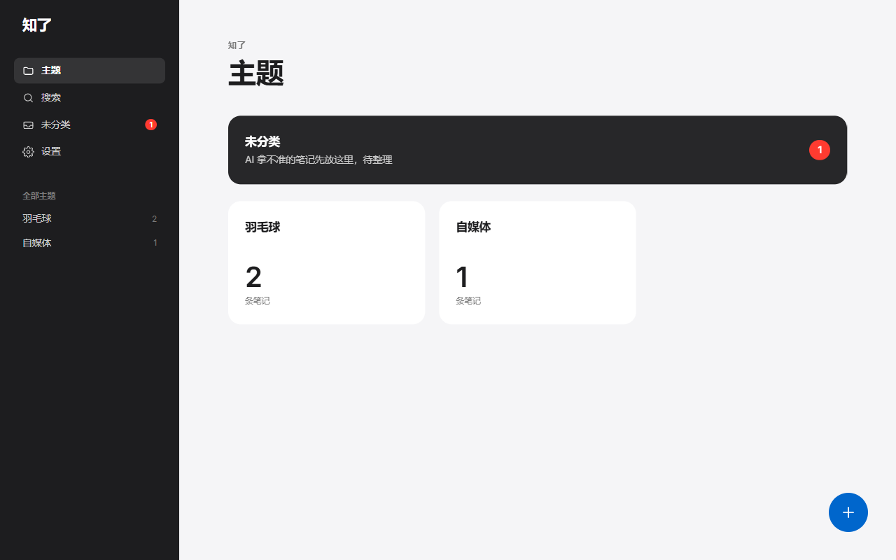
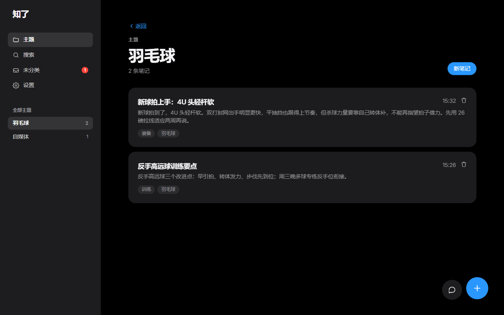
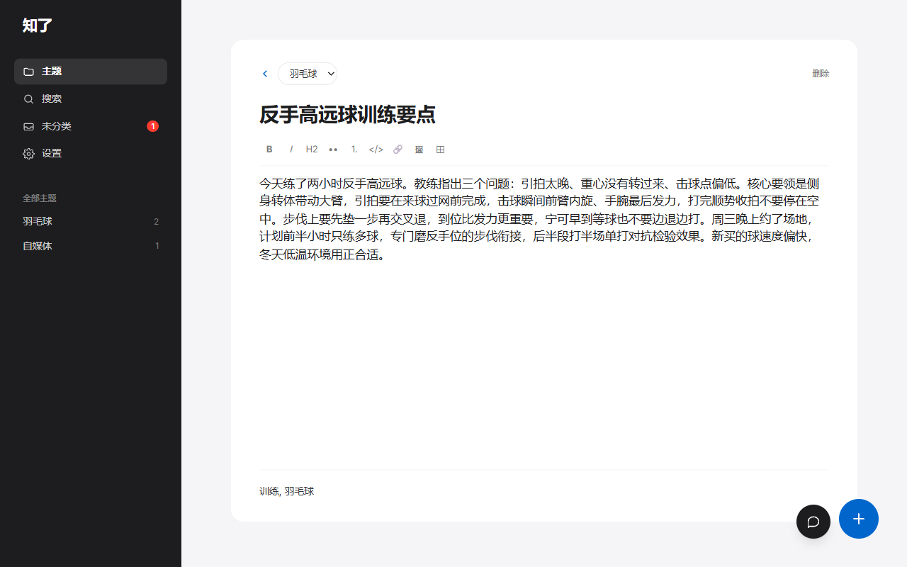
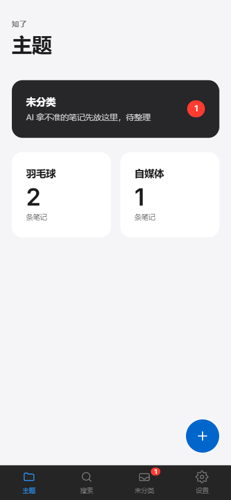

# 知了（zhiliao）

[](https://github.com/B-tech-hub/zhiliao/actions/workflows/ci.yml)
[](https://github.com/B-tech-hub/zhiliao/releases)
[](https://github.com/B-tech-hub/zhiliao/pkgs/container/zhiliao)
[](LICENSE)
[](Dockerfile)

> **English**: *Zhiliao* (知了, "got it / noted") is a self-hosted, AI-organized personal knowledge base — jot a note, and an LLM titles it, tags it, summarizes it, and files it into the right topic. Next.js 15 + SQLite, single-user, PWA-ready, works with any OpenAI-compatible API. **English quickstart: [README.en.md](README.en.md)**; full documentation is in Simplified Chinese.

主题导向的个人知识库：随手记一条笔记，AI 自动阅读理解，起标题、打标签、写摘要，并归入合适的主题；拿不准的进"未分类"，攒多了 AI 会建议"要不要新建主题 X"。

单用户自用，响应式 Web 应用（手机/电脑浏览器通用）。

> **为什么叫"知了"**：你随手记完，AI 应一声"知了"——是"知道了、已收到"，谐音"知识"，也是夏天的蝉。

<!-- TODO(维护者)：录制演示 GIF 后取消下一行注释，录制清单见 docs/演示GIF录制清单.md

-->

## 一键体验（无需 API Key）

一条命令在本地体验完整的「随手记 → AI 自动归档 → 主题建议」流程。内置演示数据与本地 mock LLM，不需要申请任何 API Key，也不会发出任何外部请求：

```bash
git clone https://github.com/B-tech-hub/zhiliao.git
cd zhiliao && npm install
npm run demo
```

打开 http://localhost:3000 ，密码 `demo`。推荐动线：

1. 新建一条笔记，写「今晚羽毛球多球训练，杀球终于有点下压了」——保存后几秒，AI 自动起标题、打标签并归入「羽毛球」主题；
2. 打开「未分类」——AI 已根据攒下的笔记建议了「跑步」「下厨」两个新主题，一键采纳即可建组迁移；
3. 进「羽毛球」主题页，看长笔记的 AI 一句话摘要。

> 演示中的 AI 是本地 mock（按关键词模拟判断），只为展示产品流程；真实效果取决于你接入的 LLM（见下文「LLM 供应商切换」）。
> 演示数据在 `./data-demo/`，删除该目录即可重置；正式数据 `./data/` 不受影响。

装了 Docker、不想装 Node？下载 [docker-compose.demo.yml](docker-compose.demo.yml) 后：

```bash
docker compose -f docker-compose.demo.yml up -d
```

访问 http://localhost:3210 （密码 `demo`）；结束体验：`docker compose -f docker-compose.demo.yml down -v`。

## 界面预览

| 首页 · 浅色 | 主题页 · 深色（AI 标题/摘要/标签） |
|---|---|
|  |  |

| 笔记编辑器（Markdown 所见即所得） | 手机端 |
|---|---|
|  |  |

## 功能

- **主题**：扁平一层，手动增删改；内置不可删除的"未分类"；删除主题时笔记自动回落未分类
- **笔记**：Markdown 所见即所得（TipTap），粘贴/拖拽图片直接上传，2 秒防抖自动保存；主题页可快捷删除，未分类支持多选批量删除/移动（删除为物理删除，不可恢复）
- **AI 流水线**：保存后异步处理，一次调用完成"选主题 + 起标题 + 提标签 + 写摘要"；置信度低于阈值归未分类；用户手动改过的字段 AI 不再覆盖；失败自动退避重试 3 次，可手动"重新处理"
- **主题建议**：未分类攒到 8 条后（或手动触发），AI 聚类给出最多 3 个建议，确认后一键建主题并迁移
- **中文搜索**：jieba 分词 + SQLite FTS5 全文检索，标题/标签加权，单字查询降级 LIKE
- **外观**：浅色 / 深色 / 跟随系统三态切换（设置 → 外观），偏好保存在本机浏览器
- **PWA**：手机可"添加到主屏幕"当 app 用（需 HTTPS，推荐 Tailscale 方案，见下），断网有离线兜底页
- **安全与运维**：单用户密码登录（30 天会话）、登录限流；每日自动备份数据库与图片（各保留 7 份，[恢复方法](docs/备份与恢复.md)）；`/api/healthz` 健康检查，Docker 镜像内置 HEALTHCHECK

## 技术栈

Next.js 15（App Router，全栈单体）· TypeScript · Tailwind CSS 4 · Drizzle ORM + better-sqlite3 · TipTap · @node-rs/jieba · jose · Vitest

> ⚠️ **本应用强依赖长驻进程**（进程内 AI 任务队列 + 定时备份），**不能部署到 Vercel 等 serverless 平台**，请用 Docker 或 `node server.js` 方式长驻运行。

## 文档

专项文档集中在 [docs/](docs/README.md)：设计规范（含暗色模式 token 表）、Tailscale 部署手册、[备份与恢复](docs/备份与恢复.md)、架构决策记录（ADR）。领域术语见 [CONTEXT.md](CONTEXT.md)。

## 本地开发

```bash
npm install
cp .env.example .env.local   # 修改其中的密码、密钥、LLM 配置
npm run dev
```

访问 http://localhost:3000 ，用 `.env.local` 中的 `APP_PASSWORD` 登录。

开发协作约定见 [CONTRIBUTING.md](CONTRIBUTING.md)。

## 部署（Docker）

默认使用预构建镜像 [`ghcr.io/b-tech-hub/zhiliao`](https://github.com/B-tech-hub/zhiliao/pkgs/container/zhiliao)（amd64 / arm64），无需本地构建：

```bash
# 1. 下载 compose 文件与环境变量模板（或直接 git clone 整个仓库）
curl -LO https://raw.githubusercontent.com/B-tech-hub/zhiliao/main/docker-compose.yml
curl -Lo .env https://raw.githubusercontent.com/B-tech-hub/zhiliao/main/.env.example

# 2. 编辑 .env：设置 APP_PASSWORD / SESSION_SECRET（LLM 可稍后在设置页配置）

# 3. 启动
docker compose up -d
```

> **想从源码构建**：把 `docker-compose.yml` 里的 `image:` 行注释掉、取消 `build: .` 的注释，再 `docker compose up -d --build`。
>
> **Windows Docker Desktop 本地测试**：绑定挂载不支持 SQLite WAL 所需的共享内存（报 `SQLITE_IOERR_SHMOPEN`），请叠加命名卷 override：
> `docker compose -f docker-compose.yml -f docker-compose.win.yml up -d`
> Linux 服务器不受影响。

数据全部落在宿主机 `./data/` 目录：

| 路径 | 内容 |
|---|---|
| `./data/db/app.db` | SQLite 数据库（WAL 模式） |
| `./data/db/backups/` | 每日自动备份：数据库快照 `app-*.db` 与图片快照 `uploads-*/`，各保留 7 份（[恢复方法](docs/备份与恢复.md)） |
| `./data/uploads/` | 上传的图片 |

迁移在应用启动时自动执行。升级版本：`docker compose pull && docker compose up -d`（源码构建则 `docker compose up -d --build`），重启不丢数据与未完成的 AI 任务。

### 手机安装为 App（PWA）

浏览器要求 PWA 必须运行在 HTTPS 下。单用户自用推荐 **Tailscale 组网**：免费获得 `*.ts.net` 域名与受信任证书，手机随处可访问且服务零公网暴露。完整步骤见 **[docs/部署手册-tailscale.md](docs/部署手册-tailscale.md)**。

## 环境变量

| 变量 | 必填 | 说明 |
|---|---|---|
| `APP_PASSWORD` | ✅ | 登录密码 |
| `SESSION_SECRET` | ✅ | 会话签名密钥，≥32 字节随机串（`openssl rand -hex 32`） |
| `DATABASE_PATH` | | SQLite 路径，默认 `./data/db/app.db`（Docker 内 `/data/db/app.db`） |
| `UPLOAD_DIR` | | 图片目录，默认 `./data/uploads`（Docker 内 `/data/uploads`） |
| `LLM_BASE_URL` | | OpenAI 兼容接入点的默认值（兜底），如 `https://api.deepseek.com/v1`，可在"设置 → AI 服务"页面覆盖 |
| `LLM_API_KEY` | | 模型服务 API Key 的默认值（兜底），可在设置页覆盖 |
| `LLM_MODEL` | | 模型名的默认值（兜底），如 `deepseek-chat`，可在设置页覆盖 |
| `LLM_TIMEOUT_MS` | | LLM 请求超时，默认 60000（仅支持环境变量） |
| `AI_CONFIDENCE_THRESHOLD` | | 分类置信度阈值，默认 0.6，低于则归未分类 |
| `PORT` | | 监听端口，默认 3000 |
| `DEMO_MODE` | | 设为 `1` 时空库启动会写入演示数据（**仅供一键体验，正式部署请勿设置**） |
| `NEXT_DIST_DIR` | | 构建输出目录，默认 `.next`；仅在 Windows 下 `.next` 被残留进程句柄锁死、`next build` 卡住时临时改用其他目录 |

未配置 `LLM_*` 时应用照常可用，笔记会停留在"待整理"状态，配置后自动补处理。

> LLM 配置读取顺序：**设置页保存的值（存数据库）优先，环境变量兜底**。在设置页修改后立即生效，无需重启；详见 `docs/adr/0001-llm-config-in-db.md`。

## LLM 供应商切换

任何 OpenAI 兼容的 Chat Completions 服务均可，直接在"设置 → AI 服务"页面修改接入点 / API Key / 模型，保存后立即生效（也可通过环境变量配置默认值）：

| 供应商 | LLM_BASE_URL | LLM_MODEL 示例 |
|---|---|---|
| DeepSeek | `https://api.deepseek.com/v1` | `deepseek-chat` |
| 通义千问 | `https://dashscope.aliyuncs.com/compatible-mode/v1` | `qwen-plus` |
| Claude | `https://api.anthropic.com/v1/` | `claude-haiku-4-5` |

在"设置 → AI 服务 → 测试连接"可验证配置是否可用。

## Roadmap

**计划中**

- 数据导出（Markdown + 附件打包）与回收站（软删除）
- 设置页手动备份按钮与最近备份时间展示
- Notion / Bear / Obsidian 导入
- 语义（向量）搜索、AI 问答

**远期再议**

- 笔记双链、块编辑器

**明确不做**（保持单用户、自托管的定位）

- 多用户 / 注册 / SaaS 化

## 参与与反馈

这是我的第一个开源项目，既是给自己用的工具，也希望对想学习 Next.js 全栈开发的朋友有参考价值（架构取舍都记录在 [ADR](docs/adr/) 里）。欢迎提 Issue 反馈问题、交流想法；也欢迎 PR（改动较大的建议先开 Issue 讨论）。

- 参与方式与开发约定：[CONTRIBUTING.md](CONTRIBUTING.md)
- 安全问题请走私密披露：[SECURITY.md](SECURITY.md)
- 版本历史：[CHANGELOG.md](CHANGELOG.md)

## 许可证

[MIT](LICENSE)
