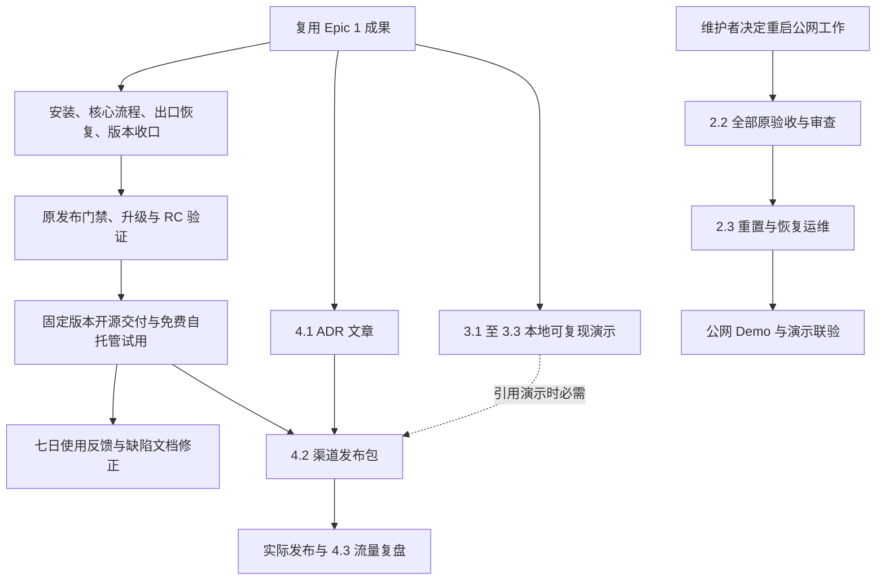

# Sprint 范围调整提案：开源发布优先，商业化后续

- 提案日期：2026-09-12；核对日期：2026-09-13（北京时间）
- 项目：知了；负责人：baibai
- 状态：2026-09-13 用户已批准，范围调整生效；不代表产品交付或发布完成
- 方式：单 Agent；提案编写阶段仅新增本文件，批准后落实规划同步与 R0 调查
- 调整路径：直接调整待办与依赖，结合近期交付范围复核
- 影响等级：Moderate（中等）；涉及产品排期和分发计划，无需重做产品或架构

建议把近期交付收束为：**固定版本可安装，现有“记、找、用”可走通，数据能完整导出和恢复，版本与文档相符，并取得免费自托管试用反馈。** 公网 Demo 后移为独立工作，收费招募与报价暂缓。开源软件发布、文章分发和免费使用观察不再整体等待公网 Demo。

知了已有 MIT 开源版本 v0.6.0。本次要准备的是下一次可信、可复现的开源交付；没有核验或发布任何新版本。本提案保留 MIT、单用户自托管、100 条真实笔记前的新功能冻结、原合并/发布门禁，以及 Story 2.2 的全部原验收要求。

本文件补充[同日既有提案](sprint-change-proposal-2026-09-12.md)。用户于 2026-09-13 明确回复“批准”，本文件成为范围调整基线；旧提案追加接续说明，其技术验收保护继续保留，不将其独立标为全部执行。下文的旧值、证据和提案阶段限制保留原调查语境；当前执行与待补项见 [R0–R4 清单](../../docs/产品规划/开源发布范围与执行清单-2026-09-13.md)。

## 一、问题摘要与事实依据

### 1.1 调整触发

用户明确将近期目标从收费服务准备转向开源发布与免费使用验证。Story 2.2 的本机验证已有成果，剩余公网工作仍依赖存储硬配额、实际正式服务边界、HTTPS 与补丁镜像。与此同时，现有计划把来源演示和分发串在公网 Demo 之后，商业材料又把免费访谈导向盘点报价。这些安排需要一起调整，否则改了目标，实际待办仍会把投入带回公网部署和收费准备。

这是交付优先级和验证目标的变化。没有证据支持宣布商业模式失败、产品无人需要，或用新功能重做产品。

### 1.2 已核对的事实

| 编号 | 来源 | 事实及其限制 |
|---|---|---|
| E1 | [README](../../README.md)、[LICENSE](../../LICENSE)、[CHANGELOG](../../CHANGELOG.md) | MIT、单用户自托管与冻结规则明确；v0.6.0 是既有发布基线，搜索续读等变化仍在“未发布”段。不能把工作区能力归给旧镜像。 |
| E2 | [Sprint 状态](../implementation-artifacts/sprint-status.yaml)、[Story 2.2](../implementation-artifacts/spec-2-2-isolate-demo-deployment-and-limit-resources.md) | Epic 1 与 1.1–1.3 为 done；2.1 为 done；Epic 2 为 in-progress；2.2 规格为 in-review、Sprint 为 review；2.3、Epic 3/4 及其 Story 为 backlog。当前 HEAD 为 f213761b795cc020be2122e27301fe4a7c5cf7a0，工作区已有未提交修改。 |
| E3 | [旧提案](sprint-change-proposal-2026-09-12.md)、[Epic 源文件](epics-github-install-distribution-demo.md) | 旧提案仅将 2.2 分期，仍保留 2.3 → 3.1 的强依赖，以及 4.2 对 2.3、3.2 的依赖。它尚未解决开源分发的等待问题。 |
| E4 | [B2 运行报告](../../docs/验收证据/story-2-2-runtime-b2-2026-09-12T11-48-30Z.json)、[网络报告](../../docs/验收证据/story-2-2-runtime-b2-2026-09-12T11-48-30Z-network.json)、[A2 代理报告](../../docs/验收证据/story-2-2-proxy-timeouts-2026-09-12T09-42-14-119Z.json) | 本轮只读核对三份 JSON 均为 passed、cleanup 为 removed。B2 的 HTTP/SSE、20 项网络对照及 A2 四项代理结果适用于原本机环境，不证明公网、硬配额或当前全部源码镜像已通过。 |
| E5 | [安装冒烟记录](../../docs/验收记录-全新环境安装冒烟-2026-09-09.md)、[部署手册](../../docs/部署手册-tailscale.md) | 记录实际日期为 9 月 10 日，Windows 上固定 0.6.0 镜像已存在，登录、保存、导出和重启持久化通过；未证明无缓存首次下载。手册 §2 仍使用占位仓库地址和默认分支 ZIP，且称后续需要构建，与 §4 的预构建主路径不一致。 |
| E6 | [备份与恢复](../../docs/备份与恢复.md)、[ADR-0020](../../docs/adr/0020-incremental-markdown-export.md)、[ADR-0024](../../docs/adr/0024-markdown-zip-import.md) | Markdown、ZIP 往返、数据库及完整图片快照已有契约。Windows 命名卷示例只演示数据库回填；完整图片卷恢复步骤需要补齐。既有小包往返证据不能代替候选版本完整恢复或大规模性能验收。 |
| E7 | [MCP 路由](../../src/app/api/mcp/route.ts)、[package.json](../../package.json)、[开发实施方案 §7.3](../../docs/产品规划/知了开发实施方案-v1.0.md) | MCP 的 serverInfo.version 仍为 0.5.0，package 与 lockfile 根版本为 0.6.0。MCP 鉴权和工具语义另有已记录偏差，不能只改版本便宣称整个契约已修复。 |
| E8 | [商业行动规划](../../docs/产品规划/知了商业化行动规划-v1.0.md)、[商业 SPEC](../specs/spec-zhiliao-commercialization-pressure-test/SPEC.md)、[首单入口](../../docs/产品规划/首单执行入口-2026-09-12.md) | 文档记录收费实验未启动、尚无候选，15 小时/周与内部时薪 ¥15 已确认；首单、报价、付款和交付仍待实际记录。本轮未核查私有客户记录，不把空模板填成零实绩。 |
| E9 | [手机开发验收](../../docs/产品规划/手机快捷记录首版开发验收-2026-08-31.md)、[PRD](../../docs/产品规划/知了产品视觉PRD-v1.0.md) | 手机入口有开发证据，真实 iPhone、蜂窝网络和连续 7 日使用仍待验证。免费恢复案例不能替代 #4 的原行为验收；真实笔记当前数量未重新调查，冻结继续生效。 |

### 1.3 冲突处理

| 冲突 | 提议采用的处理 |
|---|---|
| 旧提案、PRD 和 Issue 计划仍把公网 Demo 放在演示/分发之前 | 用户本轮明确要求评估后移；提出第 2、4 节的依赖修改，批准前不改原计划。 |
| 商业材料仍写“先验证付费需求”，近期目标已改为免费使用反馈 | 商业材料保留为后续实验基线；近期入口另写免费试用规则，禁止自动转成报价或套餐招募。 |
| 旧 Epic 写固定 v0.6.0，README 与 ADR-0026 明确它不含 Demo 补丁 | 保留旧版本历史；下次发布使用新版本和可追溯提交。公网 Demo 仍必须使用含补丁的新固定镜像及 digest。 |
| CONTRIBUTING 的发布步骤列出三条命令，项目级门禁为四条 | 依 AGENTS.md 与开发规范保留 check:design、lint、test、build 全部四条；文档同步时补齐，不据旧列表减项。 |
| 提案编写阶段只授权出提案；Skill 后段还包含批准、路由与状态同步 | 用户批准后由同一 Agent 承接规划与 R0，不派生子 Agent、不通知外部人员，Story/Sprint 完成状态继续保留。 |

## 二、影响分析与范围调整

### 2.1 近期保留、前移和后移

| 安排 | 范围 | 边界 |
|---|---|---|
| 始终保留 | MIT；单用户、自托管、主题导向；AI 不覆盖正文；来源集约束；100 条真实笔记前冻结新功能 | 不增加收费墙、注册、多用户、自动埋点、新安装器或新内容类型。达到 100 条仍需逐项重新评估。 |
| 近期优先 | 安装、核心流程、导出导入及真实恢复、版本文档一致、已有阻断缺陷 | 沿用已有能力、文档和测试。Epic 1 的历史完成事实不重新计功，候选版本增量核对另记。 |
| 近期推进 | 免费自托管试用、固定来源的本地演示、ADR 文章和反馈观察 | 用户自己运行实例，复用 GitHub 与文档入口；无需公共共享实例或收费招募页。 |
| 后移 | Story 2.2 剩余目标部署工作、Story 2.3、公网域名/服务器采购和 Live Demo 上线 | 保留全部技术要求、既有实现与证据；仅改变当前投入和启动时点。 |
| 暂缓启用 | ¥99 诊断、¥299～¥699 套餐招募、报价转化、收款配置、年度维护销售、托管/网关预付 | 原价格、样本、验收、成本与停止规则完整保留。若有存量承诺须继续处理，不能以暂停新招募免除责任。 |
| 后续再评估 | 商业服务、主动赞助推广、托管与 AI 网关 | 不把它们作为本轮发布门槛；如已有自愿赞助入口可保留，不能计为服务需求或付费验证成功。 |

应用技术栈、数据模型、API 范围、导航和 UI 规范无需因本次范围调整改变。现有 Nginx/isolated 拓扑继续按 [ADR-0026](../../docs/adr/0026-demo-ingress-isolation.md) 保留；只有以后选定的部署方案改变架构决策时才补 ADR。

### 2.2 Epic 与 Story 影响

| 对象 | 当前状态 | 建议安排；状态本轮均不改 |
|---|---|---|
| Epic 1 / 1.1–1.3 | done | 复用安装与文档成果；为下一发布版本补事实缺口，不回退旧 Story。 |
| Epic 2 / Story 2.1 | in-progress / done | 保留安全化目标与已完成服务端限制，不回退代码。 |
| Story 2.2 | in-review / review | 归档已有本机成果，剩余工作后移；原 8 条 AC、复审项、基线和冻结块逐字保留。 |
| Story 2.3 | backlog | 继续依赖 2.2 全部门槛及审查完成，自动/人工重置和故障停止服务的要求不变。 |
| Epic 3 / 3.1–3.3 | backlog | 提议先交付固定版本的本地可复现演示；公网联验作为后续部署工作保留。 |
| Epic 4 / 4.1–4.3 | backlog | 文章和安装承接前移；发布包按实际包含的素材校验；Traffic 从真实发布事件计时。 |
| Issue #4 / #10 | 沿用仓库原记录 | 手机真实使用和冻结闸门持续；本轮不修改远程 Issue，不以恢复或试用人数替代原标准。 |
| 商业 CAP-1～CAP-7 | 规格与空模板已存在 | 暂缓该实验的新招募与收费转换；免费反馈另记，不改写 CAP 已通过或商业成立。 |

### 2.3 依赖修改建议

以下排期变化已于 2026-09-13 获批，图中分支表示依赖关系，执行仍由同一 Agent 逐项推进。



| 位置 | 原依赖/口径 | 建议依赖/口径 |
|---|---|---|
| Story 2.3 | Story 2.2 | 不变；明确要求 2.2 全部原验收通过，本机归档不解除依赖。 |
| Story 3.1 | Story 2.3；Demo 重置必须恢复同一套数据 | 改为 Story 1.2、1.3 与明确的应用/数据版本；在隔离本地实例用已有导入或播种路径恢复固定数据后复现。公网重置一致性仍留在后续公网联验。 |
| Story 3.2 | Story 3.1；分镜以 Demo 链接结束 | 依赖仍为 3.1；结尾改为固定 Release、安装教程和本地复现步骤。对外素材只能展示对应已发布版本。 |
| Story 3.3 | Story 3.2；本地与已上线公网复现、重置检查 | 保留 3.2 依赖及连续两次复现、失败留证要求；首期在恢复同一数据后的隔离实例复现。公网上线时补真实入口及重置联验，不把未执行项记为通过。 |
| Story 4.1 | Story 1.2 | 不变；文章必须与其引用版本、ADR 和证据一致。 |
| Story 4.2 | Story 2.3、3.2 | 改为 4.1 与已发布固定版本、安装/恢复文档；引用演示时追加 3.2、3.3。只发布文章与安装入口时无需等待演示；公网 Demo 链接仍等待完整 Epic 2 验收。 |
| Story 4.3 | Story 4.2 | 保留；发布前采基线，以实际对外发布时间为 T0，再采 24 小时、7/14/30 天。草稿完成不启动观测时钟。 |

Issue #8 原文含“公网 demo 中可以重复得到严格接地回答”。获批后必须同步改为首期本地复现的验收口径，并明确保留后续公网联验归属；在该变更正式批准、同步前，不能凭本地素材关闭仍含原公网要求的 Issue #8。#5 的公网安全、重置和上线验收完全保留。

**模型证据边界：** mock 仅证明流程。严格来源问答的实际模型证据应来自固定数据的隔离自托管实例，使用已确认的模型、发送范围和调用预算；无需改变 DEMO_MODE、放开公共 Demo 的外部模型或上传权限。保留完整原始输出及失败样本，不把 mock 模板或剪辑当作真实模型质量结论。

## 三、推荐路径、里程碑与验收

### 3.1 路径评估

| 选项 | 判断 | 投入与风险 |
|---|---|---|
| 直接调整现有待办与依赖 | 推荐作为执行方式；复用已完成成果，修改未开工 Story 的交付承接 | 规划同步投入低；需防止漏改文档或误关父 Story。 |
| 回退已经完成的 Demo 实现 | 不推荐；回退无法补齐安装、恢复或用户反馈证据 | 增加回归成本，可能重新引入已修复的服务端和入口问题。 |
| 复核近期最小交付范围 | 推荐与直接调整结合；首期目标改为开源交付与免费使用验证 | 调整的是阶段目标，PRD 的 G1–G7、核心能力和 Story 2.2 最终标准保留；商业化结论后移。 |

这是中等范围的待办重排。虽然近期商业目标改变，已有产品、架构与数据出口仍适用，无需新增 Epic、重编号 Story 或建设新平台。下列 R0–R4 是提案工作包标识，不是已创建的 Sprint 条目，也不增加完成数量。

### 3.2 开源交付工作包

| 工作包 | 建议工作 | 退出条件与证据 |
|---|---|---|
| R0：确定发布范围 | 列出拟发布的现有修复、必要文档/版本修正、未完成事项及对应提交；核对哪些工作区变化已获实现和审查授权 | 形成可审阅的版本清单和证据索引。尚在审查的改动不能因本提案被默认打包；无明确新版本前继续如实使用 0.6.0 基线。 |
| R1：可复现安装与核心闭环 | 统一 README、Tailscale 手册、首次使用文档的固定版本与主路径；检查无缓存获取、持久化、登录、记录、整理、搜索、来源问答及失败降级 | Windows 命名卷与 Linux 路径分别留证；记录实际平台/架构、镜像 tag/digest、首次下载与缓存命中、耗时和失败恢复。用户能保存后重开笔记；模型未配置或失败仍能保存、关键词搜索和导出。真实模型整理、来源引用/拒答另有样本。 |
| R2：数据出口与恢复 | 复用增量 Markdown、ZIP 往返和备份测试；补 Windows 数据库与图片两个卷的恢复说明和隔离演练 | 导出包含有效笔记的正文、主题、标签、时间、摘要及引用图片；适用时核对 HEIC 原件。ZIP 导回逐字段与图片映射核对、重复导入不增副本。数据库加完整 uploads 快照实际恢复后，打开笔记/图片、搜索与会话；处理 WAL/SHM 并保留源备份。 |
| R3：版本、文档与发布 | 统一 package/lockfile 根版本、运行时 MCP 版本、Compose、安装命令、CHANGELOG、Release Notes、素材版本；按原流程准备候选 | 新版本的提交、镜像、配置、文档和证据可关联；旧版本不覆盖。完成原门禁、升级/恢复彩排、双架构镜像及 manifest 核对、RC 冒烟，RC 与正式标签使用同一提交；对外发布按原确认流程执行。 |
| R4：免费反馈与修正 | 基于实际已发布版本邀请少量自愿用户自己安装、使用并反馈；按第 3.3 节记录 | 有可核对的实际尝试、失败点和后续动作；免费样本、真实记录、测试样本及商业证据口径清楚。仅把有证据的阻断转为缺陷/文档任务。 |

发布就绪以 R1–R3 的实际证据和原门禁判断；R4 的招募人数或 30 天观测不是新增发布前置条件。没有通过的支持平台或能力必须标明待验证，不能把 Windows 本机证据推广为 Linux/NAS/所有架构均通过。

R2 的几类出口分别验收：增量 Markdown 是持续可读副本；ZIP 用于阅读和迁移；数据库与完整图片快照用于完整恢复。ZIP 不包含所有设置、会话等内部数据，不能替代数据库恢复；同盘备份不替代异地副本。公开受限 Demo 禁用的导入导出/备份能力，应在隔离普通自托管实例验收，不修改 Demo 权限来迁就流程。

已知自然问句排名、极短笔记向量误排、批量导入导出阻塞和 MCP 契约偏差，按已有证据逐项分诊。阻断安装、保存、取用、数据完整性或安全边界的缺陷进入发布准备；其他项保留适用规模和限制。修复大批量路径时仍沿用开发规范的 2,000/5,000 篇验证要求，先说明必要性后再安排重验证，不在本轮执行。

原正式合并/发布门禁逐项保留：

```text
npm run check:design
npm run lint
npm test
npm run build
```

现有局部测试、历史 CI 和本机候选不能自动充当新提交的完整通过结果；先核对版本与影响范围再复用证据。下次构建、全量测试、重型浏览器/恢复验证及发布，按项目既有规则在具体范围明确后执行。本轮没有运行上述工作。

### 3.3 免费试用反馈方案

建议首轮邀请 **3–5 名自愿的个人自托管试用者**，每人观察 7 天，首批观察结束后复盘；招募与人数均是待批准目标，尚无实绩。样本量不足就报告实际人数及渠道问题，不把免费试用做成必须购买诊断的入口。

软件按 MIT 免费使用。试用者在自己的设备和账号中安装，使用其自选模型；设备、网络和外部模型可能产生的费用需在说明中写清。反馈采用现有 GitHub Issue 或维护者人工记录，不增加产品内埋点、报名页、用户表或托管实例。不要求每位试用者执行有破坏风险的恢复；发布方的隔离恢复证据须先具备，用户自愿演练时先约定独立目标和数据范围。

建议记录以下字段，真实填写后的身份、联系信息与敏感材料保存在私有位置，仓库只留脱敏汇总：

| 记录项 | 口径 |
|---|---|
| 试用代号、日期、渠道、应用版本、平台 | 同一人去重；记录首次安装或既有用户升级，不混用分母。 |
| 安装、登录与首次记录 | 记录尝试数/成功数、实际耗时、是否需要维护者帮助和阻断位置。沿用 PRD 的 5 分钟选路、安装后 15 分钟保存首条真实笔记目标。 |
| 整理、搜索与来源问答 | 分别记录已配置/未配置、成功/失败/未尝试；至少记录具体任务、正确笔记是否打开、引用是否支持回答或是否正确拒答。 |
| 出口与恢复 | Markdown/ZIP、导回与数据库恢复分别记录通过数/尝试数；未演练为未知，不能根据“有备份”填通过。 |
| 七日真实使用 | 逐日记录真实新写、手机捕获和使用摩擦；历史导入与观察期新写分开。只保存必要计数，不收正文。 |
| 反馈与处置 | 预期、实际、复现步骤、影响、证据代号、下一步和责任人；无回复为无回复，不等于满意。 |
| 维护投入 | 支持分钟与实际费用保留，沿用 15 小时/周总投入约束，不承诺无限免费代装或长期值守。 |

真实笔记数仍按 #10 的原范围计量，不能相加多个试用者的库宣布维护者正式库解冻。Demo、自动测试、专门验收样本及自动周报不计入；恢复通过不证明留存，也不能关闭 #4。#4 仍要求其原真机、蜂窝网络、Token 吊销与连续 7 天每天至少一条真实手机记录的证据。

复盘建议：安装失败集中则先修安装与文档；能安装却无法找回或恢复则先修核心问题；运行正常但不持续记录则回访实际需求。遇到数据损坏、泄露或恢复失败，停止受影响试用步骤并保护源数据；不以免费身份降低数据处理要求。免费反馈的继续与调整只指导开源改进，不推导价格、付费意愿或商业成立。

### 3.4 商业化暂停与重启

1. 暂缓新增收费招募、报价转化、收款设置、套餐名额销售及可退款预付。商业 D1 尚未填写，本轮不启动 D1，也不把免费试用日期代入原 90 天时钟。
2. 原 SPEC 的 CAP-1～CAP-7、15–20 次有效商业访谈、3 名套餐实付且交付、其中 2 名行为或恢复证据、成本率不超过 50%、无事故和重复渠道条件全部保留。20 次有效商业访谈无付款、5 名额截止不足 3 人等原硬停止规则也保留。
3. 新免费试用不以报价反应为必填，因此不能自动计入原 CAP-1 的有效商业访谈，也不会因“免费期间未收款”触发该付费实验的无付款判定。已发生且符合原定义的访谈、付款、免费服务成本、退款及停止结论仍保留在原轮次，不重新起算或删除。
4. 建议为新免费观察使用独立记录代号，与商业台账互相引用；共用准备和支持成本只记一次，并保留用途。以后转入商业实验时不得重复计算同一人或隐藏准备成本。
5. 重新评估商业化的输入是：固定版本交付稳定，安装与恢复证据齐备，免费使用中出现可复核的重复人工协助需求，且维护者愿意分配容量。该条件只允许提出商业重启方案；仍须补齐原条款、价格实验与截止日，并明确批准后才收费。

商业重启与公网 Demo 重启是独立决定；人工服务可以在客户自有设备交付，不能重新把域名/云服务器变成收费前提。后续服务仍遵守 MIT 和现有功能冻结，收费不能自动授权新功能。

### 3.5 公网 Demo 的后移条件与原验收保留

公网续办由维护者在发布/首批反馈复盘时重新决定。建议出现明确的“安装门槛妨碍评估、需要共享演示入口”证据，并具备主机、存储配额、域名/HTTPS、费用、维护责任和运行窗口后，才投入后续实施。它不再决定开源软件能否发布，但仍决定公网 Demo 能否开放。

Story 2.2 的以下映射只用于追踪，不替换原 Given/When/Then 文本：

| 原 AC | 必须保留的结果 | 后移后的归属 |
|---|---|---|
| AC1 | 独立 project、网络、三个 named volume，正式目录/卷不进入 Demo 挂载 | Story 2.2 目标部署；本机资源对照按原范围复用。 |
| AC2 | 独立目录中 Compose、Nginx 与 demo.env 可解析；不读正式 .env；仅 ingress 发布回环 3210 | Story 2.2 最终分发与启动路径，不能用 3322 候选替代。 |
| AC3 | DEMO_MODE 与 mockllm 固定端点、Demo 网络边界、无正式服务别名 | Story 2.2；保留 ADR-0026 的有限 ingress 互通例外。 |
| AC4 | 三服务 CPU、内存、进程数、日志上限；超限 413；业务卷容量强制限制和触发证据 | Story 2.2 目标存储验收；不以 tmpfs 或只读根文件系统替代。 |
| AC5 | 目标主机明确阻断两个元数据地址及 RFC1918 私网，模型依赖仅 mock LLM | Story 2.2 目标网络及实际正式服务对照。 |
| AC6 | 缺独立 DEMO_SESSION_SECRET 时拒绝启动；独立注入且不写入仓库文件 | Story 2.2 配置与最终启动验证。 |
| AC7 | 指定端口生效；资源冲突拒绝；按归属清理；失败非零 | 后续继续复用原工具与判定标准。 |
| AC8 | Nginx 后真实 SSE 首段、分批、done、中断后健康，分别记录探针与代理空闲超时 | 按镜像、配置和目标代理链复用或补验。 |

复审要求同样保留：实际正式服务隔离、三个业务卷持久硬配额及实际触发、公网 HTTPS/入口信任链、含 Story 2.1/2.2 补丁的新固定应用镜像和 digest、最终启动路径及完整门禁。2.2 全部门槛满足并审查后才进入 2.3；2.3 的自动/人工重置、健康失败停止公开服务、监控和恢复手册通过后才开放公网入口。

原数值标准保持：Nginx 200 MiB 请求体上限、300 秒代理空闲配置、295–330 秒判定范围、450 秒客户端预算、32 MiB 发送场景上限、两段各 20 秒计时且误差在 1% 内。三卷建议 512 MiB / 1 GiB / 256 MiB 仍是建议值；持久硬配额、释放恢复、重启及删卷重建后重新设限均须实证。旧失败报告不改判，本机通过不证明长期时钟修复；完整保护细节继续引用旧提案 §3.3–3.5 和[剩余验收方案](../../docs/Story-2.2-剩余验收实施方案-2026-09-11.md)。

通用应用发布可以先完成相关版本工作；若该镜像包含经过审查的 Demo 补丁，它仅提供后续验收候选，不能单独关闭 2.2 的发布/部署行动项。若本次发布未包含补丁，文档必须明确，2.2 的补丁镜像任务继续未完成。

### 3.6 投入、排期与风险

初估：规划同步 2–4 小时；安装和核心闭环核对 4–8 小时；出口与隔离恢复 4–8 小时；版本与发布材料 3–5 小时，共 13–25 小时。发现的代码缺陷修复、完整门禁运行和 CI/下载等待另估；这是安排量级，不是发布日期承诺。

沿用已记录的每周 15 小时上限，建议先分配：技术核对/必要修复 8 小时、文档和发布材料 3 小时、反馈及复盘 2 小时、缓冲 2 小时。按单 Agent 串行安排，发布准备预计占 2–3 个周容量窗口；实际以缺陷及验收结果调整。免费使用观察至少跨 7 个自然日，渠道复盘保留 30 天。公网工期待目标环境落实后重估，不沿用旧“1–2 天”承诺。

| 风险 | 应对 |
|---|---|
| 公网后移后无人跟进，或被误记为完成 | 原状态和未完成项保留；维护者在首批免费反馈复盘时重新决定继续后移或准备目标方案。 |
| 将未审查工作区整体发布 | 先完成 R0 版本清单，保留用户改动；每项待发布变化需审查、验证与来源关联。 |
| 安装/素材描述领先于固定镜像 | 以版本矩阵逐项核对，旧发布历史与候选能力明确标注。 |
| 免费反馈耗尽维护容量，或被当成付款信号 | 小批自愿观察、记录支持时间；超过容量停止扩大邀请；商业与使用证据分别判断。 |
| 为解冻而堆导入数据、合并试用者计数 | 沿用 #10 口径与 #4 七日验收，不把一次导入或恢复当持续记录。 |
| 缩短排期时省略恢复或质量门禁 | 原标准照常执行；证据不足则延期交付，不用 Demo 本机结果代替。 |

## 四、具体修改建议（已批准，按阶段落实）

本节保留审批时的旧值/新值对照。批准后先同步规划、依赖、商业适用范围与当前入口；涉及安装/恢复命令、运行时版本、镜像和实际验证的工作按 R0–R4 清单继续，不能把规划同步当成这些技术任务完成。历史结果保留日期和原结论，Story/Sprint 状态不变。

### 4.1 与既有待批准提案的关系

文件：[sprint-change-proposal-2026-09-12.md](sprint-change-proposal-2026-09-12.md)。

| 位置 | 旧提案建议 | 本提案建议 |
|---|---|---|
| §2.1 Epic 3 | “保留 2.3 → 3.1 → 3.2 → 3.3 的链路。” | 按本提案 §2.3 解除 3.1 对 2.3 的强依赖；先做本地固定版本复现，公网联验保留在后续部署范围。 |
| §2.1 Story 4.2/4.3 | “发布包仍依赖 2.3 和 3.2” | 文章/安装发布包按本提案 §2.3 验收；视频与公网链接按实际包含的内容增加各自门槛。4.3 的时间点不减。 |
| §4.3 批次依赖 | “C 的演示交付、D 的公开分发仍等待 B 的完整退出” | C 的本地复现交付与 D 的文章/安装分发可先行；B 全部要求继续约束公网 Demo。 |
| §4.4 PRD P0 | 保留 #5 为近期 P0，只补本机/公网两阶段解释 | #5 从当前开源发布关键路径后移，发布准备与免费反馈前移。 |
| §3.3 P3 镜像 | 将补丁镜像和最终启动路径放入公网阶段工作包 | 通用应用版本收口可以先行；Demo 镜像、目标配置和最终启动路径的完整验收仍归 2.2，不提前关项。 |

保留旧提案的本机证据归档、所有原 AC、复审缺口、数值门槛、2.2 → 2.3 顺序及状态保护。若获批，给旧提案追加“排期与部分依赖由本补充提案调整”的说明和引用，不删除历史论证，不把旧提案独立改成已全部执行。

### 4.2 PRD 的阶段目标与路线图

文件：[知了产品视觉 PRD](../../docs/产品规划/知了产品视觉PRD-v1.0.md)。

**位置：§十三开头与 P0 第 5 项。**

当前原文：

> 主线顺序仍是 #4 → #5 → #8 → #9，缺陷与文档可并行。
>
> 5. 完成 #5 公网 demo 安全化与正式数据隔离。

建议新文：

> 近期主线为固定版本安装、核心“记、找、用”、数据出口与恢复、版本文档一致及免费自托管试用反馈。#4 的真实手机使用和 #10 的指标记录持续；#8 先交付本地可复现素材，#9 按已发布版本与安装文档承接。#5 公网 Demo 后移，原安全、配额、HTTPS、重置和发布要求继续保留。

**位置：§四 G1–G7、§十二指标、§十四产品验收。** 原目标与验收保留，在诊断指标后追加第 3.3 节的免费记录口径；不以免费样本改变北极星，不把恢复替代 #4 的七日行为证据。

**位置：§五“公开体验”场景。** 当前为“独立 demo 容器”；建议补充“后续部署形态，当前试用采用用户自有设备的自托管实例；本地 mock 可了解流程”。此处是交付说明调整，不新增产品页面或改变登录、编辑和来源问答交互。

理由：将近期投入与本轮目标一致化，保留产品不变量和后续公网交付责任。

### 4.3 Epic、Story 交付内容

文件：[Epic/Story 源文件](epics-github-install-distribution-demo.md)。依赖按第 2.3 节逐项替换，其他交付条款仅按下表调整。

| 对象与位置 | 当前原文/内容 | 建议新文/内容 |
|---|---|---|
| Story 2.2，交付第一项 | “使用固定 v0.6.0 镜像、独立 compose project、卷、网络和环境文件。” | “保留独立 project、卷、网络和环境文件；v0.6.0 为历史分发基线，公网使用另行发布、包含 Story 2.1/2.2 补丁的新固定版本和 digest。”不改本 Story 验收句。 |
| Epic 3，范围 | “演示数据、问题文本、对照流程、GIF/短视频、README 双语承接和 Demo 重置一致性。” | “首期交付固定版本数据、问题、完整对照输出、本地复现、GIF/短视频及双语安装承接；公网重置一致性在公网上线时补验，保留待办。” |
| Story 3.1，交付与验收 | 固定数据/问题/模型/日期，保存原始结果；维护者按相同数据复现 | 保留这些要求；明确使用隔离本地实例及既有数据恢复路径，记录每次复现前的数据版本。真实模型与 mock 证据分开。 |
| Story 3.2，录制第一项及验收 | “来源集选择 → 同一问题对照 → 明确拒答 → 展示来源集 → Demo 链接”；素材与当前 Demo 数据版本一致 | “来源集选择 → 同一问题对照 → 明确拒答 → 展示来源集 → 固定 Release 与本地复现入口”；保留 20–30 秒、静音可理解、文字可读、版本一致与脱敏要求。 |
| Story 3.3，环境与重置条款 | 本地 Demo 和已上线公网各复现，记录 Demo 重置结果 | 首期恢复固定数据后在本地连续两次复现；保留不利结果、失效下架与修复记录。以后上线公网时验证真实入口和自动/人工重置后的同一数据及结论，不用本地结果替代。 |
| Epic 4，非目标 | “不在没有安全 Demo 和可复现素材时公开链接” | “未完成 Epic 2 验收时不发布公网 Demo 链接；文章可指向经核实的固定 Release、安装和恢复文档；包含演示时须有对应复现证据。” |
| Story 4.2，交付第二项 | “所有渠道统一指向固定版本、安装教程、Demo 安全说明和可复现演示。” | “各渠道指向固定版本、安装/恢复文档和反馈入口；引用演示时附对应素材与复现步骤；公网 Demo 链接仅在原上线条件全部满足后加入。” |
| Story 4.3，记录与复盘 | 仓库访问、README 点击、Demo 使用、反馈和安装失败；含“Demo 承接失败”分类 | 保留可取得的 Traffic 字段和原时间点；承接按实际入口记录安装尝试、免费反馈与失败。没有点击/使用数据就写未知，不虚构自动漏斗。公网未启动期间不把 Demo 使用填零或判承接失败。 |

文件：[Story 2.2 规格](../implementation-artifacts/spec-2-2-isolate-demo-deployment-and-limit-resources.md)、[Epic 2 Context](../implementation-artifacts/epic-2-context.md)。建议只在执行说明、Cross-Story Dependencies 中补充获批后的排期引用：

> 当前开源交付与免费自托管反馈先行；Story 2.2 原目标部署验收后移且仍未完成，Story 2.3 继续等待。该排期不修改原 AC、任务勾选、基线或冻结块。

不重写 Story 2.2 的 Acceptance Criteria 或把 type、status 改为新的“本机完成”口径。规格 `in-review`、Sprint `review`、Epic 2 `in-progress`、2.3 `backlog` 均保持；[sprint-status.yaml](../implementation-artifacts/sprint-status.yaml) 本轮连更新时间也不改。

### 4.4 商业行动规划与执行合同

文件：[商业行动规划](../../docs/产品规划/知了商业化行动规划-v1.0.md)，位置：§1、§4、§5、§7、§11。

当前原文：

> 继续采用“服务先行、赞助并行、托管候补、功能冻结”。
>
> 先建立私有候选表与台账，找有具体问题的人并约免费访谈；并行补齐收费条款和自身交付准备。

建议新文：

> 当前采用“开源发布优先、免费使用反馈、商业化后续、功能冻结”。先完成可复现安装、核心使用、数据出口与恢复和版本文档一致，再以免费自托管试用收集真实阻断。原收费服务、价格、交付与核算模型保留供后续重启评估，暂缓新增收费招募、报价、收款准备与预付。当前免费观察不启动原 90 天付费实验。

§4 收入模型表、§5 原 90 天表及 §6 继续/停止规则保留为“商业重启后适用的原基线”，不把 3 名付款改成 3 名免费用户，不删除已有成本或潜在存量责任。§8–9 竞品研究保留历史日期，本轮不重新取证，也不改变原研究结论。

文件：[商业 SPEC](../specs/spec-zhiliao-commercialization-pressure-test/SPEC.md)，位置：正文开头的合同说明之后；CAP、Constraints、Success signal、Assumptions 和 Open Questions 保留原文。建议新增适用说明：

> 本付费验证合同暂缓启用，近期任务以获批的开源发布优先提案为准。CAP-1～CAP-7、原资金/成本口径、继续与停止标准保留；新免费试用不自动计入有效商业访谈或付款交付。已有符合原定义的准备活动、款项和费用继续累计，重启前核对条件与历史记录，不抹去原停止结论。

同一适用说明须同步以下材料，避免单独打开手册便被引回收费路径：

| 材料 | 当前入口 | 拟调整 |
|---|---|---|
| [execution-plan.md](../specs/spec-zhiliao-commercialization-pressure-test/execution-plan.md) | 启动条件、90 天安排、服务预算、继续与停止规则 | 顶部标明暂缓启用并链接当前免费方案；D1 保持待填，原商业条件完整保留。 |
| [pilot-runbook.md](../specs/spec-zhiliao-commercialization-pressure-test/pilot-runbook.md) | 首周找人、访谈、诊断与报价 | 标为后续商业实验手册；“今天第一小时”和逐日收费安排不作为当前行动入口。 |
| [interview-guide.md](../specs/spec-zhiliao-commercialization-pressure-test/interview-guide.md) | 访谈需价格反应，并约盘点报价 | 保留原商业访谈提纲；近期只用免费反馈任务与记录口径，解除免费观察对价格反应的要求。 |
| [service-offer.md](../specs/spec-zhiliao-commercialization-pressure-test/service-offer.md)、[order-template.md](../specs/spec-zhiliao-commercialization-pressure-test/order-template.md) | 对客服务、报价、支持、退款与授权底稿 | 保留待填模板，标明当前不用于新增收费招募；不将建议字段填成已确认承诺。 |
| [delivery-checklist.md](../specs/spec-zhiliao-commercialization-pressure-test/delivery-checklist.md) | 套餐四项结果及七日跟进 | 保留完整付费交付条件；免费试用可复用技术检查方法，不把未付款者填为已成交订单或四项交付成功。 |
| [experiment-ledger.md](../specs/spec-zhiliao-commercialization-pressure-test/experiment-ledger.md) | 付款漏斗、服务成本和渠道 | 保留原样本、成本及资金账；新增免费观察通过代号关联，不把原记录迁走、归零或重复求和。 |

文件：[首单执行入口](../../docs/产品规划/首单执行入口-2026-09-12.md)，位置：开头、§2 邀请、§3 访谈卡、§4 报价及 §6 下一步。

当前原文：

> 先完成一次免费访谈，确认对方的问题与现有能力匹配，再盘点报价。

建议新文：

> 本文保留为后续收费服务准备记录，近期不按本文招募或报价。当前邀请自愿用户在自有设备免费试用已发布版本，重点反馈安装、记录、搜索、来源问答和数据出口。原客户设备路线、报价条款及历史确认继续保留，商业重启时再核实启用。

免费邀请建议稿只供后续人工选择发送：

> 知了是 MIT 开源的个人自托管知识库。我正在改进安装和日常使用，想邀请少量朋友在自己的设备上试用，并反馈卡在哪一步。软件免费，模型由你自选并承担相应费用；只需提供版本、环境与问题经过，不用发送密码、Key 或完整笔记。本轮不推销付费套餐，有兴趣可从固定版本和安装教程开始。

本轮不发送邀请、不联系候选、不开放收款，也不使用文件中的既有草稿自动触发外部动作。

### 4.5 Issue 计划、批次与架构实施说明

| 文件与位置 | 当前内容 | 拟替换/追加内容 |
|---|---|---|
| [Issue 执行计划](../../docs/Issue执行计划-2026-08-29.md) §1、§3.2、§6、§16 | 共享基础设施决策及 #4 → #5 → #8 → #9 主线 | 当前先按 R0–R3 收口开源交付，#4/#10 持续，#8 本地素材与 #9 分发按新依赖推进；域名/公网存储决策只阻塞 #5。历史 #6/#11 完成记录和旧调查日期保留。 |
| 同文件 §8 | 固定 v0.6.0 公开部署、Live Demo 链接与全部公网验收 | 补充后移说明和新补丁镜像规则；§8.5 的 HTTPS、密钥/数据隔离、主路径、重置、资源保护与双语入口标准全部保留。 |
| 同文件 §9.1、§9.2、§9.4 | 分镜结尾为公网链接，公网复现作为验收 | 首期改为固定 Release 与本地复现入口；问题、数据、完整输出及不利结果保留；后续公网重置联验单列未完成，不静默删除承诺。 |
| 同文件 §10.1、§10.4–10.5 | Live Demo 可用后投首篇；按时点留存和 30 天失败复盘 | 固定版本、文章与安装承接就绪即可准备发布，不要求 Live Demo；时间点不变，原“Star <20 且 Issue 为 0”仅用于停止同形式批量发文，不能用来判产品或商业失败。 |
| [执行批次计划](../../docs/执行批次计划-2026-09-09.md)“批次顺序”“依赖与人工闸门”“总体验收” | A → B 公网安全化 → C 演示 → D 分发 | A 已有证据复用；近期按 R0–R4、C 本地演示及 D 分发推进；B 转后续独立工作。总体验收分为近期交付与后续公网义务，不写成原四批次已全部结束。 |
| [开发实施方案](../../docs/产品规划/知了开发实施方案-v1.0.md) §8.1、§8.2、§14 | #4 后接 #5，再接 #8/#9；恢复演练不打断主线 | 安装、核心缺陷、出口恢复和版本一致成为近期主线；#5 后移，#8/#9 按第 2.3 节承接。§8.1 E 与 §9.4 的公网安全要求保留。 |
| 同文件 §7.3、§11 | MCP 存在版本/鉴权/语义偏差；发布需版本、升级、多架构与隔离验证 | 将偏差列入 R0 的缺陷评估清单，后续据实修复并同步契约；应用发布与公网部署分别验证，各自原验收保留。 |

架构影响限定为排期、版本与证据引用；Next.js、SQLite、worker、备份调度、数据模型、API 与运行拓扑图保持。没有新增组件、服务或架构模式的必要。

### 4.6 安装、恢复、版本与文档入口

| 文件与位置 | 当前内容 | 建议修改及验收 |
|---|---|---|
| [README](../../README.md)、[README.en.md](../../README.en.md)，安装与 Demo 部分 | 主路径固定 0.6.0，夹有当前工作区 Demo 说明 | 保留明确版本边界；下次版本确认后同步中英文安装命令、配套文件与能力说明。先提供安装、恢复和免费反馈入口，未验收的公网 Demo 不提供 Live 链接。 |
| [Tailscale 手册](../../docs/部署手册-tailscale.md) §2.1、§2.4、§4、§8.2 | 占位仓库地址、默认分支下载与 git pull；§2 说构建、§4 说预构建 | 固定官方仓库及交付 tag，主路径统一为拉取预构建镜像，源码作为备用；升级围绕固定版本和既有 project/卷，保留窗口与回退说明。不能强制改用户原目录名造成空库。 |
| [首次使用文档](../../docs/首次使用与故障排查.md)“最短闭环”“安全边界与数据出口” | 登录、记录、整理、主题、搜索；恢复链接 | 保留原步骤，补来源问答与出口/恢复的连续阅读入口和版本说明；无模型时说明降级，后续恢复仍在隔离目标进行。 |
| [备份与恢复](../../docs/备份与恢复.md)“Windows 命名卷” | “恢复：先停容器，再放回文件（示例恢复数据库快照）” | 补完整数据库与 uploads 两卷恢复、HEIC 原件、准确卷名核对、WAL/SHM、独立目标、失败回退及恢复后打开笔记/图片/搜索的检查。示例据实际隔离演练验证后发布。 |
| [安装冒烟脚本](../../scripts/smoke-fresh-install.ps1)及[原记录](../../docs/验收记录-全新环境安装冒烟-2026-09-09.md) | 固定 0.6.0，已有记录为镜像已存在 | 下一候选按明确版本复用或最小调整脚本；无缓存获取的结果单独留证，不回写原成功记录，不删除既有用户镜像来制造“全新”环境。 |
| [package.json](../../package.json)、[package-lock.json](../../package-lock.json)、[MCP 路由](../../src/app/api/mcp/route.ts) | 根版本 0.6.0，MCP 0.5.0 | 后续版本任务统一运行时与发布版本来源，并验证安装包实际返回值；这是待实现建议，本轮不改源码、依赖或元数据。 |
| [CHANGELOG](../../CHANGELOG.md)、[Release Notes](../../docs/releases/v0.6.0.md)、[发布工作流](../../.github/workflows/release.yml)、[CONTRIBUTING](../../CONTRIBUTING.md) | 存在未发布变更；流程已按 tag 选择 Release Notes；贡献指南发布步骤漏列设计门禁 | 新版本另建对应 notes，准确列已包含/未包含的变化；沿用现有工作流、双架构和同提交 RC 规则。贡献指南补齐四条门禁，不改变已有发布历史。 |
| [录制清单](../../docs/演示GIF录制清单.md) | 现有 mock 主流程 GIF | 增加独立的来源问答用例、数据/模型/版本与完整输出索引；结尾指向固定版本安装，分别标注 mock 流程和真实模型样本。 |
| [产品规划索引](../../docs/产品规划/README.md)、[文档索引](../../docs/README.md) | 商业验证与首单材料作为当前入口 | 获批后突出开源交付/免费反馈，商业材料标为后续使用；链接本提案并准确记录审批状态，保留旧提案与原历史索引项。 |

[ADR-0020](../../docs/adr/0020-incremental-markdown-export.md)、[ADR-0024](../../docs/adr/0024-markdown-zip-import.md)、[ADR-0025](../../docs/adr/0025-non-core-features-off-by-default.md) 无需改决策。ADR-0026、Demo 验收记录和剩余验收方案获批后只补排期引用及未完成边界，原证据与技术要求保留。

### 4.7 UI/UX 影响

[UI 规范](../../docs/UI规范.md)的页面、组件、线框、导航、键盘、无障碍和交互契约保持原样。变化发生在安装选择、文档与分发承接：读者先到固定版本安装与免费反馈，后续才有公网 Demo 或收费服务入口。仅在试用中出现可复现的现有页面阻断时，另按缺陷范围提出修复，不为这次排期调整添加产品内状态、营销页面或设置入口。

## 五、实施交接与成功标准

### 5.1 交接安排

提案已于 2026-09-13 获批，由同一 Agent 承接规划同步与 R0 范围调查，未执行外部路由。交接按角色说明，同一维护者和同一 Agent 依次承担，无需开启多 Agent。

| 角色 | 责任与顺序 |
|---|---|
| baibai / 产品负责人 | 审阅近期目标、依赖修改、免费反馈和商业重启口径；决定是否让本提案成为当前执行基线。 |
| 同一 Agent / 待办维护 | 获准后先同步第 4 节的规划、索引、适用说明与依赖；保留原状态、历史证据和商业规则。需同步远程 Issue 时，先准备与批准内容一致的具体文本，再按已有授权执行。 |
| 同一 Agent / 开发与验证 | 完成 R0 范围清单；对必要缺陷分别调查、给出实现计划，按确认范围推进；复用有效证据，重验证按项目规则安排。 |
| baibai / 发布与试用组织 | 核对发布版本和原门禁结果，决定发布与外部邀请；选择可用渠道、安排真实手机观察和反馈，保管私有资料。 |
| baibai / 公网与商业决策 | 首批反馈复盘时明确继续后移或准备重启方案；公网补齐目标条件，商业补齐原合同条件，各自独立审批。 |

批准范围调整和文档同步，不自动授权采购、公网部署、收费、发送招募、执行构建/全量测试或发布；后续以具体任务范围和已有授权为准，不重复询问已经确认的事项。

建议获批后的第一项工作是 **R0 与规划同步**：确认待发布变化和验证缺口，给出可审阅的安装、恢复、版本修正任务清单，再进入实现。避免先投入新的配额工程或收费条款细化。

### 5.2 提案验收标准

1. 近期目标覆盖可复现安装、核心使用、可靠出口/恢复、版本文档一致和免费反馈，并给出可验证的退出条件。
2. 公网后移有明确责任、重启输入和未完成验收归属；2.2 原 8 条 AC、复审项、数值门槛、基线与冻结块均保留。
3. 3.1–3.3、4.1–4.3 及 #5/#8/#9 的依赖变化逐项可审阅，未靠改名或自动关闭 Story 绕过公网门槛。
4. 商业样本、价格、资金、成本、继续与停止规则保留；免费观察不虚构付费成功，不抹掉准备阶段历史。
5. MIT、单用户自托管、100 条冻结、#4 原七日验收、原完整发布门禁和版本发布规则不降低。
6. 提案编写阶段仅新增本文件；批准后允许同步规划文档与 R0 清单。代码、配置、产品版本、完成状态、任务勾选、历史 JSON、Git HEAD 和索引仍保持原样。

本轮只做提案的编码、链接、结构及保留范围检查，不运行应用测试。将来文档落地后，先做相应局部文档检查；代码、安装、恢复或发布验证按实际变更另行安排，文档检查不能替代运行验收。

## 附录：Correct Course 清单与执行记录

标记只表示本提案的分析进度，不代表项目 Story 或商业实验完成。[!] 是后续动作，[N/A] 仅指本轮不执行的工作流动作，不能用于豁免产品验收。

| 清单项 | 标记 | 结论 |
|---|---|---|
| 1.1 触发项 | [x] | 用户战略调整；2.2 后续投入与商业准备牵动分发路径。 |
| 1.2 核心问题 | [x] | 近期目标与现有依赖、收费转换流程不一致。 |
| 1.3 支持证据 | [x] | E1–E9，来源及适用范围已列明。 |
| 2.1 当前 Epic 可行性 | [x] | Epic 2 仍可完成，后移且保留所有最终门槛。 |
| 2.2 Epic 调整 | [x] | Epic 3/4 先服务本地复现和开源分发。 |
| 2.3 后续 Epic 影响 | [x] | 逐项列出 Story 依赖与原状态。 |
| 2.4 新增或废弃 Epic | [N/A] | 无需新增、删除或重编号。 |
| 2.5 优先级 | [x] | R0–R4 前移，公网与收费后移。 |
| 3.1 PRD | [x] | 近期路线图调整，G1–G7 与产品不变量保留。 |
| 3.2 架构 | [x] | 无组件、数据模型、API 或拓扑变化。 |
| 3.3 UI/UX | [x] | 调整文档承接，现有应用 UI 契约保留。 |
| 3.4 其他产物 | [x] | 安装、恢复、版本、发布和商业材料有对应修改建议。 |
| 4.1 直接调整 | [x] | 可行，作为执行方式。 |
| 4.2 回退 | [x] | 已评估，不推荐。 |
| 4.3 MVP/阶段范围复核 | [x] | 收束近期交付；公网最终验收不降级。 |
| 4.4 推荐路径 | [x] | 直接重排与近期范围复核结合，Moderate。 |
| 5.1 问题摘要 | [x] | 第一节。 |
| 5.2 影响分析 | [x] | 第二、四节。 |
| 5.3 推荐路径 | [x] | 第三节。 |
| 5.4 阶段目标与行动 | [x] | R0–R4、免费观察、公网与商业重启条件齐备。 |
| 5.5 交接计划 | [x] | 角色与先后顺序明确，保持单 Agent。 |
| 6.1 清单完整性 | [x] | 分析项完整，未知项不冒充事实。 |
| 6.2 提案准确性 | [x] | 按实际源文件、状态、规格与既有证据核对。 |
| 6.3 用户批准 | [x] | 2026-09-13 用户明确回复“批准”，范围调整生效。 |
| 6.4 Sprint 状态同步 | [N/A] | 用户要求本轮不改完成状态；未更新任何状态文件。 |
| 6.5 实际交接与实施 | [!] | 同一 Agent 已承接规划同步与 R0；后续技术实现、验证和发布按具体任务继续，不记整体完成。 |

工作流依据：[bmad-correct-course SKILL.md](../../.agents/skills/bmad-correct-course/SKILL.md) 与 [checklist.md](../../.agents/skills/bmad-correct-course/checklist.md)。已运行 customization resolver，prepend/append 均为空；persistent facts 指向的 project-context.md 未发现，使用 AGENTS.md、CONTEXT.md 与相关 ADR/规划补足。配置为知了、baibai、中文沟通与文档输出，采用集中呈交方式。

已全文读取当前 PRD、Epic、架构实施方案、UI 规范、商业 SPEC 及配套材料；读取 Story 2.2 和现有待批准提案，按相关范围核对验收记录与脚本/版本事实。仓库未发现 .trellis/，没有启用其他工作流或子 Agent。默认输出文件名已由旧待批准提案占用，因此以 `-open-source-first` 后缀新建，保留原文件。

提案编写阶段只读核对记录（2026-09-13）：写入本提案后，比对 675 个既有文件的 SHA-256，全部保持原样；唯一新增文件为本提案，Git HEAD 与索引均未变。新提案为 UTF-8、LF，68 个相对链接均有效，代码块成对；Story 2.2 仍有 8 条原 AC，规格状态和原始基线未变。结束钩子 `workflow.on_complete` 解析结果为空，未触发后续动作。这些检查只证明文档与保留范围，不是应用测试、运行验收或发布通过证据。

审批与交接记录（2026-09-13）：用户已批准范围调整，同一 Agent 完成 PRD、Epic/依赖、Issue/批次计划、架构实施说明、商业材料和文档入口同步，并形成 R0 范围与证据清单。旧提案只补接续说明，Story 2.2 及相关验收文档只补排期引用；Sprint 状态未改。安装/恢复命令修正、运行时版本、候选验证和发布仍按 R0–R4 待办继续，远程 Issue 尚未同步。

本次规划同步核对：已有首次使用文档局部回归 6 项通过；30 份文档的 UTF-8/LF、新增行格式、代码块和 57 个新增相对链接（含 6 处锚点引用）通过。执行前 676 个文件中 29 份既有 Markdown 按范围修改、647 个文件哈希不变，仅新增 R0 清单，HEAD/索引不变。Story 2.2 原 8 条 AC、冻结块、任务勾选和元数据、Sprint、商业核心条款、PRD 原目标/验收及 #4/#5 原验收均已比对保持；未执行构建、全量门禁、容器验证或外部动作。

Correct Course 的批准与规划交接已完成；后续交付由同一维护者和同一 Agent 按具体任务推进，不能把范围调整批准等同于技术验收、上线或收费授权。
