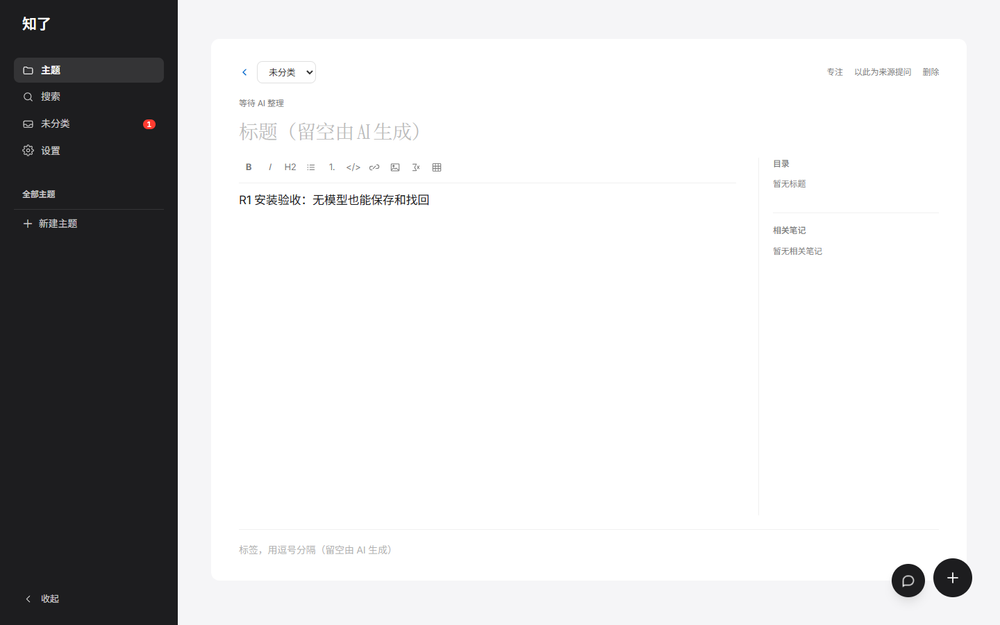
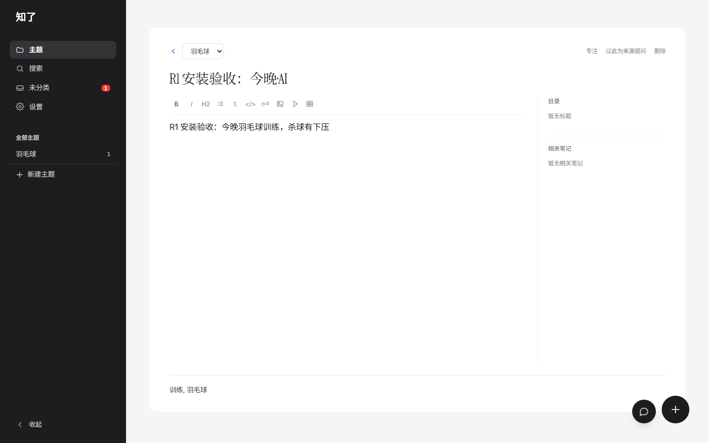
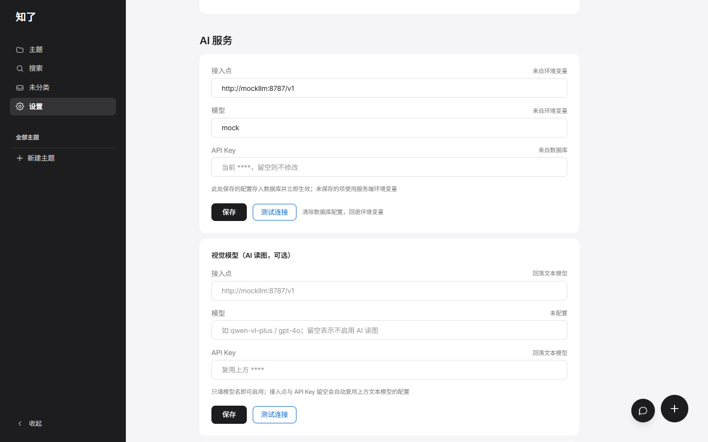
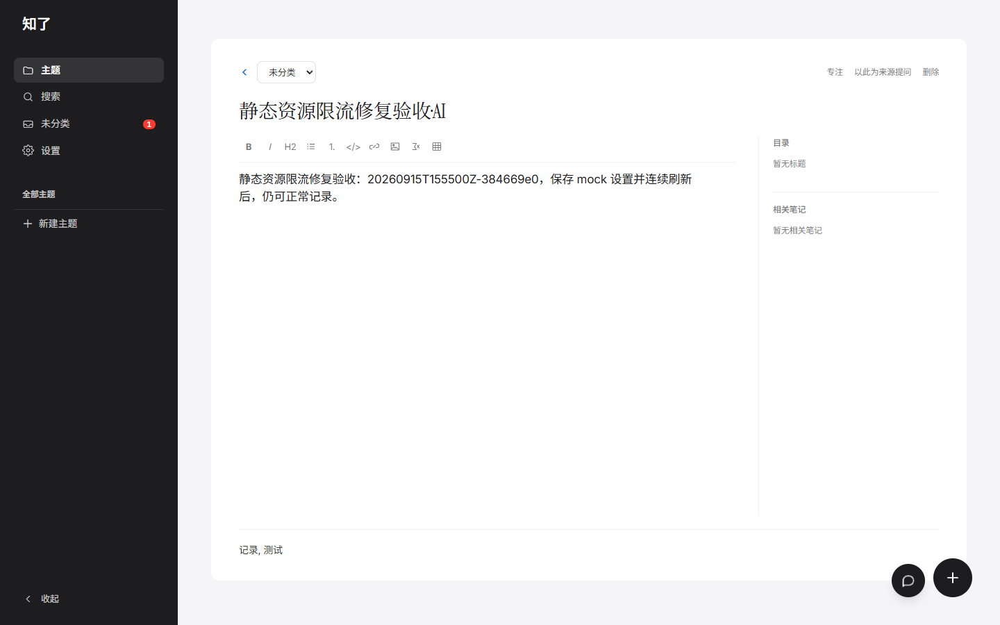

# R1 安装验收：0.6.1 本地候选

日期：2026-09-15，时间按北京时间说明。原安装轮次结论：**临时入口修正后的本机安装主流程通过；该轮原模板入口失败，浏览器异常待处理，R1 整体未关闭。**

同日后续：仓库入口配置已修复，默认 3210 端口的独立定向复验通过，见[第 8 节](#demo-ingress-repair)。下方原安装轮次与历史失败证据保留，浏览器异常及 R1 整体验收继续待完成。

2026-09-16 追加：静态资源请求限流已修复并完成局部 HTTP/浏览器复验，见[第 9 节](#demo-static-rate-limit-repair)。React #418 继续单独跟踪，R1 整体仍未关闭。

2026-09-16 后续：设置页备份时间的水合缺陷已复现并完成修复，13 项组件回归及目标文件 ESLint 通过，见[第 10 节](#settings-hydration-repair)。另行确认的一次候选构建、14 个生产页面场景及 10 张截图检查均通过，见[第 11 节](#settings-hydration-browser)；本专项验收完成，原现场归因仍有证据缺口，完整 R1 未关闭。

依据：[开源发布执行清单](产品规划/开源发布范围与执行清单-2026-09-13.md#r1-install)与用户已确认的[准备方案](R1安装验收准备-2026-09-14.md)。单 Agent，仅本机 mock。完成一次构建、隔离运行、真实浏览器操作、数据核对与清理，没有提交、推送、tag 或发布。

## 1. 候选与证据身份

| 项目 | 本轮事实 |
|---|---|
| 源码 | `main@f213761b795cc020be2122e27301fe4a7c5cf7a0` 加已有未提交工作区；包版本 0.6.1 |
| 快照 | 262 文件，运行后全部 SHA-256 保持；排除环境文件、凭据、正式数据、依赖及构建产物 |
| 旧证据复用 | 186 项旧源码 Demo 指纹再次吻合；9 月 14 日已核对的 66 份归档证据按原范围复用 |
| 平台 | Windows Docker Desktop 4.46.0；Engine 28.4.0，Compose 2.39.4，context `desktop-linux`；linux/amd64 |
| 镜像 | `zhiliao-r1:0.6.1-20260915-093206-7a7ba6b4`；由本轮源码副本构建，app/mock 共用实际 ID |
| Project | `zhiliao-r1-061-20260915-093206-7a7ba6b4` |
| 入口 | `http://127.0.0.1:3312`；普通应用模式 `DEMO_MODE=0`、`NODE_ENV=production` |
| 数据 | 两个新卷 `install_db`、`install_uploads`；临时 `notes/` 绑定 `/data/notes` |
| 浏览器 | 已安装的 Chrome 153.0.8010.36，独立配置目录，1440×900；保留真实 Cookie，未注入会话 |

完整身份：

```text
本地 image ID（不是 GHCR 发布摘要）:
sha256:8a8f2cd3ec1a26fc68bf04a2661f2306f09bba4b06ba9b1593d74b3f3953deb1

源码清单 SHA-256:
1de98911e22cfca248a709c92d247436d50c862baaa04cd947ea0bf0750cac0d

源码 ZIP SHA-256:
fb76293f0c3599e4f5bd142e5c771099606beb06b4556a1b968dc2c52d5d5614

构建解析的基础镜像:
node:22-bookworm-slim@sha256:83f487e0a63425e5b4d146fb5e5be574bcbe1b7b843d3ebafdd95eaf7767a7e5

复用的入口镜像:
nginx:1.30.4-alpine@sha256:dc5069ad14f19660b141b21236140b91656bf89bbc3e2417c70ae650cd66104c
```

9 月 14 日查询的 GHCR 0.6.1 镜像为 not found，未发现远端 `v0.6.1*` 标签；本轮复用该查询时点，不把本地构建写成分发已可获取。旧 Story 2.2 镜像没有用于代替当前候选。

## 2. 原入口失败与实际运行配置

第一次 `up` 在 21.328 秒内报告三服务健康，但宿主 HTTP 请求被拒绝。Docker 的 `HostConfig.PortBindings` 声明了 3312，`NetworkSettings.Ports["8080/tcp"]` 却为空；直连回环请求也失败，排除了仅由宿主 HTTP 代理造成的解释。

重新读取[旧 B2 网络报告](验收证据/story-2-2-runtime-b2-2026-09-12T11-48-30Z-network.json)，可见旧入口网实际为 `internal:false`，当前仓库 Compose 与静态测试则要求 `true`。准备阶段没有识别这处差异。因此，**原确认模板的入口验收失败**，旧 B2 的 passed 不能直接转记给当前配置。

仅在临时 `compose.r1.yml` 增加以下覆盖，以保留卷的 down/up 重建本轮环境；没有再次构建镜像：

```yaml
networks:
  ingress_net:
    internal: false
```

修正后入口实际发布为 `127.0.0.1:3312`。app/mock 仍只加入 `internal + isolated` 业务内网，没有发布端口或默认路由。Nginx 只挂载原只读配置，没有业务数据、模型密钥或会话密钥；这是旧 B2 已记录的入口网络形式。见[配置差异](验收证据/r1-install-20260915-093206-7a7ba6b4/compose-runtime-change.txt)、[最终解析配置](验收证据/r1-install-20260915-093206-7a7ba6b4/config-redacted.json)与[业务网络核对](验收证据/r1-install-20260915-093206-7a7ba6b4/runtime-business-isolation.json)。

所有 Compose 操作使用同一随机 project、独立 `r1.env`、临时目录和两份配置。启动参数为 `up -d --no-build --pull never --wait --wait-timeout 180`；持久化重建为 `down --timeout 15` 后再次 up；最终清理为 `down -v --timeout 15`。命令在清洁子进程环境中执行，实际参数与耗时分别保存在对应 JSON/日志中，辅助脚本归档供审阅。

仓库 Compose、静态测试和 Nginx 配置均未修改；本轮成功只适用于上述临时覆盖。后续修复应同步配置、相关断言和部署说明，再做定向运行验证。

## 3. 已完成的用户路径

| 步骤 | 实测结果 |
|---|---|
| 身份与空库 | app/mock 使用相同候选 ID；三服务健康，healthz 200，MCP initialize 为 0.6.1；新库 0 笔记、无模型设置，无 Demo 播种 |
| 真实登录 | 错误密码 401；本轮密码登录 200，页面可继续访问；`kb_session` 保留 Secure、HttpOnly、SameSite=Lax，未注入或改写 Cookie |
| 无模型保存 | 正文“R1 安装验收：无模型也能保存和找回”保存 201；点击保存至响应 177 毫秒；未配置模型不影响记录 |
| 找回与出口 | 搜索“安装验收”返回同一 ID，点击重开正文一致；SQLite、唯一 Markdown 副本和下载 ZIP 的正文一致，ZIP CRC 通过 |
| 本机 mock | 设置页创建“羽毛球”，仅配置 `http://mockllm:8787/v1`、合成 Key 和 `mock`；四组附加模型未配置 |
| 整理 | “R1 安装验收：今晚羽毛球训练，杀球有下压”保存 201；观察到 done，归入羽毛球，标签为训练/羽毛球，标题为“R1 安装验收：今晚·AI”，正文未改写；mock 日志匹配处理请求 |
| 重建持久化 | 保留卷重建后清除浏览器 Cookie 并重新登录；搜索、重开两条原笔记，ID、正文、已完成整理字段均保持；Markdown、上传卷合成标记和再次下载的 ZIP 通过核对 |

合成笔记 ID：无模型记录为 `ox6f52w66q7g9ldv1jt1am52`，羽毛球记录为 `mkh5swgf5bcho7oqg19vfbfz`。配置 mock 后，先前等待的无模型记录也完成整理；其正文继续保持。重建前后均为这两条笔记。





ZIP 核对：

| 下载 | 大小 | SHA-256 |
|---|---:|---|
| 无模型阶段 | 375 字节 | `a8e6b6c6537d35d75d180e250e4d8112a95bbd7f93f12d53fffdf4b92bf3dc10` |
| 容器重建后 | 861 字节 | `2d191025857784876acff04c8e6758a9aaf25079fcd01a2e79e2b60e878a3b20` |

下载 ZIP 不等于导回或恢复通过；上传卷标记只验证挂载持久化，不代表图片上传 API、图片展示或 HEIC 恢复。

## 4. 耗时与构建事实

| 观察项 | 耗时 |
|---|---:|
| 单次 Docker 构建，09:36:29–10:06:44 | 1,814.750 秒 |
| 其中 npm ci | 1,704.8 秒 |
| 其中 Next 生产构建 | 45.6 秒 |
| 入口修正后的三服务启动 | 16.922 秒 |
| 修正后服务健康至首条保存 | 150.998 秒 |
| 开始登录至首条保存 | 29.665 秒 |
| 持久化重建 down / up | 15.484 / 16.438 秒 |

构建上下文约 2.27 MB，记录到 1 个缓存命中步骤。npm ci 的主要等待发生在 `@next/swc-linux-x64-musl@15.5.23`：控制台长时间静默，但采样显示压缩包、解压文件和网络字节持续增长，最终安装正常结束。没有重建、换源、改依赖或修改系统代理。WSL 的 localhost 代理提示已记录，不能据此断定下载缓慢的根因。

上述首条保存观察满足本机“安装后 15 分钟”目标，但包含 Agent 操作停顿，不能推广为安装成功率或性能基准。构建下载、服务启动与页面操作分别统计，不充当无缓存预构建镜像下载证据。

## 5. 仍需处理的问题

1. **默认入口配置阻断（后续已修复）。** 原安装轮次的仓库 `ingress_net.internal:true` 与旧 B2 实际配置不一致，原模板没有发布宿主端口；当时仅作临时覆盖。后续已修复仓库声明并完成默认入口定向复验，见[第 8 节](#demo-ingress-repair)，不据此关闭完整安装验收。
2. **静态资源被限流（后续已定向修复）。** 保存模型设置后刷新、以及后续页面加载期间，共有 6 个静态脚本请求返回 503，与 Nginx `demo_req` 限流日志逐条匹配。首次导致 ChunkLoadError，mock 记录操作在提交前超时；同一脚本直连随后为 200，刷新后完成后续流程。限流参数保持 10r/s、burst 40。Playwright 的请求拦截会禁用 HTTP 缓存，本轮不推断普通缓存浏览器的发生率，也没有把恢复操作算成问题已修复。后续独立修复及证据见[第 9 节](#demo-static-rate-limit-repair)，原安装失败记录保留。
3. **React hydration 错误。** 设置页刷新出现一次 React #418，具体不一致字段尚未定位。后续路径完成不能代替该问题的修复与复验。
4. **构建提示待分诊。** npm ci 自带审计汇总为 37 项：34 moderate、2 high、1 critical；未区分生产/开发依赖或可达性，未运行 audit fix。编译还记录 libheif-js 动态 require、package.json 版本命名导入与 jose Edge Runtime API 警告。最终构建退出码为 0，不代表这些提示已经处理。

浏览器同时记录正常的错误密码 401、导航/下载取消请求和本轮主动阻断 Service Worker 的提示。页面请求记录中没有本轮 origin 之外的 HTTP 请求；模型配置、容器网络和 mock 日志共同限定本次本机 mock 范围。未重复执行旧 20 项网络对照、长时代理场景或完整来源问答。

## 6. 保护、清理与验证工具说明

同步文档前，原工作区 748 个文件、HEAD、索引、148 份环境/数据文件的哈希和 143 份数据文件元数据均未变化。既有 7 个容器、8 个卷、7 个网络的完整保护字段一致，旧镜像均保留。

本轮三容器、两卷、两网已按 project 与运行标签核对后删除，3312 释放，浏览器已关闭。临时目录限定为 `%TEMP%/zhiliao-r1-install-061-20260915-093206-7a7ba6b4/`；目录、凭据与浏览器配置的最终清理状态以[目录清理记录](验收证据/r1-install-20260915-093206-7a7ba6b4/cleanup-directory.json)为准。删除前验证绝对路径、系统 TEMP 父目录、运行标记、无重解析点及归档哈希。本地候选镜像、所有旧镜像、基础镜像与构建缓存保留。

本轮辅助工具有两处调整，原始记录保留：隐藏启动的浏览器驱动未收到 stdin，尚未访问应用时按已核实进程树关闭，改用显式管道；Docker inspect 的挂载列表顺序不稳定，初次保护比较误报，改为排序后比较完整挂载对象，没有忽略字段。两个调整都限于临时验收工具。

文档同步仅涉及本文、准备方案、文档索引、执行清单与候选 Release Notes；应用源码、仓库 Compose/Nginx、版本、旧证据、Story/Sprint、冻结规则及正式数据保持。文档编码、增量格式、代码围栏和新增相对链接检查，以及最终保护核对均单独留证。

本次没有另跑全量测试或四条发布门禁；只执行已确认 Docker 构建内的 npm ci、npm run build，以及本轮必要的局部数据/文档检查。无缓存分发获取、独立 Linux、ARM64、R2 恢复、完整核心闭环、RC、完整门禁、R3 发布及 Story 2.2 的剩余验收继续保留。

## 7. 证据入口

- [机器汇总](验收证据/r1-install-20260915-093206-7a7ba6b4/summary.json)、[构建身份](验收证据/r1-install-20260915-093206-7a7ba6b4/build.json)、[完整构建日志](验收证据/r1-install-20260915-093206-7a7ba6b4/build.log)。
- [源码清单](验收证据/r1-install-20260915-093206-7a7ba6b4/source-manifest.json)与[源码快照](验收证据/r1-install-20260915-093206-7a7ba6b4/source-snapshot.zip)：用于复核含未提交内容的候选身份。
- [入口差异](验收证据/r1-install-20260915-093206-7a7ba6b4/ingress-config-finding.json)、[最终实际端口](验收证据/r1-install-20260915-093206-7a7ba6b4/runtime-final-bindings.json)、[初始空库](验收证据/r1-install-20260915-093206-7a7ba6b4/initial-empty-db.json)。
- [浏览器步骤](验收证据/r1-install-20260915-093206-7a7ba6b4/browser-report.json)、[操作记录](验收证据/r1-install-20260915-093206-7a7ba6b4/browser-actions.jsonl)、[重建前服务日志](验收证据/r1-install-20260915-093206-7a7ba6b4/runtime-before-restart.log)。
- [无模型数据核对](验收证据/r1-install-20260915-093206-7a7ba6b4/data-without-model.json)、[重建前](验收证据/r1-install-20260915-093206-7a7ba6b4/data-before-restart.json)、[重建后](验收证据/r1-install-20260915-093206-7a7ba6b4/data-after-restart.json)。
- [文档同步前保护](验收证据/r1-install-20260915-093206-7a7ba6b4/preservation-before-documents.json)、[最终保护](验收证据/r1-install-20260915-093206-7a7ba6b4/preservation-final.json)、[文档检查](验收证据/r1-install-20260915-093206-7a7ba6b4/document-verification.json)。
- [脱敏辅助脚本](验收证据/r1-install-20260915-093206-7a7ba6b4/harness.zip)与[证据 SHA-256 清单](验收证据/r1-install-20260915-093206-7a7ba6b4/artifact-manifest.json)。辅助脚本含本机工具路径；合成 Key 字面量已替换，私有保护清单、密码、会话密钥与 Cookie 值不归档。重跑需重新准备独立环境，不能直接复用已清理目录。

<a id="demo-ingress-repair"></a>

## 8. 后续入口修复与定向验收（2026-09-15）

用户确认[入口修复规格](../_bmad-output/implementation-artifacts/spec-repair-demo-ingress-config.md)的收尾计划后，单 Agent 完成配置回归、一次独立入口冒烟及文档同步。本节只关闭该入口修复，不关闭 R1、Story 2.2 或发布验收。

仓库 `ingress_net.internal` 已设为 `false`；app/mock 继续仅加入 `demo_net`，其 `internal: true` 与 `gateway_mode_ipv4: isolated` 保持。独立 `.mjs` 检查已归并到既有 Vitest 测试，并修正 CLI 旧断言：Docker Compose 展开时会省略默认的 `false` 字段，测试接受 `false` 或未声明，禁止回到 `true`。

| 检查 | 本次结果 |
|---|---|
| 局部回归 | 两份配置测试 9 项通过、无跳过；强制 `REQUIRE_DOCKER_COMPOSE=1`，包含真实 Compose 解析、独立环境文件、缺失密钥和 project 隔离 |
| 局部 ESLint | `demo-compose.test.ts`、`demo-compose-cli.test.ts` 通过 |
| 输入边界 | 原样复制仓库 Compose 与 Nginx 配置；临时覆盖仅改变 app/mock 的本地镜像引用并添加归属标签，合并后的其他配置逐字段一致 |
| 镜像与平台 | 复用第 1 节同一个本地候选 ID `sha256:8a8f2cd3ec1a26fc68bf04a2661f2306f09bba4b06ba9b1593d74b3f3953deb1` 和固定 Nginx；Engine 28.4.0，Compose 2.39.4-desktop.1 |
| 实际入口 | 三服务健康；Docker 实际发布 `127.0.0.1:3210:8080`；通过回环直连 `/api/healthz` 返回 200、正文 `{"ok":true}`，本次请求耗时 9 毫秒 |
| 业务网络 | app/mock 无宿主端口，仅加入本次业务网络，均无默认路由；业务网 `internal + isolated`，入口网 `internal:false`；Nginx 语法检查通过 |
| 清理与保护 | 本轮 3 容器、3 卷、2 网及临时运行目录已清理，3210 释放；既有 7 容器、8 卷、7 网的受保护元数据及镜像列表未变，Compose/Nginx 运行前后指纹一致 |

运行时间为北京时间 23:06:38–23:07:17，三服务启动等待 17.290 秒；这些耗时是单次本机观察。Project 为 `zhiliao-ingress-repair-20260915t145944z-b56abe15`，凭据与三个业务卷均为本次新建。启动使用 `up -d --no-build --pull never --wait --wait-timeout 180`，归属核对后使用同一 project 的 `down -v --timeout 15` 清理。本轮没有构建、拉取、浏览器操作、全量测试或发布。

独立证据：[运行与清理报告](验收证据/demo-ingress-repair-20260915T145944Z-b56abe15/runtime.json)、[真实配置测试结果](验收证据/demo-ingress-repair-20260915T145944Z-b56abe15/vitest-results.json)、[临时覆盖](验收证据/demo-ingress-repair-20260915T145944Z-b56abe15/compose.runtime.json)、[脱敏解析配置](验收证据/demo-ingress-repair-20260915T145944Z-b56abe15/config-redacted.json)、[验收辅助脚本原文](验收证据/demo-ingress-repair-20260915T145944Z-b56abe15/runtime-harness.mjs.txt)。脚本按本次临时目录和保护快照执行，以文本归档供审阅；复验应重新准备运行标识、凭据与保护基线。

本次复用本地镜像，不证明 GHCR 0.6.1 已可获取或当前全部工作区源码已构建；业务网络配置与默认路由核对不替代原 20 项目标网络对照。静态资源 503、React #418、无缓存分发、独立 Linux、恢复、长时代理与公网/发布等既有未完成项继续保留，原失败证据不覆盖。

<a id="demo-static-rate-limit-repair"></a>

## 9. 静态资源限流修复与局部验收（2026-09-16）

用户确认[修复规格](../_bmad-output/implementation-artifacts/spec-repair-demo-static-rate-limit.md)及局部验收后，单 Agent 在现有工作区落地修复。`nginx/demo.conf` 使用规范化 `$uri` 生成请求限流 key：仅 `/_next/static/` 为空 key，不计入 `demo_req`；其他路径继续按来源地址执行 `10r/s`、`burst=40 nodelay`。所有路径仍受 `demo_conn 32` 限制，代理路径、转发头、正文上限和超时未改。

独立 project 为 `zhiliao-static-repair-20260915t155500z-384669e0`，入口为 `127.0.0.1:3313`，三个数据卷与凭据均为本轮新建。复用第 1 节的 R1 应用镜像及固定 Nginx 摘要；临时运行配置仅调整本地镜像引用、`DEMO_MODE=0`、回环验收端口和归属标签，其余解析字段与仓库 Compose 一致。app/mock 仅在 isolated 业务网，均无宿主端口和默认路由。该模式对应原安装失败场景，不是完整 Demo 能力边界复验。

| 检查 | 本轮结果 |
|---|---|
| 局部回归 | `demo-compose.test.ts` 20 项通过、无跳过；局部 ESLint 通过；旧、新配置的 `nginx -t` 均通过 |
| 真实静态样本 | 原 6 次失败涉及的 5 个脚本 URL，加真实 CSS 和字体；所有突发请求均携带查询参数，最多 6 并发，校验成功响应的正文 SHA-256 与类型 |
| 旧配置对照 | 100 次请求：41 次 200、59 次 503；59 次拒绝逐条匹配 `demo_req` 日志 |
| 修复配置 | 同样 100 次请求全部 200，正文哈希一致，无对应请求限流日志；随后健康接口为 200 |
| 动态保护 | 健康接口突发 100 次仍有 59 次 503；额度耗尽后 14 次真实静态请求全部 200 |
| 路径边界 | 页面、导入、上传、伪装为 `.js` 的 API、`/_next/image`、`/_next/data`、`/_next/staticx/`、大小写及 `..` 规范化等 10 组各 30 次请求仍受限；299 次 503 均匹配日志，另 1 次无参数 image 请求为正常 400 |
| 其他入口约束 | 未出现连接限流；普通请求 8 MiB、上传 25 MiB、导入 200 MiB 的超限长度声明均提前返回 413，每次仅发送 1 字节 |
| 浏览器 | Chrome 153.0.8010.36，独立新目录、真实登录、未注入 Cookie；保存 mock Key 后连续 3 次禁用 HTTP 缓存刷新设置页。两段浏览器记录共 215 次静态响应，全部 200，无 ChunkLoadError |
| 笔记保存与重开 | 保存 201；仅新建 1 条合成笔记 `el22x397om53jf1ah2wy56l9`，独立库只读核对正文一致，新浏览器会话真实登录后重开正文可见 |
| 清理与保护 | 本轮 3 容器、3 卷、2 网已清理，3313 释放；既有 7 容器、8 卷、7 网及镜像列表保持。工作区及临时目录的最终核对见下方证据 |

切换旧、新配置时只重建本轮 ingress，app/mock 的容器 ID 和启动时间保持。更换请求限流 key 后采用新入口进程初始化限流区；已有实例的应用命令见 [README](../README.md)。回退需恢复修复前的 Nginx 配置并同样重建入口，原静态限流故障也可能恢复。





工具调整保留原记录：首轮未从 HTML 找到字体，清理后改从 CSS 解析；临时重置命令出现 PowerShell 引号问题，重入保护阻止重复启动。浏览器首段误把仅返回 `{id}` 的创建接口当成完整笔记响应；保留已完成的设置刷新和 POST 201 证据，仅补做只读数据库核对及新会话重开，没有重复新建笔记。浏览器另有 1 条字体响应因后续导航而无法采集正文，保留原始采集错误，不计作正文哈希通过；HTTP 对照的 7 个样本正文校验均完成。

证据：[运行与清理](验收证据/demo-static-rate-limit-20260915T155500Z-384669e0/runtime.json)、[局部检查](验收证据/demo-static-rate-limit-20260915T155500Z-384669e0/local-checks.json)、[旧静态对照](验收证据/demo-static-rate-limit-20260915T155500Z-384669e0/old-static.json)、[新静态对照](验收证据/demo-static-rate-limit-20260915T155500Z-384669e0/new-static.json)、[动态额度耗尽后的静态请求](验收证据/demo-static-rate-limit-20260915T155500Z-384669e0/static-under-load.json)、[浏览器原始结果](验收证据/demo-static-rate-limit-20260915T155500Z-384669e0/browser-report.json)、[笔记读回](验收证据/demo-static-rate-limit-20260915T155500Z-384669e0/note-readback.json)、[工作区保护](验收证据/demo-static-rate-limit-20260915T155500Z-384669e0/preservation.json)、[目录清理](验收证据/demo-static-rate-limit-20260915T155500Z-384669e0/cleanup-directory.json)、[辅助脚本说明](验收证据/demo-static-rate-limit-20260915T155500Z-384669e0/harness/README.md)。

本轮仅关闭静态资源请求限流缺陷。React #418 本轮未出现，但未调查或修改，继续保留原独立待办。浏览器缓存被主动禁用，不能推断普通缓存浏览器的发生率；有界突发对照不是性能基准。未构建、拉取、运行全量测试或发布，不证明当前全部工作区源码已构建、GHCR 0.6.1 可获取或完整 R1 通过；原 Story/Sprint、恢复、无缓存分发及公网门槛保持。

<a id="settings-hydration-repair"></a>

## 10. 设置页备份时间水合修复与局部回归（2026-09-16）

用户确认[修复规格](../_bmad-output/implementation-artifacts/spec-r1-settings-hydration-418.md)后，单 Agent 完成代码、局部测试及文档同步。本阶段未获准运行新构建或真实浏览器；规格保持进行中，不关闭 React #418 的生产页面验收或完整 R1。

根因机制：设置页将备份时间戳直接交给依赖本地时区和当前日期的 `formatTime()`。服务端 UTC 与浏览器时区不同，或两次渲染跨午夜/跨年时，相同时间戳会输出不同文字。原日志中的备份早于故障刷新，后续静态限流复验的页面则明确显示“从未备份”。[调查记录](R1设置页刷新React418调查-2026-09-16.md)保留原快照比对、时间线和最小复现；原现场缺少首帧 HTML、组件差异、精确备份 mtime 与浏览器时区，不能把本次机制复现冒充原现场采样。

生产代码只修改 `src/app/(app)/settings/settings-panel.tsx` 的 `DataSection`：已有备份的服务端与浏览器首帧都显示时间占位 `—`，挂载后再显示浏览器本地时间；无备份继续显示“从未备份”，时间戳 0 作为有效时间。没有改共享 `formatTime`、设置页服务端取数、备份/API、数据库、依赖、版本或部署配置，也没有增加水合警告抑制。

| 检查 | 结果与范围 |
|---|---|
| 旧代码回归 | 同一测试文件 13 项：6 失败、7 通过；跨时区、跨午夜和跨年均捕获真实 `SettingsPanel → DataSection → span` 文本水合错误，原失败报告保留 |
| 修复后回归 | 13 项全部通过、无跳过；覆盖空备份、时间戳 0、跨时区/日/年、备份请求期间及成功/HTTP 失败/网络失败、设置保存和密钥输入清空 |
| 错误与首帧 | 水合用例同时断言无可恢复错误、无 console error/warn；首帧保留设置标题和备份按钮，仅时间使用占位 |
| 局部 ESLint | 仅设置组件及新增测试文件，2 文件均为 0 错误、0 警告 |
| 测试边界 | Vitest 4.1.10、jsdom、真实设置组件与时间函数；模拟 Next 导航、主题上下文及 fetch，单 worker 执行，测试后恢复时钟和时区 |

Vitest 输出了现有 `vitest.config.mts` 使用 `__dirname`、未来原生配置加载器不支持的兼容提示；未屏蔽该提示或改动配置。组件测试中的刷新只是验证 `router.refresh()` 被调用，不是实际 Next.js 页面刷新；这些结果不证明真实 HTTP 写入或生产浏览器通过。

证据：[旧代码失败报告](验收证据/r1-settings-hydration-repair-20260916/vitest-before.json)、[修复后报告](验收证据/r1-settings-hydration-repair-20260916/vitest-after.json)、[局部 ESLint](验收证据/r1-settings-hydration-repair-20260916/eslint.json)。可复跑命令见[调查记录第 6 节](R1设置页刷新React418调查-2026-09-16.md#6-验收与执行范围)。

下一步在确认后，用包含本次补丁且身份可核对的新候选，验证 UTC 服务端、UTC/Asia/Shanghai 浏览器、有/无真实备份、保存设置后的刷新和直接访问。旧本地镜像只保留作修复前对照。小屏占位与长日期排版、原事件归因、完整 R1、Story/Sprint、四条门禁和发布继续待验；不重复已有效的静态限流、网络或长时代理验证。

<a id="settings-hydration-browser"></a>

## 11. 设置页 React #418 本机生产页面复验（2026-09-16）

用户另行确认一次含补丁的候选构建和隔离浏览器复验后，本专项通过。单 Agent 使用新的源码快照、普通模式、独立凭据及三个命名卷，沿用已修复的入口与业务内网；正式数据未挂载。此结论覆盖备份时间水合缺陷及本机生产页面，完整 R1 仍未关闭。

运行标识为 `20260916T041726Z-9b7d27a9`，基线为 `f213761b795cc020be2122e27301fe4a7c5cf7a0` 加工作区。[263 文件源码清单](验收证据/r1-settings-hydration-browser-20260916T041726Z-9b7d27a9/source-manifest.json)的 SHA-256 为 `8474075a8140692fd38dc7369534d466f8422607710f31589fb938f3de9c0350`，新镜像 ID 为 `sha256:c54958650c37439cf5d734070be78ab56d6ca87f9dc5c85cd3d7b8dbcdba3548`。它是本机 `linux/amd64` 候选，没有发布到 GHCR。

| 检查 | 实际结果 |
|---|---|
| 一次候选构建 | 167.094 秒，退出码 0；`npm ci` 命中缓存，生产编译、构建内置 lint 与类型检查完成；原 libheif、版本命名导入和 jose Edge Runtime 提示保留 |
| 环境与登录 | Docker Engine 28.4.0、Compose 2.39.4；入口仅 `127.0.0.1:3316`，app 显式 UTC、普通模式，仅连接本机 mock；Chrome 153.0.8010.36 的三个全新目录均真实登录 |
| 空备份与真实备份 | 两时区共 4 个空备份场景显示“从未备份”；“立即备份”返回 200，API 时间戳与真实文件 mtime 同为 `1789533039853.4211`，备份 SQLite `quick_check` 为 `ok` |
| 首帧与时区 | 同一备份在上海显示 `12:30`、UTC 显示 `04:30`；已有备份的服务端文字均为 `—`，挂载后才本地化；保存设置后的刷新、直接访问与站内导航均通过 |
| 操作与密钥 | 两次设置 PATCH 成功，刷新后配置读回正确；密钥输入清空、页面无完整密钥；邻近的导出下载成功 |
| 浏览器结果 | 14 个设置页场景通过，包括 12 次文档加载和 2 次站内导航；页面错误、React #418、新水合警告均为 0；553 个构建静态资源响应均为 200 |
| 视觉与边界 | 10 张截图通过审阅：规范五个视口/主题组合、桌面/手机首帧占位、390px 浅/深色及 320px 长日期；时间和按钮无横向溢出，320px 下自然换行 |
| 资源与工作区 | 本轮 3 个容器、3 个卷、2 个网络已清理，新候选镜像保留；原 7 个容器、8 个卷、7 个网络内容未变。文档同步前 910 个工作区文件受保护，148 个正式环境/数据文件与元数据、HEAD、索引和 263 个候选源文件核对通过 |

浏览器明确禁用 HTTP 缓存并阻止 Service Worker。17 条阻止注册提示、26 条 fetch 取消和 1 条导出导航取消按原因保留，不冒充“所有控制台及网络事件为零”。两个首帧截图样本暂缓外部脚本，截图后放行并确认水合；长日期样本仅将浏览器 Date 固定到下一年，未修改服务端时钟或备份 mtime。这是 Chrome 视口模拟，未做手机真机或整站视觉验收。

验收辅助脚本的两次配置预检分别修正了 Compose 保留顶层标签锚点、以及省略默认 `internal:false` 的处理，均发生在启动容器之前。清理命令已成功，最初资源比较仅遇到一组 Mounts 数组顺序变化；保留原失败并按挂载目标排序后逐字段比较通过，没有再次删除资源。这些是辅助脚本问题，没有重建候选或重复浏览器场景。

证据入口：[说明与全部材料](验收证据/r1-settings-hydration-browser-20260916T041726Z-9b7d27a9/README.md)、[构建报告](验收证据/r1-settings-hydration-browser-20260916T041726Z-9b7d27a9/build.json)、[浏览器原始结果](验收证据/r1-settings-hydration-browser-20260916T041726Z-9b7d27a9/browser-report.json)、[视觉检查](验收证据/r1-settings-hydration-browser-20260916T041726Z-9b7d27a9/visual-review.json)、[运行及清理](验收证据/r1-settings-hydration-browser-20260916T041726Z-9b7d27a9/runtime.json)。

原现场缺失的浏览器时区与首帧差异仍不能事后补齐，备份时间仍是原事件的高可信解释；本轮确认的是已复现缺陷的修复与生产页面表现。其他页面的共享时间函数风险未扩展处理。没有重跑静态压力、网络矩阵、长时代理、全量测试或完整安装；独立 Linux、无缓存分发、R2 恢复、完整门禁、Story/Sprint 和发布保持独立。
