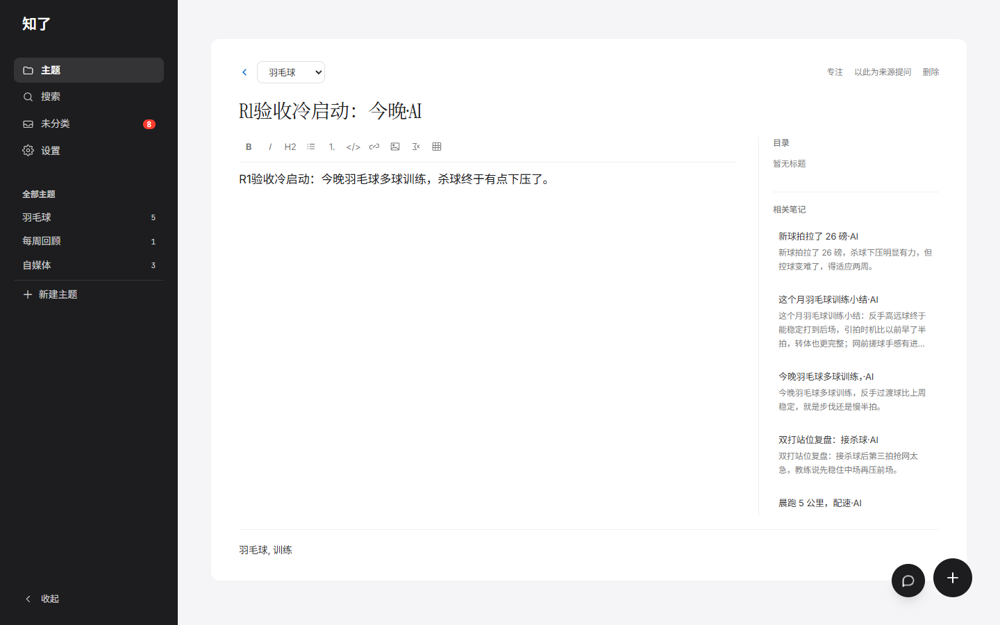
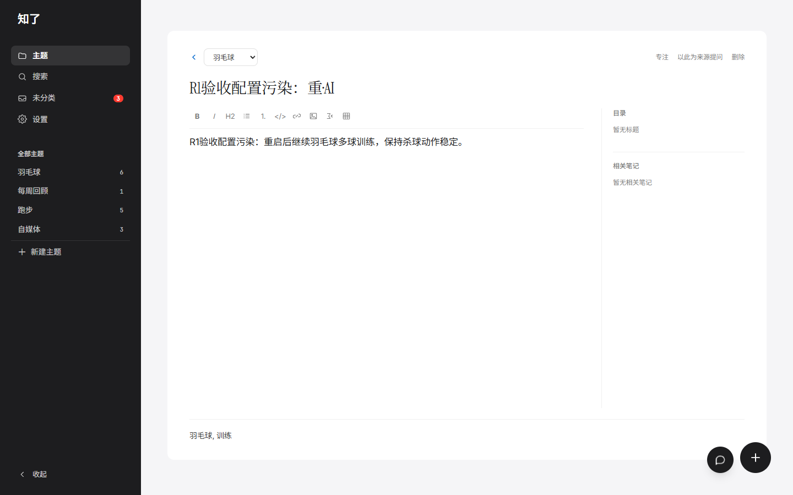

# R1 源码 Demo 接线验收（2026-09-14）

**结论：当前 0.6.1 候选通过 Windows 本机受控源码 Demo 验收。** 已实际执行原 `npm run demo`，完成登录、笔记整理、主题建议、搜索重开、受限接口和配置污染后的重启检查。该结论限定于本页环境与保护措施，不表示候选已经发布。

依据：[R1 规格](../_bmad-output/implementation-artifacts/spec-r1-source-demo-wiring.md)。用户先审核隔离目录、启动命令、浏览器步骤与清理范围，再明确同意执行；全程单 Agent，模型仅使用本机 mock。

## 候选与环境

| 项目 | 本次实测 |
|---|---|
| 身份 | `main@f213761b795cc020be2122e27301fe4a7c5cf7a0` 加当前未提交候选；不是新提交或 tag |
| 版本 | package 0.6.1；Node 22.19.0；Next 15.5.23 |
| 浏览器 | 本机 Chrome 153.0.8010.36，headless，1440 × 900，独立配置目录 |
| 副本 | `%TEMP%/zhiliao-r1-061-20260914T070442Z-5c531772/candidate` |
| 依赖 | 物理复制本机现有 `node_modules`，未安装、下载或升级依赖 |
| 入口 | 应用 `127.0.0.1:3311`；mock `127.0.0.1:8787` |
| 数据 | 副本内 `data-demo/db`、`uploads`、`notes` 和后台备份 |
| 排除 | 原 `.env*`、全部 `data*`、构建目录、Git 元数据和原日志 |

复制时核对 186 个运行文件的 SHA-256。运行期间 Next 为 `.next-r1` 自动调整了临时副本的 `next-env.d.ts`、`tsconfig.json`，其余 184 个文件保持原样；原工作区的类型配置没有改动。差异见 [generated-types.diff](验收证据/r1-source-demo-20260914T070442Z-5c531772/generated-types.diff)。

## 启动与隔离

在已准备的独立副本及清洁子进程环境中运行以下核心命令；实际由归档的 `start.ps1` 调用 `run-demo.ps1`，后者执行原 npm 脚本：

```powershell
Set-Location (Join-Path $r1Root 'candidate')
$env:PORT = '3311'
$env:NEXT_DIST_DIR = '.next-r1'
$env:NEXT_TELEMETRY_DISABLED = '1'
$env:NODE_OPTIONS = '--require "' + (Join-Path $r1Root 'local-only.cjs').Replace('\','/') + '"'
$env:DEMO_MODE = '0'
$env:DEMO_RUNTIME = 'r1-invalid'
$env:APP_PASSWORD = 'r1-host-canary'
$env:LLM_BASE_URL = 'http://127.0.0.1:18787/v1'
npm.cmd run demo
```

完整环境还为会话密钥、三个数据路径及五组模型注入合成冲突值，并使用空 npm 配置。启动器传给 Next 的实际值为 `DEMO_MODE=1`、`DEMO_RUNTIME=local`、固定 Demo 凭据、`./data-demo/` 三个路径，以及 `http://127.0.0.1:8787/v1`、`demo/mock`。没有创建副本内的假配置目录 `canary` 或默认正式目录 `data`。

`local-only.cjs` 只限制本轮监听与出站访问，记录请求目标，不替换模型目标或响应。应用与 mock 的实际监听均为 `127.0.0.1`；浏览器也只放行本轮应用入口。原启动器并未自行限定回环监听，**本次不能作为产品原生网络隔离通过的证据**。

发现 Next 开发模式会请求 `registry.npmjs.org` 查询版本。首次发现后已停服务、定位并留证；后续继续在请求发出前阻断该已知框架查询。冷启动及污染后重启各记录一次阻断，模型目标始终为本机 mock。此限制独立于 `NEXT_TELEMETRY_DISABLED`，不能据关闭遥测承诺完全不尝试外连。

启动器单次探测超时仍是既有待办。本轮外部启动等待预算为 180 秒，单场景观察预算为 60 秒，没有修改生产探测实现。首次有效启动耗时 50.080 秒；恢复浏览器通道并重建临时空库后为 13.641 秒，污染后重启为 15.038 秒；后两次复用了开发缓存，不是无缓存安装性能数据。

## 浏览器步骤与结果

| 操作 | 实测结果 |
|---|---|
| 登录 | 假宿主密码返回 401；`demo` 返回 200 |
| 保存普通笔记 | 返回 201，AI 状态为 done，自动归入羽毛球并生成标题、羽毛球/训练标签 |
| 正文与 Markdown | 冷启动及污染后新建的两条笔记，数据库正文和唯一 Markdown 副本均与输入一致 |
| 主题建议 | 显示跑步与下厨；采纳跑步后迁移 5 条，未分类从 8 变为 3，下厨建议保留 |
| 搜索与重开 | 输入“杀球”找到本轮笔记；点击后正文仍一致 |
| 客户端配置 | 页面 HTML 不包含本机/容器 mock 地址或假配置地址 |
| 重启持久化 | 重启前后 17 条笔记的 ID 集合完全一致，会话有效，没有重复播种 |
| 数据库污染 | 停服务后写入五组共 15 项假配置；重启后新笔记仍通过本机 mock 整理，四组附加模型保持未配置 |
| 浏览器状态 | 无页面脚本异常、无页面外连请求、无未解释的 HTTP 失败 |

初始演示笔记为 15 条，后台另生成 1 条每周回顾，再加两条本轮笔记，最终共 18 条。它们都是临时演示/合成数据，不计入真实笔记指标。





## 服务端防护

登录会话内完成八类入口、十二项方法检查，全部返回 `403` 与“体验模式不支持此操作”：

| 路径 | 方法 |
|---|---|
| `/api/settings/llm` | PATCH、DELETE |
| `/api/settings/tokens` | GET、POST、DELETE |
| `/api/export` | GET |
| `/api/backup` | POST |
| `/api/embedding/backfill` | GET、POST |
| `/api/import` | POST，226 字节有效 ZIP |
| `/api/llm/test` | POST |
| `/api/uploads` | POST，包含 90 字节有效 PNG 的 multipart |

ZIP 通过 CRC 检查，PNG 通过完整解码。请求前后 21 张表的内容哈希及排除活动 SQLite 主文件、WAL/SHM 后的 17 个数据文件哈希一致，未产生业务副作用。HTTP 观察不能证明服务端完全没有消费正文；这一实现细节继续复用规格中已有的局部回归证据。

设置页仍可看到部分受限表单和按钮，本次以实际服务端 403 为判断依据，不宣称所有入口已隐藏。`deferred-work.md` 中其他 Demo 路径边界和探测超时待办保持。

## 过程异常与证据解释

- 临时 PowerShell 脚本增加 UTF-8 BOM 以兼容 PowerShell 5.1；`NODE_OPTIONS` 使用正斜杠，修复辅助脚本路径解析。第一次失败发生在应用启动前。
- MCP 浏览器工具通道关闭后，改用本机已有 Playwright 和 Chrome；未安装新工具。首次成功启动与后续浏览器运行分别归档。
- 一次浏览器定位器误用了编辑页没有的控件名称；改按实际无名称的 combobox 核对，未重建笔记。另一处辅助代码把 Fetch 的 `status` 属性当作方法，修正后完成全部十二项请求。
- 上传夹具在实际请求前重新生成为可完整解码的 PNG。上述调整均在验收辅助代码中，未改业务实现。

这些中断及首次框架外连阻断均保留，不写成候选业务失败，也不从记录中删除。

## 保护、清理与验证边界

运行验收结束、同步文档之前：原工作区 687 个文件、HEAD 和索引未变；51 份环境/数据库文件的哈希与 143 份数据文件的元数据均一致。来源清单仅用于本轮私有临时核对，已随临时目录删除；公开证据只保留核对数量与结论。

服务已按本轮 PID 和创建时间关闭，浏览器独立会话已关闭，3311/8787 已释放。本轮临时副本、复制依赖、数据库、浏览器配置、缓存、夹具、辅助脚本及私有保护基线均已清理；最终核对结果见本页末尾。

本次复用 R1 实现阶段的局部回归；不将旧阶段的 77 项、64 项或配置层 18 项相加作为一次新测试。容器/非法标记回退及正式模式语义仍按原局部证据解释。本机 mock 只证明流程，不证明真实模型效果。

未执行 build、全量测试、Docker、无缓存安装、升级/恢复、镜像发布或公网验收。R1 安装、完整核心闭环、R2、R3 发布准备和 Story 2.2 的其余门槛保留；Story/Sprint、版本号、冻结块和历史记录不推进。

## 证据入口

- [机器汇总](验收证据/r1-source-demo-20260914T070442Z-5c531772/summary.json)：运行环境、实际参数、浏览器结论、请求目标与限制。
- [浏览器记录](验收证据/r1-source-demo-20260914T070442Z-5c531772/browser-report.json)：完整步骤和 HTTP 状态，不保存 Cookie 或 Token。
- [业务副作用核对](验收证据/r1-source-demo-20260914T070442Z-5c531772/boundary-sideeffects.json)、[数据核对](验收证据/r1-source-demo-20260914T070442Z-5c531772/data-checks.json)、[原工作区保护](验收证据/r1-source-demo-20260914T070442Z-5c531772/preservation-before-documents.json)。
- [辅助脚本与夹具归档](验收证据/r1-source-demo-20260914T070442Z-5c531772/harness.zip)：用于审阅本轮保护和操作方式；包含本机工具路径，重新使用前需按实际环境准备。
- [证据 SHA-256 清单](验收证据/r1-source-demo-20260914T070442Z-5c531772/artifact-manifest.json)。日志已归一化为 UTF-8/LF，并脱敏验收目录和开发服务横幅中的宿主地址。

## 收尾结果

文档局部复验 `npx --no-install vitest run tests/docs/first-use-guide.test.ts --maxWorkers=1` 为 **1 个文件、8 项通过**，定向 ESLint 通过。10 份本轮文档/测试文件的 UTF-8、LF、代码块和新增行格式检查通过，新增相对链接目标存在。两条命令均使用现有依赖并开启 npm 离线模式。Vite 关于未来 native 配置加载器与 `__dirname` 的提示已保留，不影响本次用例结果；详见[文档复验](验收证据/r1-source-demo-20260914T070442Z-5c531772/document-verification.json)。

同步文档后，原 687 个文件中仅批准的 9 个文件变化，其余 678 个哈希不变；范围外变动和新增均为 0。HEAD、索引、51 份环境/数据库文件、143 份数据文件，以及冻结块、已发布 CHANGELOG、既有规格和 Story/Sprint 记录保持，见[最终保护核对](验收证据/r1-source-demo-20260914T070442Z-5c531772/preservation-final.json)。

核对运行标记、绝对路径、系统 TEMP 归属和目录内无重解析点后，已删除 `%TEMP%/zhiliao-r1-061-20260914T070442Z-5c531772`。清理前后均无本轮残留进程，3311/8787 无监听；原归档的 62 份运行证据在清理前已逐项核对 SHA-256。见[清理结果](验收证据/r1-source-demo-20260914T070442Z-5c531772/cleanup.json)。证据清单已随收尾记录刷新。
