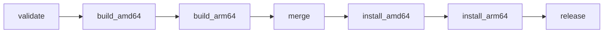

# R3 门禁 4：RC 前最小补丁草案

状态：**已准备，未应用，未运行测试或工作流校验器**。接续[最终候选收口与 RC 执行单](../../R3门禁4最终候选收口与RC执行单-2026-09-29.md)。用户要求保持单 Agent、仅准备、不提交/推送/重验证/发布，因此本目录提供可审阅补丁，不改实际工作流与发布材料。

## 补丁与影响范围

[proposed.patch](proposed.patch)包含 6 个目标文件；[targets.json](targets.json)记录当前工作树原始字节哈希、拟应用后的 UTF-8/LF 哈希及补丁哈希。它基于当前含未提交结果文档的工作树，不能按旧 HEAD 直接套用。应用前任何目标哈希变化均停止重审，不采用模糊匹配、三方合并或忽略空白强行应用。

[snapshot.json](snapshot.json)另存本次完整未提交准备快照，排除自身哈希；上一轮 `docs/r3-gate4-rc-preparation-inputs-20260929.json` 保留原字节，只作为历史快照。两者均不构成提交授权。

| 文件 | 具体变化 |
|---|---|
| `.github/workflows/release.yml` | 将 build/install 两个矩阵展开为四个原生 job，通过 needs 成功依赖严格串行；保留原步骤、权限、超时、artifact 名称、初始化路径和清理 |
| `tests/config/release-gate4.test.ts` | 两平台逐一检查路径、runner、缓存、匿名存储和清理；增加依赖链及禁止 job/step 容错绕过的守卫 |
| `tests/config/release-version.test.ts` | 调整旧 build 矩阵引用，继续守卫版本检查前置、双架构与原 CI 四条完整门禁 |
| `CHANGELOG.md` | 首段拟定为 `## [0.6.1] - 2026-09-29`，说明是 RC 前材料定稿日期；历史段落不删改 |
| `docs/releases/v0.6.1.md` | 改为 RC/正式版本共用说明，所有既有验收标为 RC 前基线，不预写新 SHA、digest 或发布成功 |
| `CONTRIBUTING.md` | 说明成功依赖、失败跳过及取消时清理不保证完成的边界 |

日期 2026-09-29 是本次拟批准的材料日期；若维护者选择其他日期，应在应用和锁定最终提交前修订补丁，不在 RC 后为改日期新增发布提交。应用基础版本、MCP 版本、Compose、普通安装入口、验证脚本、依赖及业务源码均无变化。

## 依赖与失败行为



实际 needs 还显式保留 validate → build_arm64、两个 build → merge，以及 merge/两次 install → release。所有 job 使用 GitHub 默认成功条件，不加 `always()` 或 `continue-on-error` 绕过前置失败。已启动 job 内原有清理及 artifact 上传的 `always()` 保留。

| 失败位置 | 必须停止的后续行为 |
|---|---|
| validate | 不启动任一构建 |
| build_amd64（包括证据上传失败） | 不启动 arm64 构建、manifest、安装或 Release |
| build_arm64 | 不执行 manifest、安装或 Release；amd64 已推送 digest 如实保留 |
| merge | 不启动安装或 Release；已写 RC 标签可能存在，不能自动回滚 |
| install_amd64（包括清理/上传失败） | 不启动 arm64 安装或 Release |
| install_arm64 | 不创建 Release |
| 取消/超时 | 后续成功依赖不放行；强制取消时清理和证据可能不完整，按未确认记录 |

选择展开 job，是为了直接表达成功依赖，避免新增 reusable workflow 的入口、权限传递和 artifact 接口。代价是两平台步骤重复；配置测试须覆盖两份，不能只检查第一个 build/install。未来若调整流程，两平台需同步修改。本次不做无关抽象重构。

资源预算沿用执行单：构建各 60 分钟（构建步骤 45 分钟）、安装各 15 分钟，原生平台各构建一次；未增加 runner 数量、构建次数或付费资源。job ID 改名属于维护者可见变化，旧运行记录仍使用旧 ID，不重写历史。

## 已做与未做的检查

已做：读取原工作流、两个配置测试及发布文档；串行审阅差异；`git apply --check` 检查补丁可应用，**没有应用补丁**。草案生成时发现矩阵块移除的缩进问题，已修正生成结果后再次只读检查。原工作流、两个测试及材料文件按 targets 的 before 哈希保持。

未做：Vitest、ESLint、actionlint、版本校验、完整门禁、Docker、远端查询、Actions 或发布。补丁适用性检查不是 YAML/Actions 语义通过，也不能把原 64 项局部成绩或 V3 CI 记为本补丁成绩。

## 待确认的本地实施与局部检查

建议下一步仅批准以下范围；本轮不执行：

1. 核对补丁与 6 个目标文件哈希后应用，按 after 哈希核对；保留旧证据与未提交结果。将规格、候选定稿、环境计划、执行单和索引中的当前状态同步为“已本地实施，真实 R 未执行”，不修改冻结块或关闭门禁。生成新的候选准备清单，保留上一轮快照。
2. 在不含正式数据的隔离副本中，串行运行这两份配置测试及目标 ESLint，复用现有依赖，不安装/升级依赖：

   ```powershell
   node node_modules/vitest/vitest.mjs run tests/config/release-gate4.test.ts tests/config/release-version.test.ts --maxWorkers=1 --no-file-parallelism
   node node_modules/eslint/bin/eslint.js tests/config/release-gate4.test.ts tests/config/release-version.test.ts
   ```

3. 用已留证的 actionlint 1.7.7 校验 `.github/workflows/release.yml`，选项沿用 `-shellcheck= -pyflakes= -no-color`。先核对本地工具与旧来源哈希；不可用就报告，不自动下载、换版本或改用普通 YAML 解析冒充通过。
4. 运行 `npm run check:version`、`npm run check:version -- --tag v0.6.1-rc1`。这是材料校验，不创建 tag。任何命令失败立即停止，保存失败和未执行项，不自动重试或扩大修复。
5. 将本次检查存入新的独立证据目录，保存确切输入和实际数量，不预填通过数。建议每个检查命令上限 120 秒、整个局部检查阶段 10 分钟；不运行 build、全量测试、PowerShell 安装预览全组或真实容器。

验收标准：两种架构均受相同守卫保护，依赖顺序不可被容错绕过；原 artifact/匿名/无缓存/清理条件保留；材料不误报已发布；局部检查实际通过并独立留证。只有完成后才能准备最终候选提交 F；main、tag、GHCR、远端 CI 和 Release 继续另行确认。

确认依据是项目 [AGENTS.md](../../../AGENTS.md) 的“中等及以上复杂改动在获得确认前不得进入实现”，以及本次“仅准备、不重验证”的范围。BMad 的继续实现与验证指示不扩大用户授权。
