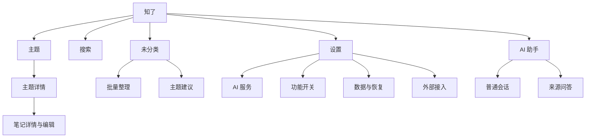
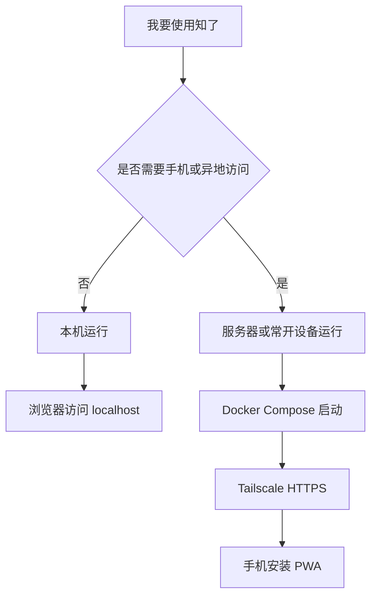
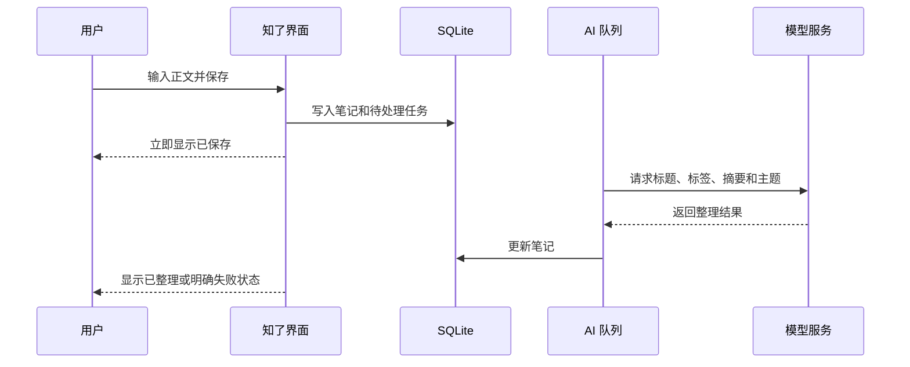
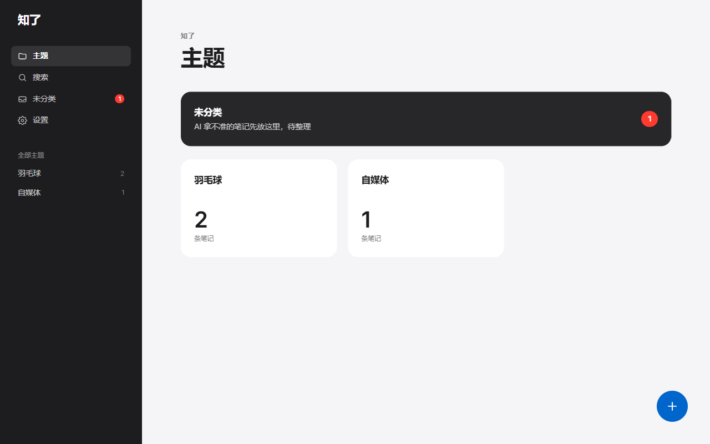
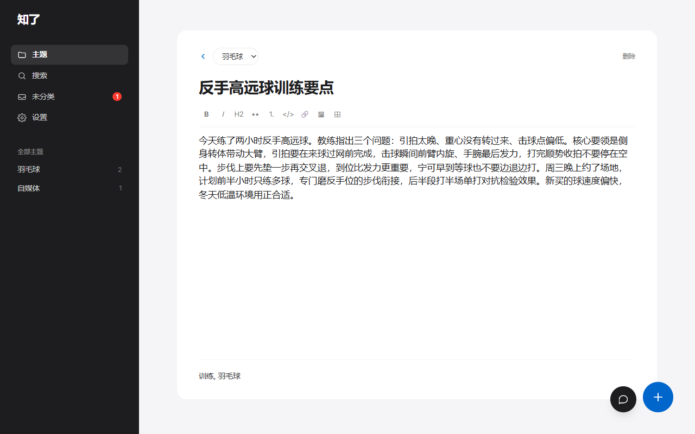
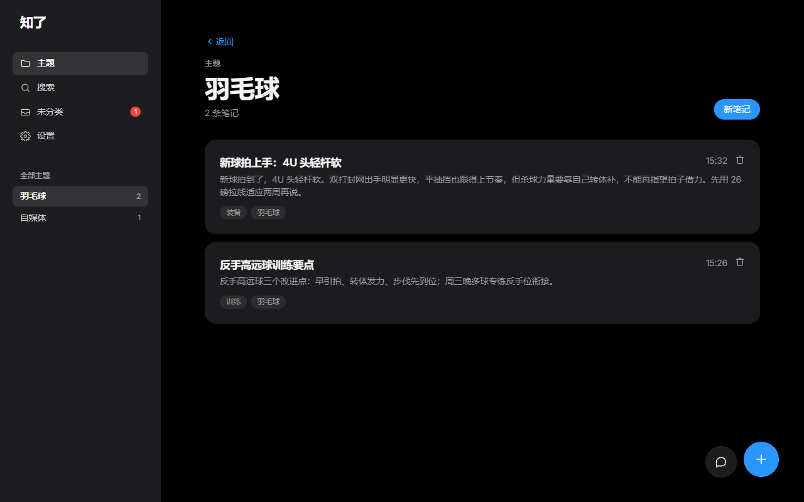
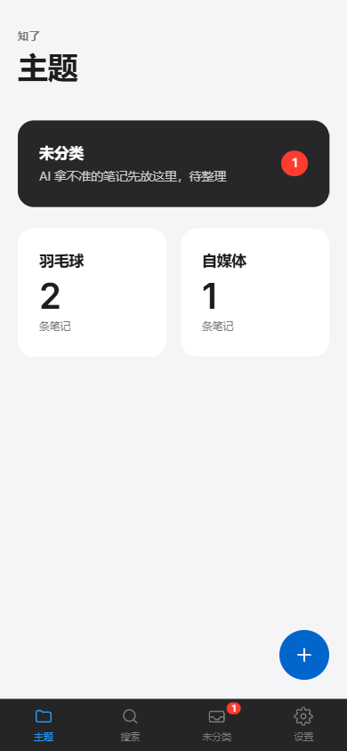

# 知了产品视觉 PRD

版本：v1.0  
日期：2026-08-30  
对应产品基线：知了 v0.6.0  
目标读者：产品负责人、设计人员、项目决策者、研发负责人  
状态：已完成两轮规划审计；候选功能仍需按冻结规则单独批准

## 一、结论先行

知了的产品方向不需要重做。它已经具备个人 AI 知识库的完整核心：记录、AI 整理、主题管理、关键词与语义搜索、严格来源问答、助手读写、备份恢复、Markdown 导入导出、外部捕获、PWA 和 Docker 部署。

下一阶段的核心命题不是“再增加什么 AI 功能”，而是：

> 让一个不了解技术的用户知道该选哪种运行方式，完成第一次真实记录，并在之后可靠地找回、引用和带走自己的内容。

产品一句话定义：

> 知了是一款单用户、自托管的 AI 个人知识库。它帮你随手记、自动整理、自然语言找回，并在问答时给出真实来源。

产品差异化：

1. 不是企业文档问答平台，而是个人日常记录工具。
2. AI 负责整理和取用，不替用户接管正文。
3. 来源问答只依据选定笔记，资料里没有就明确说没有。
4. 数据持续落为 Markdown，离开产品后仍然可读。

## 二、规划前提

### 2.1 已有能力

当前产品已实现：

- 主题和未分类。
- Markdown 所见即所得笔记。
- AI 自动标题、标签、摘要和主题归类。
- BM25 与 Embedding 混合检索。
- 长笔记分块与最高分块召回。
- 全局 AI 助手、工具调用、操作卡片和撤销。
- 来源集与严格接地问答。
- 相关笔记和冲突提示。
- 手机捕获 API、只读 Knowledge API 和 MCP。
- Markdown 增量导出、zip 导入、备份和回收站。
- 浅色、深色、跟随系统。
- Docker、本机运行和 PWA。

### 2.2 当前约束

- 真实笔记达到 100 条前冻结所有新功能。
- 缺陷修复、文档、分发、部署和运维可以继续。
- 产品保持单用户、自托管，不做注册、多用户和 SaaS。
- 应用依赖 Node.js 长驻进程，不能部署到 Vercel 等 serverless 平台。
- PWA 只有离线兜底页，不支持离线记录和回网同步。
- Windows Docker Desktop 需要命名卷保存 SQLite 数据。

### 2.3 本 PRD 的权限边界

本 PRD 用于统一产品方向，不自动授权实现所有候选功能。凡涉及新页面、新持久化状态、新数据表或新内容类型，仍需按现有 Issue 和冻结规则单独决策。

## 三、目标用户

### 3.1 核心用户

**个人知识工作者**

- 在学习、工作或兴趣中持续记零散内容。
- 不想先设计复杂目录，再开始记录。
- 经常记得“我写过”，却想不起原话和位置。
- 希望 AI 能帮忙整理，但不愿把数据交给不透明平台。

典型任务：

- 随手记下一个想法、经验或资料摘要。
- 让 AI 自动归入主题，不因分类焦虑放弃记录。
- 用与原文不同的说法找回旧笔记。
- 只依据选定笔记提问，并打开真实来源核对。
- 在本机、家中服务器或云服务器运行。
- 随时导出 Markdown 和图片，迁移到其他工具。

### 3.2 次要用户

**愿意自托管但不熟悉运维的用户**

- 能按步骤操作，但不理解 Docker、SQLite、PWA、Tailscale 等术语。
- 需要明确的选择题、成功标志和故障排查路径。
- 不应被迫先理解整个技术栈。

### 3.3 非目标用户

- 需要团队协作、成员权限、审批和审计的企业。
- 需要公开知识库 SaaS 或客服机器人平台的团队。
- 需要完整白板、数据库、块编辑器或知识图谱的用户。
- 需要完全离线移动端编辑和多端冲突同步的用户。

## 四、产品目标与非目标

### 4.1 目标

| 编号 | 目标 | 判断方式 |
|---|---|---|
| G1 | 用户能判断本机运行还是服务器运行 | 首次阅读 5 分钟内能选出路径 |
| G2 | 用户能完成第一次真实记录 | 安装完成后 15 分钟内保存首条真实笔记 |
| G3 | 用户能看到 AI 整理结果或明确降级原因 | 不出现“没反应但不知道为什么” |
| G4 | 用户能用自然语言找回内容 | 搜索任务能打开正确笔记 |
| G5 | 用户能完成一次有来源的问答 | 回答含有效笔记引用，或明确资料不足 |
| G6 | 用户相信数据可恢复、可迁移 | 完成一次备份恢复或导出导入演练 |
| G7 | 产品形成持续记录行为 | 手机捕获启用后完成 7 日真实使用观察 |

### 4.2 非目标

- 不在冻结期建设完整首次使用向导。
- 不在冻结期新增自动行为埋点系统。
- 不在冻结期建设 PDF、Word、PPT、网页统一文档中心。
- 不在冻结期建设 Electron 或 Tauri 桌面壳。
- 不新增 Workspace、成员、角色、权限和组织。
- 不建设 Agent 工作流画布、知识图谱、白板和数据库视图。

## 五、App 形态

知了使用同一套 Web 应用覆盖本机、服务器和手机，不维护三套产品。

| 使用场景 | 当前推荐形态 | 用户看到的 App 体验 | 关键限制 |
|---|---|---|---|
| 只在一台电脑使用 | 本机 Node 或 Docker，浏览器访问 | 可固定到任务栏，也可安装为浏览器 App | 电脑关闭或休眠后不可访问 |
| 电脑和手机都要用 | 家中常开设备、NAS 或云服务器 + Docker | 电脑浏览器使用，手机安装 PWA | 需要 HTTPS，推荐 Tailscale |
| 公开体验 | 后续独立 demo 容器；当前采用个人免费自托管试用 | 自有设备使用已发布版本，本地 mock 可了解流程 | 公网后移，原隔离与上线验收保留；mock 不证明真实模型效果 |
| 原生桌面安装包 | 证据驱动候选 | 双击安装、托盘常驻 | 当前未实现，不得对外宣称已有 |

### 5.1 对外说明口径

可以说：

- “可在自己的电脑或服务器运行。”
- “手机可添加到主屏幕，当 App 使用。”
- “数据保存在你自己的设备上。”

不可以说：

- “完全离线 App。”
- “已有 Windows/macOS 原生客户端。”
- “手机断网也能继续记录并自动同步。”

## 六、产品原则

1. **先记下来，再谈整理。** 记录路径必须比分类路径短。
2. **主题是导航，不是负担。** AI 拿不准时进入未分类，不阻塞保存。
3. **搜索和问答是两件事。** 搜索用于找笔记，来源问答用于在明确边界内得出回答。
4. **AI 能写库，但不能覆盖正文。** 不可恢复的操作不能交给模型。
5. **失败必须可见。** 模型未配置、任务失败、向量过期、来源过大都要明确说明。
6. **默认界面只保留记、找、用。** 手写、生图、Mermaid、深度思考继续默认关闭。
7. **数据出口不是附加功能。** 保存、备份、导出、导入和恢复共同构成信任。

## 七、信息架构

冻结期保持现有一级导航，不因竞品调研改名或扩张。



### 7.1 桌面结构

```text
┌──────────────┬──────────────────────────────┬──────────────────┐
│ 近黑侧栏     │ 羊皮纸主内容                 │ AI 助手第三栏    │
│ 主题         │ 页面标题                     │ 会话历史         │
│ 搜索         │ 列表、编辑器或设置           │ 回答与引用       │
│ 未分类       │                              │ 输入卡           │
│ 设置         │                              │                  │
└──────────────┴──────────────────────────────┴──────────────────┘
```

助手打开时推窄正文，不覆盖正文。侧栏和助手都保持一屏高度，分别滚动。

### 7.2 移动结构

```text
┌──────────────────────────────┐
│ 页面标题                     │
│ 主内容                       │
│                              │
│                    快速记录  │
├──────────────────────────────┤
│ 主题   搜索   未分类   设置  │
└──────────────────────────────┘
```

AI 助手和来源选择器在手机端使用全屏层。快速记录继续进入整页，避免软键盘挤压小浮层。

## 八、核心用户流程

### 8.1 运行方式选择



冻结期交付形式是文档决策树和成功检查，不新增持久化向导。

### 8.2 第一次真实记录



### 8.3 找回内容

1. 用户进入搜索。
2. 输入与原文不同的自然语言描述。
3. 系统使用 BM25 和可用的向量结果融合。
4. 用户查看标题、摘录、主题和标签。
5. 用户打开真实笔记，而不是停留在 AI 摘要中。

### 8.4 来源问答

1. 用户选择若干笔记或主题作为来源集。
2. 系统在会话顶部持续显示来源边界。
3. AI 只读取来源集内容，长文可按需继续读取后面的正文。
4. 回答中的引用链接必须对应真实笔记 ID。
5. 来源中没有答案时明确显示“来源笔记中没有相关内容”。
6. 来源过大或模型不支持工具时显示降级原因；尚未读完时说明无法确认，不能把未读到当作来源里没有。

### 8.5 数据信任

1. 每次笔记变更持续导出 Markdown。
2. 每日备份数据库和图片。
3. 用户可手动立即备份。
4. 用户可导出 zip，并原样导回。
5. 产品文档必须引导完成一次真实恢复演练，而不只看到“备份成功”。

## 九、当前视觉基线

设计判断：面向个人知识工作者的编辑器优先型 App，视觉安静、工具化、接近 Apple 与 Notion 的克制语言，但不是 Apple 商店营销页。

设计参数：

- `DESIGN_VARIANCE: 4`
- `MOTION_INTENSITY: 3`
- `VISUAL_DENSITY: 6`

### 9.1 当前界面

| 首页 | 笔记编辑器 |
|---|---|
|  |  |

| 主题页深色 | 手机端 |
|---|---|
|  |  |

截图可能早于部分现有功能，视觉 token、组件、交互和验收细节以 [UI 规范](../UI规范.md) 为准；源码用于核对当前实现事实。

### 9.2 色彩

| 语义 | 亮色 | 暗色 | 用途 |
|---|---|---|---|
| 页面底色 | `#f5f5f7` | `#000000` | 主画布 |
| 内容面 | `#ffffff` | `#1c1c1e` | 编辑器、卡片、设置区块 |
| 填充面 | `#f5f5f7` | `#2c2c2e` | chip、代码块、气泡 |
| 主文字 | `#1d1d1f` | `#f5f5f7` | 标题和正文 |
| 辅助文字 | `#7a7a7a` | `#98989d` | 摘要、时间、说明 |
| 行动蓝 | `#0066cc` | `#2997ff` | 链接、焦点和明确行动 |
| 主题不变 chrome | `#1d1d1f` | `#1d1d1f` | 桌面侧栏和助手入口 |
| 危险色 | `#ff3b30` | `#ff453a` | 删除、错误、未分类计数 |

规则：

- 不新增 AI 紫色渐变。
- 不使用彩色仪表盘。
- 不在内容区使用裸 `bg-white`、`bg-black` 或任意语义色。
- 状态不能只靠颜色区分。

### 9.3 字体与字阶

- 正文和 UI：Inter Variable + Noto Sans SC Variable。
- 页面大标题：Instrument Serif + Noto Serif SC Variable，仅用于 24px 以上。
- 元信息和数字：JetBrains Mono Variable。
- 六级字阶固定为 34、22、17、15、13、11px，不继续增加随意字号。
- 新增或修改界面的字母间距统一为 0，不新增负字距或营销式超大标题；现有负字距作为兼容债务增量收敛。

### 9.4 圆角与容器

- 卡片和弹层：12px。
- 按钮、输入和小容器：8px。
- 标签、筛选和内联代码：4px。
- `rounded-full` 只用于圆形 FAB、圆形图标按钮和计数角标。
- 页面区块不套成一层层浮动卡片。

### 9.5 动效

- 只使用状态反馈、打开关闭和轻微按压反馈。
- 不做持续漂浮、视差和装饰性滚动动画。
- 尊重 `prefers-reduced-motion`。
- 动效不得改变固定工具栏、输入区和列表的稳定尺寸。

## 十、页面规格

### 10.1 登录页

目标：让用户知道自己正在进入私有实例，而不是注册 SaaS 账号。

必须包含：

- 产品名“知了”。
- 单个密码输入框。
- 登录错误和限流提示。
- demo 模式下明确显示演示密码和数据会重置。

不包含：注册、忘记密码、社交登录和企业 SSO。

### 10.2 主题首页

```text
知了
主题                                      [新建主题]

[未分类 3]
AI 拿不准的笔记先放这里，待整理

羽毛球          24      嵌入式开发       38
写作            12      每周回顾          8
```

要求：

- 未分类始终置顶，暗色瓷砖作为唯一强焦点。
- 普通主题高密度排列，一屏能扫描多个主题。
- 空库只给一句说明和一个明确行动。
- 不在首页加入虚假的活跃指标或营销式卡片。

### 10.3 快速记录与新建笔记

目标：最少决策地保存一条内容。

要求：

- 正文是第一焦点，主题可选。
- 保存成功立即反馈，AI 整理异步进行。
- 草稿在桌面浮层关闭后保留，保存成功才清空。
- 手机端使用整页。
- AI 未配置时仍允许保存，并明确显示“待整理”。

### 10.4 主题详情

目标：浏览该主题下的笔记并继续记录或提问。

要求：

- 显示主题名、笔记数量、新建笔记和“以此为来源提问”。
- 笔记列表显示标题、摘要、标签和更新时间。
- 主题改名和删除不抢占主要阅读路径。
- 删除主题时明确说明笔记会回到未分类。

### 10.5 笔记编辑器

目标：稳定写作、查看 AI 结果、关联旧笔记。

要求：

- 自动保存状态可感知。
- 正文列宽优先可读性，宽屏目录和相关笔记不挤压正文。
- 图片、表格、公式和 Mermaid 失败时保留源码或给出原因。
- 右侧相关笔记失败不影响编辑和保存。
- 删除进入回收站，30 天内可恢复。

### 10.6 搜索

```text
搜索
[ 搜索标题、正文、标签                         ]
[全部主题] [主题 A] [主题 B] [未分类]

匹配标题                               更新时间
包含命中内容的两行摘录
主题  标签
```

要求：

- 输入 300ms 防抖，主题可以单独作为筛选。
- 显示向量过期或未参与语义检索的原因。
- 无结果空态不建议用户开启无关功能。
- 候选的时间、类型、状态筛选不在冻结期实施。

### 10.7 未分类

目标：处理 AI 没把握的笔记，不让它们成为死角。

要求：

- 支持选择、批量移动和批量删除。
- 达到条件时显示主题建议。
- 建议说明原因，并允许排除不合适的笔记。
- AI 分析失败时保留当前列表，不制造内容丢失感。

### 10.8 AI 助手

```text
AI 助手
[会话标题]                         [新对话]

用户问题
AI 回答正文 [1] [2]
[操作卡片：已新建笔记，可撤销]

[当前笔记] [来源 3] [看图] [深度思考]
[问点什么，Enter 发送                 ][发送]
```

要求：

- 桌面是第三栏，手机是全屏层。
- 普通会话和来源问答的边界必须明显。
- 写操作留下操作卡片，删除前确认，其余操作可撤销。
- 模型不支持工具时明确降级为纯问答。
- 引用只为真实返回过的笔记生成链接。
- 不承诺模型绝对无幻觉，产品承诺是“来源边界可见、引用可核验、越界时拒答”。

### 10.9 设置

设置内容较多，但仍保持页面内分区，不新增后台侧栏。

“最近备份”在已有备份时先显示时间占位 `—`，页面挂载后显示本机时间，避免服务器与浏览器时区不同造成刷新异常。没有备份时仍显示“从未备份”；备份成功后更新时间，失败保留原时间和错误提示。该行为已通过局部组件回归与本机隔离生产页面复验，含桌面/手机视口、浅深色和 320px 长日期，见 [R1 设置页专项验收](../R1安装验收-2026-09-15.md#settings-hydration-browser)。

建议顺序：

1. 主题管理。
2. AI 服务。
3. Embedding。
4. 功能开关。
5. 每周回顾和纠正即学习。
6. 数据、备份、导入导出和回收站。
7. 外部接入 Token。
8. 外观和账号。

候选的“部署健康”区块只有在真实用户无法判断运行状态时才立项，不进入当前 P0。

## 十一、状态与错误

### 11.1 笔记 AI 状态

| 状态 | 用户文案 | 可执行动作 |
|---|---|---|
| `pending` | 待整理 | 等待，或配置模型 |
| `processing` | AI 整理中 | 查看当前内容，不阻塞编辑 |
| `done` | 已整理 | 正常使用 |
| `failed` | 整理失败 | 查看原因、重新处理 |
| `skipped` | 已跳过 | 说明跳过原因 |

### 11.2 问答状态

- 等待响应。
- 工具执行中。
- 生成回答中。
- 已停止。
- 失败，可保留问题重试。
- 来源不足，明确拒答。

### 11.3 通用规则

- 加载状态尽量匹配最终布局，避免页面跳动。
- 网络失败保留用户输入。
- 异步状态使用 `aria-live`。
- 错误说明要给出下一步，不只显示“失败”。
- 空态只放一句说明和一个主操作。

## 十二、指标

### 12.1 北极星指标

**真实笔记数**继续是唯一北极星指标。

计入：真实撰写、手机捕获和个人历史资料导入的有效笔记。  
不计入：demo、自动化测试、专门验收样本和无效测试笔记。

### 12.2 诊断指标

诊断指标不替代北极星：

- 手机捕获产生的真实笔记数。
- 过去 7 天有真实记录的活跃天数。
- 部署是否成功。
- 首条真实笔记是否完成 AI 整理。
- 任务式测试中是否成功找回目标笔记。
- 来源问答引用是否有效。
- 是否完成真实备份恢复演练。

冻结期采用人工记录和本地 SQL 台账。当前数据模型没有来源字段或行为事件表，不伪造自动漏斗。

2026-09-13 已批准免费自托管反馈方案：首轮目标 3–5 人、每人观察 7 天，记录版本/平台、安装尝试与成功数、首条笔记耗时、整理/检索/引用结果、出口与恢复尝试、七日真实新写及支持时间，保留分母和未尝试项。详见[当前执行清单](开源发布范围与执行清单-2026-09-13.md#free-feedback)。人数不是发布门禁；不收正文、不新增埋点，不把免费反馈折算成付款，也不合并多个试用者的库宣布维护者正式库解冻。#4 的原七日手机验收保持。

### 12.3 失败信号

- 达到 100 条，但大部分来自一次性导入，没有持续记录。
- 笔记持续增加，但用户仍找不回需要的内容。
- 搜索能命中，但用户不打开结果或不再使用。
- 来源问答有引用，但引用内容不能支撑结论。
- 备份成功，但没有任何一次恢复演练。

## 十三、路线图

以下 P0/P1/P2 表示优先级和权限边界。2026-09-13 用户已批准[开源发布优先范围调整](../../_bmad-output/planning-artifacts/sprint-change-proposal-2026-09-12-open-source-first.md)：近期主线为固定版本安装、核心“记、找、用”、数据出口与恢复、版本文档一致及免费自托管反馈。#4 真实手机使用与 #10 指标持续；#8 先交付本地可复现素材，#9 按已发布版本与安装文档承接。#5 公网 Demo 后移，原安全、配额、HTTPS、重置及发布要求保留。实际任务见 R0–R4 清单，保持单 Agent。

### P0：冻结期真实使用与产品化

1. 完成 #4 手机一键记录，并连续 7 天产生真实笔记。
2. 按 #10 维护真实笔记与活跃天数台账。
3. 修复极短笔记向量误排和批量导入导出阻塞缺陷。
4. 完成安装、升级、备份和恢复的实操说明。
5. 统一版本、安装命令与发布材料，按原门禁准备开源交付，并收集免费自托管使用反馈。
6. 保持现有界面，修正文案、错误提示和空态中的真实阻断问题。

### P1：证明价值与分发

1. 完成 #8 固定版本、固定数据的本地严格来源问答演示；后续公网重置联验保留。
2. 完成 #9 ADR 内容分发和流量快照；文章/安装承接可先于公网 Demo，引用视频或公网链接时分别满足对应验收。
3. 基于 #4 的真实失败记录决定是否需要小型体验修复。
4. 不以“竞品都有”为理由解冻新功能。

公网 Demo 与商业化是后续独立工作，不以达到 100 条作为现有部署工作的前置条件，也不以收费授权新功能。公网重启继续完成 Story 2.2 全部原验收后再进入 2.3；商业重启保留原样本、资金、成本和停止规则。首批免费反馈复盘时由维护者分别评估是否重启。

### P2：达到闸门后重新评估

候选包括：

- 交互式首次使用向导。
- 本地激活与检索质量指标。
- 引用原文片段预览。
- PDF 或网页摄取。
- 原生桌面壳或一键本机安装器。
- 搜索时间、类型和状态筛选。

每个候选都必须单独立 Issue，给出真实样本、放弃条件和验收标准。

### 明确不做

- 注册、多用户、RBAC、SaaS。
- Agent 工作流画布。
- 知识图谱和白板。
- 完整块编辑器替换。
- 重型集群和多实例水平扩展。

## 十四、验收标准

### 产品验收

- 新用户能从文档中正确选出本机或服务器路径。
- Windows 和 Linux 服务器路径都有可复核的成功标志。
- 手机经 HTTPS 安装 PWA 的步骤明确。
- 用户完成首条真实笔记、首次搜索和首次来源问答。
- 来源外问题明确拒答，引用能打开真实笔记。
- 完成导出导入和备份恢复演练。
- 手机捕获经过 7 日真实使用，不以测试数据代替。

### 视觉验收

- 保留现有导航、三栏和移动底栏。
- 颜色全部使用语义 token。
- 圆角只使用 12、8、4px 三档及受控圆形。
- 新增或修改界面只使用六级字阶，字母间距为 0。
- 不新增渐变、重阴影、彩色仪表盘和嵌套卡片。
- 所有点击目标、焦点、对比度和状态说明满足无障碍要求。
- 移动端无横向滚动，软键盘不遮挡主要输入。

## 十五、风险

| 风险 | 影响 | 缓解 |
|---|---|---|
| 把 PWA 误解为完全离线原生 App | 预期落差 | 在首屏和部署文档明确能力边界 |
| 第三方模型会接收笔记内容 | 隐私风险 | 配置页和文档明确数据流，支持本地模型 |
| 模型回答仍可能推理错误 | 可信度风险 | 来源边界、引用核验、拒答和测试共同约束 |
| Windows 绑定挂载导致 SQLite 错误 | 数据误判或空库 | 强制命名卷方案和恢复说明 |
| 同盘备份被误认为灾备 | 设备损坏时同时丢失 | 文档要求异地备份 |
| 公网 demo 泄露密钥或被滥用 | 费用和数据风险 | 独立容器、mock 模型、403、限流、重置 |
| 自动指标侵入个人隐私 | 违背自托管定位 | 冻结期人工台账，未来默认本地、最小化、可关闭 |
| 竞品调研诱发功能膨胀 | 稀释主线 | 所有候选继续受 100 条闸门和真实需求约束 |

## 十六、开放问题

以下问题需要真实使用回答，而不是在规划阶段猜测：

1. 用户最大的冷启动摩擦是安装、模型配置、记录入口，还是分类焦虑？
2. PWA 是否足够满足“电脑 App”的心理预期？
3. 手机捕获能否显著提高 7 日真实记录天数？
4. 用户更常通过搜索找回，还是通过来源问答取用？
5. 笔记引用是否足够，还是必须增加原文片段预览？
6. 用户真的有 PDF/网页导入需求，还是 Markdown 和随手记已经覆盖主场景？

这些问题的答案将决定 100 条后的真正路线图。
