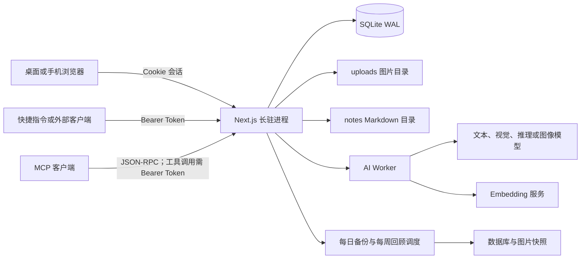
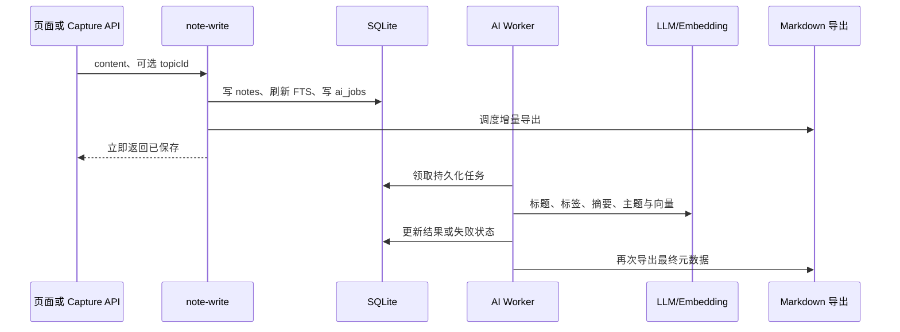

# 知了开发实施方案

版本：v1.0  
日期：2026-08-30  
对应产品基线：知了 v0.6.0  
目标读者：研发负责人、前后端开发、测试、部署与运维人员  
状态：已完成两轮审计的实施基线，不代表已批准开发全部候选功能

## 一、结论先行

知了不是待从零搭建的原型，而是已经可以本机或服务器运行的单用户 AI 个人知识库。本方案的任务是约束后续改进如何落到现有系统中，防止在真实笔记达到 100 条前，用重构、平台化或竞品功能复制偏离“记、找、用”主线。

当前实施原则：

1. 保留 Next.js 单体、SQLite、进程内任务队列和 Markdown 增量导出。
2. 保留单用户、自托管、主题导向、严格来源边界，不引入注册、多租户、RBAC 或 SaaS。
3. P0 只推进缺陷、文档、分发、部署和运维，以及现有 Issue 已批准的工作。
4. 新页面、新数据表、新持久化状态和新内容类型，必须先经过 100 条真实笔记闸门或单独的例外决策。
5. 本文描述的是“批准后如何开发”，不是本轮立即修改业务代码的授权。

## 二、事实来源与冲突处理

发生冲突时，按以下优先级处理：

1. 根目录 [README.md](../../README.md) 的 Roadmap 与当前冻结规则。
2. [CONTEXT.md](../../CONTEXT.md) 的领域语言和产品不变量。
3. 已采纳的 [ADR](../adr/) 技术决策。
4. [Issue 执行计划](../Issue执行计划-2026-08-29.md) 的当前执行顺序。
5. 本实施方案和 [产品视觉 PRD](知了产品视觉PRD-v1.0.md)。
6. [项目开发规范](../开发规范.md) 和 [UI 规范](../UI规范.md) 的日常执行要求。

若候选方案与已采纳 ADR 冲突，不得静默实施。应新建立 ADR，写明旧决策、真实证据、迁移代价和回退方案。

## 三、当前技术基线

### 3.1 技术栈

| 层级 | 当前实现 | 约束 |
|---|---|---|
| Web 与服务端 | Next.js 15 App Router、React 19、TypeScript | 全栈单体，不拆独立后端服务 |
| 样式与交互 | Tailwind CSS 4、TipTap | 继续复用现有语义 token 和组件模式 |
| 数据 | Drizzle ORM、better-sqlite3、SQLite WAL | 单实例写入，不面向水平扩展 |
| 检索 | SQLite FTS5、jieba、Embedding、RRF | 未配置 Embedding 时必须降级到 BM25 |
| AI | OpenAI 兼容 Chat Completions 与 Embeddings | 设置页数据库配置优先，环境变量兜底 |
| 异步任务 | SQLite 持久化任务表、Node 进程内 worker | 依赖长驻进程，不能使用 serverless |
| 编辑与导出 | Markdown、TipTap、持续增量导出 | SQLite 是工作库，Markdown 是持续可读出口 |
| 测试 | Vitest、Testing Library、设计门禁 | 当前缺 CI 级浏览器 E2E |
| 分发 | Docker、GHCR 多架构镜像、PWA | PWA 仅离线兜底，不是离线编辑器 |

### 3.2 运行拓扑



启动时由 `src/instrumentation.ts` 在 Node.js runtime 中依次完成全文索引检查、demo 播种、AI worker、每日备份和每周回顾调度。任何部署方案都必须保证该进程持续运行。

### 3.3 模块边界

| 模块 | 责任 | 关键约束 |
|---|---|---|
| `src/app/` | 页面、Route Handlers、应用布局 | Capture/Knowledge 在路由内鉴权；MCP 当前差异见 7.3 |
| `src/components/` | 导航、编辑器、助手、浮层等交互 | 桌面三栏、移动底栏和焦点契约不得破坏 |
| `src/db/` | Schema、单连接、内嵌迁移 | 已发布迁移只能追加，禁止改写 |
| `src/lib/note-write.ts` | 新建、更新、导入笔记的统一写入路径 | 必须同步 FTS、AI 队列、锁字段和 Markdown 导出 |
| `src/lib/ai/` | 整理、对话、工具、向量和调度 | 写操作可撤销，来源问答不得越界补充 |
| `src/lib/search.ts` | BM25、向量与混合排序 | 向量不可用或过期时必须可降级 |
| `src/lib/markdown-export.ts` | 持续导出 Markdown | 不能阻塞请求主路径，路径变化要清理旧文件 |
| `src/lib/backup.ts` | SQLite 与图片快照 | 备份成功后才允许执行破坏性清扫 |

`src/app/(app)/settings/settings-panel.tsx` 当前约 1246 行，是已知可维护性风险。后续若修改设置页，优先按“AI 服务、功能开关、数据、外部接入、外观”拆分局部组件，但不得借拆分改动业务语义。

## 四、部署形态

### 4.1 支持矩阵

| 场景 | 推荐方式 | 数据位置 | 关键限制 |
|---|---|---|---|
| 本机开发 | `npm run dev` | `./data/` | 仅开发使用，电脑关闭后不可访问 |
| 本机长期使用 | Docker Compose 或长驻 Node | Docker 卷或绝对路径 | Windows Docker 的数据库必须使用命名卷 |
| Linux/NAS/云服务器 | Docker Compose | `./data/` 绑定挂载 | 建议 HTTPS；需配置时区和异地备份 |
| 手机使用 | 访问服务器并安装 PWA | 数据仍在服务器 | 需要 HTTPS；断网只能看到兜底页 |
| 公网体验 | 独立 demo 容器 | 独立卷和环境文件 | 不得接触正式数据、真实密钥和高成本接口 |

### 4.2 本机与服务器拓扑

本机使用时，浏览器和服务运行在同一台电脑；服务器使用时，桌面与手机通过 HTTPS 访问同一个实例。产品只维护一套响应式 Web 应用，不维护三套客户端。

Windows Docker Desktop 对 SQLite WAL 的绑定挂载存在 `SQLITE_IOERR_SHMOPEN` 风险，必须叠加 `docker-compose.win.yml` 使用命名卷。命名卷中的数据库和图片不直接显示在资源管理器中，备份、迁移和恢复说明必须同时给出 `docker cp` 或临时容器路径。

### 4.3 不支持的部署

- Vercel、Cloudflare Workers 等 serverless 或按请求唤醒的平台。
- 多实例同时写同一个 SQLite 文件。
- 把相对 `DATABASE_PATH` 直接交给 standalone `server.js`，导致工作目录变化后静默新建空库。
- 把 PWA 宣传为完全离线或原生桌面 App。

## 五、数据模型与迁移

### 5.1 当前核心实体

| 实体 | 用途 | 关键关系或状态 |
|---|---|---|
| `topics` | 一层主题导航 | 内置 `inbox` 不可删除、不可改名 |
| `notes` | Markdown 笔记主表 | AI 状态、用户锁、软删除、单块向量元数据 |
| `note_chunks` | 长笔记分块向量 | 随笔记级联删除，检索按笔记取最高分块 |
| `tags` / `note_tags` | 标签与多对多关系 | 笔记删除时关联级联 |
| `images` | 上传图片与 HEIC 原件信息 | 允许先上传、保存笔记后回填 `noteId` |
| `ai_jobs` | 持久化 AI 队列 | `pending/running/done/failed`，支持退避重试 |
| `topic_suggestions` | 未分类主题建议 | `pending/accepted/dismissed` |
| `settings` | 应用配置 KV | 数据库值优先于环境变量 |
| `api_tokens` | 外部访问凭证 | 只存 SHA-256 哈希、作用域和吊销时间 |
| `correction_examples` | 用户纠正学习样例 | 可逐条禁用 |
| `conversations` / `messages` | AI 助手会话 | 工具载荷支持操作卡片与撤销 |
| `conversation_sources` | 来源问答边界 | 主题是活引用，查询时展开当前笔记 |

当前没有行为事件表，也没有笔记来源字段。因此冻结期不得声称系统能自动精确计算“手机捕获转化率”“首次搜索成功率”等漏斗。

### 5.2 迁移规则

1. Schema 变化同时更新 `src/db/schema.ts` 与 `src/db/migrations.ts`。
2. `migrations` 只能追加新 ID；已发布 SQL 不得修改、重排或复用 ID。
3. 每个迁移必须在事务中可完成，并验证旧库升级而非只验证空库创建。
4. 删除列、重建表或批量回填前，必须有备份、耗时评估和失败回退方案。
5. 向量模型或维度变化不得混算；旧向量应标记过期并允许回退 BM25。
6. 导入、恢复和覆盖写入必须清理旧向量、旧分块和旧导出路径。

## 六、关键数据流

### 6.1 创建与 AI 整理



### 6.2 搜索

搜索先以 FTS/BM25 召回，再在 Embedding 可用且模型、维度有效时加入向量结果，以 RRF 融合。任何 Embedding 请求失败、配置缺失或向量过期，都不能阻断关键词搜索。

2026-09-08 修复候选截断：先在有效笔记和来源范围内按 BM25 选候选，再统计该批候选的完整命中词数；LIKE 降级同样在限制条数前过滤来源。130 篇固定语料下助手前五命中为 12/13，圆面积自然问句的常用词排名问题仍待单独评估，见 [ADR-0018](../adr/0018-hybrid-search.md)。

已知缺陷是两三个字的极短笔记可能获得病理性高向量分。修复必须用真实样本验证相关查询和无关查询，不能只调一个阈值后观察单例。

### 6.3 来源问答

来源问答的可信边界由三层共同构成：会话来源集、工具可访问范围、引用 ID 白名单。产品可以承诺“边界可见、引用可核验、来源不足时拒答”，不能承诺第三方模型绝对不会推理错误。

长文通过既有 `read_note` 的可选 `offset` 和返回的 `nextOffset` 续读，末尾指针为 `null`，每次都重新检查来源与回收站。正文页上限为 6000 个 UTF-16 单位；单次结果、对话预算与轮次遵守 [ADR-0010](../adr/0010-grounded-source-chat.md) 的续读契约。未完成读取时应说明无法确认，不能据此断言来源没有答案。

### 6.4 备份、导出与恢复

- 每次笔记变更调度 Markdown 增量导出。
- 每日备份 SQLite 快照与整个图片目录，各保留 7 份。
- 备份和源数据同盘不构成灾备，生产使用必须增加异地副本。
- 恢复 SQLite 前必须停止服务并删除旧 `-wal`、`-shm` 文件。
- 恢复验收必须实际打开笔记、图片、搜索和会话，不能只看容器启动成功。

## 七、外部 API 契约

`POST /api/external/capture` 与 `GET /api/external/knowledge` 由各自路由校验 `Authorization: Bearer <token>`。Token 默认不存在，明文只在创建时返回一次，数据库只存哈希。`capture:write` 与 `knowledge:read` 不可互换。`GET /api/healthz` 明确免登录；MCP 当前存在分方法鉴权差异，见 7.3。

### 7.1 捕获笔记

```http
POST /api/external/capture
Authorization: Bearer zhl_xxx
Content-Type: application/json

{
  "content": "要记录的正文",
  "topicId": "可选主题 ID"
}
```

成功：

```json
{
  "id": "笔记 ID",
  "topicId": "inbox",
  "createdAt": 1788105600000
}
```

| HTTP | 响应 | 条件 |
|---:|---|---|
| 201 | 新建笔记对象 | 写入、FTS、AI 入队和导出调度成功 |
| 400 | `{"error":"content 不能为空"}` | JSON 无效、字段不符或正文为空 |
| 400 | `{"error":"主题不存在"}` | `topicId` 不存在 |
| 401 | `{"error":"无效或无权限的 Token"}` | Token 缺失、已吊销或作用域不符 |
| 500 | Next.js 通用错误响应 | 未捕获的存储或运行时错误；不得向客户端泄露密钥和堆栈 |

当前 `content` 会在写入前去除首尾空白；指定非系统主题视为用户手动归类并锁定主题字段。

### 7.2 读取知识

```http
GET /api/external/knowledge?q=检索词&topicId=可选主题ID&limit=20
Authorization: Bearer zhl_xxx
```

参数：

| 参数 | 默认 | 规则 |
|---|---:|---|
| `q` | 空 | 非空时执行混合检索；为空时按更新时间倒序 |
| `topicId` | 空 | 结果按主题过滤；当前不存在主题也只返回空数组 |
| `limit` | 20 | 最小 1，最大 50；无效数字回落 20 |

响应为 `{"notes": [...]}`，每条包含 `id`、`title`、`summary`、`content`、`excerpt`、`topicId`、`topicName`、`tags`、`createdAt`、`updatedAt`。

| HTTP | 响应 | 条件 |
|---:|---|---|
| 200 | `{"notes":[]}` 或笔记数组 | 查询成功，包括无结果 |
| 401 | `{"error":"无效或无权限的 Token"}` | Token 缺失、已吊销或作用域不符 |
| 500 | Next.js 通用错误响应 | 未捕获的数据库、检索或模型错误 |

### 7.3 MCP

```http
POST /api/mcp
Authorization: Bearer zhl_xxx
Content-Type: application/json
```

支持 JSON-RPC 2.0 方法：

- `initialize`
- `tools/list`
- `tools/call`
- 工具 `search_knowledge`
- 工具 `get_knowledge`

当前源码行为必须如实区分：

- `initialize` 与 `tools/list` 只返回协议、服务和工具元数据，目前即使没有有效 Token 也会返回 200。
- `tools/call` 会转交 Knowledge API，只有该路径校验 `knowledge:read` Token。
- 客户端仍建议所有 MCP 请求都携带 Bearer Token，以便后续收紧入口鉴权时无需修改配置。
- 这与 ADR-0019“外部请求使用 Bearer Token”的统一口径存在偏差。公网暴露 MCP 前，推荐在 `/api/mcp` 入口统一校验 `knowledge:read`；若决定让元数据长期公开，则必须先更新 ADR、威胁模型和契约测试。

| HTTP / JSON-RPC | 含义 |
|---|---|
| 200 + `result` | 初始化、列工具，或带有效 Token 的工具调用成功 |
| 400 / `-32600` | 请求不符合 JSON-RPC 结构 |
| 200 / `-32601` | 方法或工具不存在 |
| 401 / `-32001` | 仅当前 `tools/call` 路径：`knowledge:read` Token 无效或权限不足 |

当前两个工具都把 `arguments.query` 映射为 Knowledge API 的 `q`，实际都执行搜索；`get_knowledge` 并没有按笔记 ID 精确读取。正式对外固化契约前，应选择其一：实现真正的按 ID 读取，或合并/重命名工具，避免两个名字表达不同语义却返回同一路径。

原调查中，MCP `initialize` 的 `serverInfo.version` 为 `0.5.0`，产品版本为 v0.6.0。2026-09-13 已批准的 R3 将目标统一为 **0.6.1 候选**：`src/lib/version.ts` 静态导入根 `package.json.version`，握手直接使用该值，`protocolVersion` 仍为 `2025-03-26`。运行时不读取当前目录的包文件或环境版本变量；候选仍未发布。

原计划曾将版本、入口鉴权和工具语义合并处理；按本次用户批准范围，R3 仅修复版本来源并增加握手回归，其余两项独立分诊。上文鉴权偏差与两个工具均执行搜索的事实仍保留，不能宣称整个 MCP 契约已修复；已发布 v0.6.0 的旧握手行为不追溯改写。

### 7.4 健康检查

```http
GET /api/healthz
```

| HTTP | 响应 | 条件 |
|---:|---|---|
| 200 | `{"ok":true}` | SQLite `SELECT 1` 成功 |
| 503 | `{"ok":false}` | 数据库探测失败 |

该接口免登录，只暴露存活状态，不暴露版本、队列、模型或路径等内部信息。

## 八、实施批次

### 8.1 P0：冻结期内允许推进

2026-09-13 已批准[开源发布优先范围调整](../../_bmad-output/planning-artifacts/sprint-change-proposal-2026-09-12-open-source-first.md)。当前主线为安装、核心缺陷、出口恢复、版本文档一致及免费反馈，按 [R0–R4 清单](开源发布范围与执行清单-2026-09-13.md) 串行推进。#4/#10 持续，#8 本地复现与 #9 文章/安装承接可先行；E 的公网工作后移，原安全要求保留。这是排期变化，不新增组件、数据模型、API 或 UI 状态。

#### A. #4 手机捕获与 7 日真实使用

- 复用现有 `POST /api/external/capture`，首期不新增服务端接口。
- 为一个主平台交付快捷指令或等价模板、Token 创建和吊销说明。
- 覆盖 201、400、401、超时、证书错误和断网，失败时保留原文本。
- 用专用 `capture:write` Token，不与 `knowledge:read` 共用。
- 完成蜂窝网络写入、AI 整理和连续 7 日真实笔记验收。

#### B. #10 指标闸门

- 冻结期使用人工台账和本地 SQL，不新增事件采集系统。
- 记录真实笔记总数、手机捕获笔记数和过去 7 天活跃记录天数。
- demo、自动测试、临时验收笔记和自动生成回顾不计入核心指标。
- 达到 100 条后只触发重新分诊，不自动批准候选功能。

#### C. 已知缺陷

- 极短笔记向量误排：建立无关查询反例和相关查询正例，再决定最小建向量长度或长度惩罚。
- 大批量导入导出阻塞：避免新建分支逐篇递归扫描整个导出目录，并用 2,000 与 5,000 篇量级验证事件循环影响。
- MCP 契约偏差：入口鉴权与 `get_knowledge`/`search_knowledge` 语义另行分诊；版本来源已由 R3 在 0.6.1 候选中统一，仍需后续镜像握手验收。

缺陷修复必须单独立 Issue，给出复现、根因、局部测试和真实路径回归，不与产品候选混成一个大改动。

#### D. 安装、升级、备份与恢复

- 文档覆盖 Windows Docker 命名卷、Linux 绑定挂载、HTTPS/PWA 和主机休眠边界。
- 至少完成一次隔离数据的真实恢复演练。
- 明确同盘备份不是灾备，并给出异地同步建议。
- 升级前备份，升级后核对迁移、笔记、图片、搜索、Token、导出和设置覆盖关系。

#### E. #5 公网 demo 安全化（后移，原要求保留）

不作为当前开源发布前置条件。Story 2.2 原 8 条 AC、复审项与数值门槛全部保留，全验收及审查通过后才进入 2.3；原 §9.4 安全要求继续适用于公网上线。

- demo 与正式实例使用独立 compose project、网络、卷和环境文件。
- demo 只使用 mock 模型，不保存真实模型配置，不允许创建 Token。
- 备份下载、导入、向量补算等高成本接口由服务端返回 403。
- 代理层设置 HTTPS、限流、请求体、CPU、内存、磁盘和日志上限。
- 定时重置后自动执行健康检查与“新建笔记、AI 归档、主题建议”冒烟。
- 对提示注入、内部网络访问和密钥泄露做专项检查。

### 8.2 P1：证明价值与分发

#### A. #8 严格来源问答演示

- 固定演示数据、来源集、问题、模型和日期。
- 验证来源外问题明确拒答、引用 ID 有效、引用内容支持结论。
- 增加提示注入与越界工具调用测试。
- 演示 20 至 30 秒，无旁白也能理解；首期恢复固定数据后在隔离本地实例连续两次复现，结尾指向固定 Release 与安装步骤。
- mock 流程与真实模型证据分开；公网上线时仍补真实入口及自动/人工重置联验，归 #5/Epic 2 上线验收，由 Story 3.3 留存关联。

#### B. #9 内容分发

- 文章只使用已有 ADR、真实缺陷、提交和测试证据。
- 文章/安装发布包依赖 Story 4.1、已发布版本及安装/恢复文档；引用视频再依赖 3.2/3.3，公网链接仍等待完整 Epic 2。
- 发布前、24 小时、7 天、14 天和 30 天保存流量快照，以实际发布为 T0，草稿不启动时钟。
- 不能把 star、访问量或 demo 笔记混入真实笔记指标。

#### C. 真实失败驱动的体验修正

只修改已经证明阻断使用的现有页面提示、空态、错误恢复和文档。涉及持久化向导、事件表或新页面时，回到冻结例外决策。

### 8.3 P2：100 条后重新评估

候选包括：

- 交互式首次使用向导。
- 本地激活和检索质量指标。
- 引用原文片段或原位置预览。
- PDF、网页等新摄取类型。
- Electron/Tauri 壳或一键本机安装器。
- 搜索时间、类型和状态筛选。

每项都要有真实样本、放弃条件、数据迁移影响、视觉规格和独立验收，不得打包成一次“知识库 2.0”重做。

## 九、安全要求

### 9.1 身份与会话

- 保持单用户密码登录和签名会话，不新增注册入口。
- `APP_PASSWORD` 与 `SESSION_SECRET` 必填，正式环境禁止使用示例值。
- Capture/Knowledge API 只接受各自作用域的 Bearer Token；MCP 公网使用前必须修复 7.3 记录的入口鉴权偏差。
- Token 明文只显示一次，日志、截图、文档和模板不得包含真实值。

### 9.2 模型与数据

- 配置页必须说明第三方模型可能接收笔记、图片或问题内容。
- 本地模型是可选部署方式，不应虚构“所有数据永不离开设备”。
- API Key 不进入仓库、测试夹具、客户端响应和错误堆栈。
- 模型配置数据库值覆盖环境变量的关系必须可见并可验证。

### 9.3 来源问答与提示注入

- 来源集必须在会话中持续可见。
- 只允许引用实际工具返回的笔记 ID。
- 来源外问题、恶意笔记指令、工具越权和伪造引用均要有测试。
- “资料中没有依据”是正常完成状态，不应作为模型失败重试。

### 9.4 公网 demo

- 前端隐藏不是安全边界，所有禁止动作必须由服务端拒绝。
- demo 容器不能读取正式 `.env`、正式卷或真实 API Key。
- `fetch_url` 等出站能力必须评估私网、云元数据与代理 fake-IP 场景。
- 重置任务失败时要有人工恢复命令和磁盘告警。

## 十、测试与验证策略

### 10.1 当前质量门禁

正式代码变更的 CI 顺序为：

1. `npm run check:design`
2. `npm run lint`
3. `npm test`
4. `npm run build`

本轮只交付文档，不执行上述重验证。后续实际开发时，应先运行与变更范围匹配的局部测试；合并或发布前再运行完整门禁。

### 10.2 分层验证

| 变更 | 最小验证 | 发布前补充 |
|---|---|---|
| API 契约 | Route/lib 单元测试、401/400/成功路径 | 真实 HTTP 冒烟和文档示例 |
| 数据迁移 | 旧库副本升级、计数与字段核对 | 隔离 compose 升级与恢复 |
| 搜索排序 | 固定正反例、BM25 降级、向量过期 | 真实供应商样本与延迟记录 |
| Markdown 导入导出 | 往返、覆盖、判重、旧路径清理 | 2,000/5,000 篇性能样本 |
| 来源问答 | 来源不足、引用白名单、提示注入 | 真实模型人工事实抽查 |
| UI | 组件测试、键盘、焦点、响应式 | Chrome/Edge 桌面与手机截图 |
| Docker/PWA | 健康检查、卷持久化、HTTPS | Windows/Linux 与蜂窝网络 |
| 备份恢复 | 快照完整性、WAL 清理 | 真正恢复并打开内容 |

### 10.3 浏览器测试缺口

当前测试覆盖较多，但 CI 没有 Playwright 等浏览器 E2E。涉及登录、快速记录、编辑保存、搜索、来源问答、设置或 PWA 时，至少保留可重复的浏览器冒烟清单；若真实回归频繁，再单独立项引入少量核心 E2E，避免在冻结期建设庞大测试平台。

## 十一、发布、升级与回退

### 11.1 发布前

- 确认版本号、Release Notes、CHANGELOG 和 Docker tag 一致。
- 数据结构变化前保存可恢复快照，并完成旧库升级彩排。
- amd64 与 arm64 镜像使用同一提交构建。
- 公网 demo 与正式实例分别验证，不共享任何数据或密钥。

应用开源发布与公网部署分别验收：经审查的 Demo 补丁可随通用应用候选进入版本核对，但不能单独关闭 Story 2.2 的配额、目标主机、HTTPS、固定镜像及最终启动路径行动项。§7.3 的版本来源由 R3 处理，MCP 鉴权与工具语义独立分诊；版本统一不能代替其余契约修复。

R3 增加只读 `npm run check:version`，并可用 `-- --tag v0.6.1-rc1` 核对发布 tag。CI 和 Release 构建前使用同一校验器；它检查 package/lockfile、Compose、Release Notes 与 CHANGELOG 的版本，不证明安装、恢复、镜像或公网验收。原四条门禁、升级/恢复彩排、双架构 manifest 和 RC 冒烟保持，RC 与正式 tag 必须同提交。

### 11.2 升级

推荐固定版本镜像，先备份，再 `docker compose pull` 与重建容器。启动后检查：

- `/api/healthz` 返回 200。
- 迁移表新增预期 ID。
- 笔记、图片、主题、标签、会话和 Token 计数合理。
- 搜索可用，旧向量过期时能降级并提示补算。
- `data/notes/` 持续更新。

### 11.3 回退

应用回退与数据库回退必须配套。若新版本已经执行不可逆迁移，不能只降镜像；应停止服务，恢复升级前数据库与图片快照，删除旧 WAL/SHM，再启动旧版本。正式数据回退前先在隔离副本演练。

## 十二、文档同步矩阵

| 变化类型 | 必须同步 |
|---|---|
| 外部 API、Token 作用域或错误码 | 本文、ADR-0019、手机快捷记录指南、相关测试 |
| 数据表、迁移或数据生命周期 | Schema、迁移、相关 ADR、备份恢复、升级说明 |
| 搜索或向量策略 | ADR-0018/0023、README 功能说明、验收样本 |
| Markdown 导入导出 | ADR-0020/0024、README、备份与迁移说明 |
| 来源问答边界 | ADR-0010、PRD、演示说明和安全测试 |
| PWA 与部署 | ADR-0006、部署手册、README 中英文 |
| 页面行为或视觉 token | 产品视觉 PRD、UI 规范、设计门禁 |
| 公网 demo 安全限制 | demo compose、部署运维文档、README 中英文 |
| 发布版本 | CHANGELOG、Release Notes、README 必要提示 |

## 十三、开发完成定义

一个批准后的开发项只有同时满足以下条件才算完成：

1. 需求边界、非目标和冻结例外已明确。
2. 实现沿用现有模块边界，没有引入不必要的服务或平台。
3. 数据迁移、失败恢复和回退路径已验证。
4. 安全边界在服务端生效，不只依赖 UI 隐藏。
5. 局部测试覆盖真实失败路径，必要时有浏览器或真机证据。
6. 相关 README、ADR、接口、部署、视觉和发布文档已同步。
7. 没有把 demo、测试数据或一次性导入伪装成真实使用增长。
8. 未达到 100 条真实笔记前，没有借缺陷、重构或文档名义夹带新功能。

## 十四、当前建议动作

当前从 R0–R4 清单推进安装、核心闭环、出口恢复、版本与免费反馈，先完成具体任务的范围和证据核对。#4 手机捕获配置与 7 日真实使用、#10 人工指标持续；#8/#9 按本地复现和已发布版本承接。#5 公网与收费招募后移。自然问句排名、极短笔记排序、批量导入导出阻塞和 MCP 契约偏差分别分诊，不合并成产品重做；完整门禁与原验收不降低。
