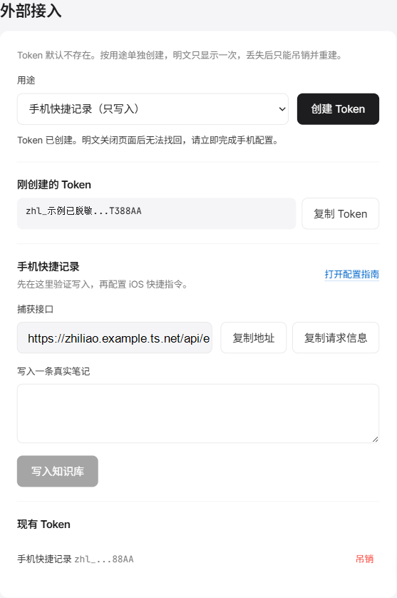
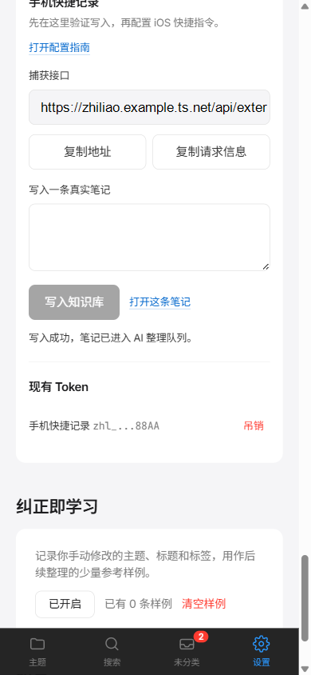

# 手机快捷记录

适用版本：知了 v0.6.0 及后续版本  
首版平台：iOS 快捷指令  
接口：`POST /api/external/capture`

## 你会得到什么

配置完成后，可以从 iPhone 主屏幕、控制中心或系统分享菜单记录内容，不需要先打开浏览器登录。分享文本、网页地址和语音听写都会写入知了现有笔记库，并继续走 AI 标题、标签、摘要和主题整理流程。

首版不提供 Apple 官方签名的 `.shortcut` 文件。快捷指令分享链接必须在 Apple 环境中创建和发布，Windows 开发环境无法生成可安全导入的签名文件。本指南提供应用内配置卡、可复制请求信息和逐步搭建流程。

## 使用前检查

1. 知了实例已启动，电脑关闭或休眠时手机无法写入。
2. 手机能通过 HTTPS 访问实例。推荐按 [Tailscale 部署手册](部署手册-tailscale.md) 配置 `https://<设备名>.<网络名>.ts.net`。
3. 在手机蜂窝网络下打开知了登录页，确认地址和证书可用。
4. 不要使用 `http://localhost:3000`。手机里的 `localhost` 指手机本身。

## 创建专用 Token

1. 打开知了的“设置”。
2. 找到“外部接入”。
3. 用途选择“手机快捷记录（只写入）”。
4. 点击“创建 Token”。
5. 立即复制 Token。页面关闭后无法找回明文，只能吊销并重建。

`capture:write` Token 只能创建笔记，不能读取知识库，也不能修改设置。不要把 `knowledge:read` Token 放进快捷指令。



## 先完成应用内自测

创建 Token 后，设置页会显示捕获接口和“写入一条真实笔记”。输入一条真实内容并点击“写入知识库”。

成功标志：

- 页面显示“写入成功，笔记已进入 AI 整理队列”。
- “打开这条笔记”可以进入新笔记。
- 配置了文本模型时，笔记随后得到标题、标签、摘要和主题。
- 未配置模型时，笔记仍会保存，并显示待整理状态。

失败时输入内容会保留在输入框。先排除实例地址、网络和 Token，再重试。



## 在 iPhone 创建快捷指令

下面三条快捷指令分别处理分享文本、分享网址和语音听写。每条指令都使用同一个捕获接口和同一个 `capture:write` Token，但建议分开命名，便于在分享菜单、主屏幕和控制中心识别。

### 一、分享文本

1. 新建快捷指令，命名为“知了：分享文本”；在详情中开启“在共享表单中显示”，接收类型只选择“文本”。
2. 读取“快捷指令输入”，添加“替换文本”或“修剪空白”动作，去除首尾无意义空白，并将结果存为“记录内容”。
3. 添加“如果”动作：内容为空时显示“没有可保存的文本”，并结束快捷指令。
4. 添加“获取 URL 内容”，URL 填设置页显示的捕获接口，方法选择 `POST`，请求正文选择 `JSON`。
5. JSON 只添加一个字段：`content`，值使用“记录内容”。请求头添加：
   - `Authorization: Bearer <capture:write Token>`
   - `Content-Type: application/json`
6. 从响应中读取 `title` 和 `id`。显示通知“已保存：<title>（<id>）”；若 `title` 为空，则显示“已保存：笔记 ID <id>”。

### 二、分享网址

1. 新建快捷指令，命名为“知了：分享网址”；开启“在共享表单中显示”，接收类型选择“URL”和“文本”。
2. 分别读取共享输入中的网址和用户选中的文本。没有选中文本时只保留网址；不要添加“获取 URL 内容”抓取网页正文等额外逻辑。
3. 将两部分组装为待记录文本，例如：
   ```text
   网址：<共享网址>
   选中文本：<用户选中的文本>
   ```
   选中文本为空时只保留 `网址：<共享网址>`。
4. 添加“询问输入”，类型选择文本，默认值使用上述待记录文本，让用户在发送前确认或修改最终文本。
5. 将确认后的文本放入 JSON 的 `content` 字段，使用 `POST /api/external/capture`，并添加同样的 `Authorization` 与 `Content-Type` 请求头。
6. 读取响应的 `title`、`id`，按“已保存：标题（ID）”格式提示；标题为空时只显示 ID。快捷指令中不得显示完整 Token。

### 三、语音听写

1. 新建快捷指令，命名为“知了：语音听写”；可开启“添加到主屏幕”或加入控制中心，不必放入分享菜单。
2. 添加“听写文本”，将结果保存为“原始听写文本”。
3. 添加“询问输入”，类型选择文本，默认值使用“原始听写文本”。用户可以修改内容；将确认结果保存为“记录内容”。
4. 添加“拷贝至剪贴板”，内容使用“记录内容”，方便网络失败后粘贴重试。
5. 使用 `POST /api/external/capture` 发送 JSON：`{"content":"记录内容"}`，请求头为 `Authorization: Bearer <capture:write Token>` 和 `Content-Type: application/json`。
6. 成功时读取 `title`、`id`，提示“已保存：<title>（<id>）”；标题为空时提示“已保存：笔记 ID <id>”。失败时保留“原始听写文本”和“记录内容”，不能直接清空或丢弃。

### 统一的响应与错误处理

在三条快捷指令的“获取 URL 内容”动作后，按 HTTP 状态码添加“如果”分支：

- `201`：读取 `title`、`id`，提示必须包含“已保存”和标题或 ID。
- `400`：提示“保存失败（400）：内容为空或请求格式有误，请检查最终文本”；保留待发送文本。
- `401`：提示“保存失败（401）：Token 无效或已吊销，请在设置页创建新的 capture:write Token”；保留待发送文本。
- 网络失败：提示“保存失败：网络不可用，请检查 HTTPS 地址和蜂窝网络”；保留待发送文本。
- 请求超时：提示“保存失败：请求超时，请确认知了实例正在运行”；保留待发送文本。

提示语、剪贴板和日志都不能输出完整 Token。设置页的“复制请求信息”可用于核对接口、方法、请求头和请求体，但复制后应立即删除或遮盖其中的 Token。

### 放到主屏幕、控制中心或分享菜单

- 主屏幕：打开快捷指令详情，选择“添加到主屏幕”。
- 控制中心：在控制中心添加“快捷指令”控制，并选择“记到知了”。
- 分享菜单：在任意应用选中文本或分享网页，选择“记到知了”。

## 接口契约

```http
POST /api/external/capture
Authorization: Bearer zhl_xxx
Content-Type: application/json

{
  "content": "要记录的正文",
  "topicId": "可选主题 ID"
}
```

| 状态 | 含义 | 处理 |
|---:|---|---|
| 201 | 已创建笔记 | 显示成功通知 |
| 400 | 正文为空或主题不存在 | 保留原文，检查请求体 |
| 401 | Token 无效、已吊销或权限错误 | 创建新的 `capture:write` Token |
| 超时 | 实例未响应 | 保留原文，检查服务是否运行 |
| 证书错误 | HTTPS 证书不受信任 | 重新核对 Tailscale HTTPS 地址 |
| 蜂窝网络不可达 | 地址只在局域网可用或电脑已休眠 | 使用 Tailscale 地址并保持主机运行 |
| 一直待整理 | 笔记已保存，但模型或队列不可用 | 到设置页检查 AI 服务与任务状态 |

## 安全与吊销

- Token 只保存在自己的快捷指令中，不放进截图、聊天、README 或共享模板。
- 截图前遮住 Token 全文。只显示前缀和末四位不等于泄露明文。
- 手机丢失、快捷指令误分享或怀疑泄露时，在设置页点击“吊销”。旧快捷指令会立即收到 401。
- 重新创建 Token 后，需要同步更新快捷指令里的 `Authorization` 请求头。

## 首版验收记录

本仓库已自动验证 201、400、401、权限隔离、吊销、自测成功、网络失败保留输入和移动布局。仍需用户在真实 iPhone 上完成以下验证：

1. 分享文本成功。
2. 分享网址成功。
3. 语音听写成功。
4. 只使用蜂窝网络成功。
5. 吊销后旧快捷指令立即失败。
6. 连续 7 天每天至少一条真实笔记来自快捷指令。

完整截图与体验结论见 [首版开发验收记录](产品规划/手机快捷记录首版开发验收-2026-08-31.md)。
